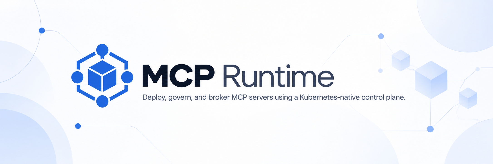

# MCP Runtime Platform

<p align="center">
  
</p>

[](https://github.com/Agent-Hellboy/mcp-runtime/actions/workflows/ci.yaml)
[](https://github.com/Agent-Hellboy/mcp-runtime/actions/workflows/ci.yaml?query=branch%3Amain+job%3AKind%20E2E)
[](https://github.com/Agent-Hellboy/mcp-runtime/actions/workflows/production-e2e.yaml)
[](https://github.com/Agent-Hellboy/mcp-runtime/actions/workflows/security-gosec.yaml)
[](https://github.com/Agent-Hellboy/mcp-runtime/actions/workflows/security-gitleaks.yaml)
[](https://github.com/Agent-Hellboy/mcp-runtime/actions/workflows/security-trivy.yaml?query=branch%3Amain+job%3ATrivy%20FS%20Scan)
[](https://github.com/Agent-Hellboy/mcp-runtime/actions/workflows/security-trivy.yaml?query=branch%3Amain+event%3Apush)
[](https://codecov.io/gh/Agent-Hellboy/mcp-runtime/branch/main)

MCP Runtime is a self-hosted Kubernetes control plane for internal [Model Context Protocol](https://modelcontextprotocol.io/) servers. It provides declarative MCP server deployment, registry workflows, operator reconciliation, request-path governance, access/session resources, audit, analytics, dashboards, and a platform control surface for browsing and operating MCP servers.

The public platform at `platform.mcpruntime.org` is a live preview of the deployable platform experience. It runs the public preview catalog mode, where visitors can browse public preview MCP servers and signed-in preview users can publish into the public catalog namespace. It is still not a general-purpose public MCP marketplace. Companies can deploy the same model in their own Kubernetes clusters, then host, manage, govern, and audit MCP servers through both the CLI and the platform control surface for agents, IDEs, and direct human workflows.

- [Website](https://mcpruntime.org/)
- [Platform preview](https://platform.mcpruntime.org/) for the platform control surface; companies can deploy the same model in their own clusters
- [Docs](https://docs.mcpruntime.org/) and [`docs/`](docs/)
- [API reference](https://docs.mcpruntime.org/api) and [`docs/api.md`](docs/api.md)
- [Articles](https://articles.mcpruntime.org/) and [`articles/`](articles/)
- Early adopters: MCP Runtime is looking for teams running or evaluating internal MCP platforms. Open a [GitHub issue](https://github.com/Agent-Hellboy/mcp-runtime/issues) with your use case, cluster shape, or integration feedback.

> [!CAUTION]
> MCP Runtime is alpha software. APIs, commands, and behavior are still evolving. Use the docs, CRDs, and `api/v1alpha1` types as the source of truth before production use.

## Why teams use MCP Runtime

- **Operate MCP servers where company data already lives.** Deploy into an existing Kubernetes cluster instead of sending internal tools, tokens, or traffic through a third-party catalog or hosted proxy.
- **Use Kubernetes as the source of truth.** `MCPServer`, `MCPAccessGrant`, and `MCPAgentSession` resources make server delivery, access grants, agent sessions, policy, rollout, and status inspectable with normal Kubernetes workflows.
- **Move beyond "connect an agent to a URL."** The gateway can enforce identity, deny-by-default tool policy, trust ceilings, side-effect limits, session expiry, revocation, and audit emission on the live MCP request path.
- **Give agents a clean integration path.** The stdio and Streamable HTTP adapters let IDEs, agent frameworks, and scripts attach platform-issued governance identity without each client reimplementing grants or session handling.
- **Support internal catalog models.** Run private tenant namespaces, an org-wide catalog, or a public preview-style catalog while keeping the same CLI, CRDs, platform UI, and operator model.
- **Separate teams without separate platforms.** Team namespaces, RBAC, `teamID`, subject matching, and namespace-scoped grants/sessions let multiple teams publish and govern MCP servers on one cluster.
- **Own the day-two path.** Setup, registry workflows, image pull wiring, ingress, rollout readiness, `cluster diagnostics`, status commands, dashboards, audit, analytics, and Sentinel services are part of the platform rather than afterthoughts.
- **Fit different cluster shapes.** The documented paths cover disposable Kind development, laptop evaluation, k3s labs, self-managed production clusters, and managed Kubernetes with external registries.

## What ships

- `mcp-runtime` CLI for `auth`, `bootstrap`, `setup`, `status`, `registry`, `server`, `catalog`, `cluster`, `access`, `team`, and `sentinel`
- `mcp-runtime adapter proxy` and `mcp-runtime adapter stdio` subcommands for
  governed HTTP and stdio agent integrations. Both can fetch identity from
  the platform with `--server <name> --agent <id> [--auto-refresh]` once an
  enabled grant exists for that server and agent, or accept explicit
  `MCP_RUNTIME_*` env vars (see [Agent Adapters](docs/agent-adapters.md))
- Platform UI for authenticated MCP catalog browsing, platform state, and web operations
- `MCPServer`, `MCPAccessGrant`, and `MCPAgentSession` CRDs
- Kubernetes operator for `Deployment`, `Service`, `Ingress`, and policy materialization
- Internal or provisioned registry workflows
- Optional gateway enforcement for identity, tool policy, trust, and audit emission
- Bundled Sentinel stack for ingest, processing, API, UI, and observability

## How it differs from MCP directories

The [Official MCP Registry](https://registry.modelcontextprotocol.io/) and public MCP directories such as [Glama](https://glama.ai/mcp), [Smithery](https://smithery.ai/), [Docker MCP Catalog on Docker Hub](https://hub.docker.com/mcp), [PulseMCP](https://www.pulsemcp.com/), [mcp.so](https://mcp.so/), and client-specific catalogs are useful discovery and installation surfaces. MCP Runtime is different: it is a deployable operating layer for running MCP servers inside a company's own environment. It can provide an internal catalog-like view, but the main product is deployment, governance, brokered access, audit, compliance evidence, and day-two operations.

| Public MCP directory or catalog | MCP Runtime |
|---|---|
| Helps users find or install public MCP servers | Helps companies host, deploy, govern, observe, and audit their own MCP servers |
| Optimizes for discovery metadata, popularity, and install snippets | Optimizes for deployment, runtime governance, Kubernetes reconciliation, policy, sessions, audit, and compliance |
| Usually runs as a third-party hosted directory or client feature | Runs in the company's Kubernetes environment or in a hosted preview shape |
| Stops at configuration or connection | Owns the governed request path through the broker/gateway |

## How MCP Runtime compares

Kubernetes-native MCP management is now a direction shared by several projects: some run MCP server workloads in Kubernetes, while others define Kubernetes APIs for MCP routing and management. Kubernetes support alone does not distinguish MCP Runtime.

**Runtime’s focus is managing MCP business logic and access as validated platform state.** `MCPServer`, `MCPAccessGrant`, and `MCPAgentSession` let the platform reconcile server workloads and express trust ceilings, allowed side effects, per-tool rules, user consent, expiry, and revocation as Kubernetes resources. This gives teams a reviewable control plane for validating what is deployed and what an agent session is allowed to do.

| Project | What it focuses on | How it compares with MCP Runtime |
|---|---|---|
| **MCP Runtime** | Kubernetes-managed MCP workloads, access grants, consented sessions, gateway enforcement, audit, and operations | Combines workload reconciliation with platform-validated trust, side-effect, tool, consent, expiry, and revocation policy. |
| [Archestra](https://github.com/archestra-ai/archestra) | MCP platform with Kubernetes server orchestration, gateway, registry, and agent/chat features | Direct overlap in Kubernetes-hosted MCP servers; broader agent platform, while Runtime centers access on grant and session resources. |
| [Obot](https://github.com/obot-platform/obot) | MCP hosting, registry, gateway, and organization-facing AI experience | Also hosts MCP servers; Runtime emphasizes Kubernetes-managed workload and access policy state. |
| [Microsoft MCP Gateway](https://github.com/microsoft/mcp-gateway) | Kubernetes-oriented MCP gateway and management APIs, with adapter/tool lifecycle and identity integrations | Direct Kubernetes overlap; Runtime models server deployment, grants, and consented sessions as platform resources. |
| [Agent Router](https://github.com/theagentrouter/agent-router) | Kubernetes Gateway API routing for MCP and AI traffic, including MCP routes and policy | Direct Kubernetes API overlap, focused on traffic routing; Runtime also manages MCP server workloads and session consent. |
| [agentgateway](https://github.com/agentgateway/agentgateway) | High-performance gateway for MCP, agents, and AI traffic | Focuses on data-plane routing and policy; Runtime owns workload lifecycle and access state in Kubernetes. |
| [IBM ContextForge](https://github.com/IBM/mcp-context-forge) | Federation and gateway for MCP, A2A, REST, and gRPC | Broader protocol federation and API virtualization; Runtime focuses on Kubernetes workload and access governance. |
| [MCPJungle](https://github.com/mcpjungle/MCPJungle) | Self-hosted team gateway, unified endpoint, discovery, and tool grouping | Centers aggregation and gateway workflows; Runtime connects access decisions to reconciled cluster resources. |
| [Unla](https://github.com/AmoyLab/Unla) | MCP/API gateway with API-to-MCP conversion and configurable integrations | Stronger API conversion focus; Runtime focuses on deployed MCP workloads and governed sessions. |
| [OpenZiti MCP Gateway](https://github.com/openziti/mcp-gateway) | Zero-trust networking and secure remote access for MCP tools | Stronger remote access/networking focus; Runtime governs workloads and agent access within Kubernetes. |
| [Docker MCP Gateway](https://github.com/docker/mcp-gateway) | Docker-centered local MCP server lifecycle, catalog, and configuration | Stronger local/container developer workflow; Runtime targets platform-managed Kubernetes operations and policy. |
| [LiteLLM](https://github.com/BerriAI/litellm) | AI/model gateway with MCP access, provider routing, keys, and spend controls | Stronger model/provider routing and spend management; Runtime focuses on MCP server lifecycle and consented access. |
| [Kong](https://github.com/Kong/kong) | Mature API gateway with MCP proxy and AI gateway capabilities | Stronger general API gateway; Runtime provides an MCP-specific Kubernetes control plane for workloads, grants, and sessions. |
| [Portkey](https://github.com/Portkey-AI/gateway) | AI gateway and managed MCP gateway capabilities | Stronger AI traffic and hosted gateway focus; Runtime centers self-managed Kubernetes resources and reconciliation. |
| [Composio](https://github.com/ComposioHQ/composio) | SaaS integrations, toolkits, and user-scoped OAuth connections for agents | Stronger breadth of integrations and OAuth; Runtime focuses on operating MCP workloads and access policy in Kubernetes. |
| [Preloop](https://github.com/preloop/preloop) | Agent control plane with MCP firewall, model gateway, approvals, and budgets | Stronger model controls and approval workflows; Runtime expresses MCP grants and consented sessions as Kubernetes state. |

Choose MCP Runtime when you want the platform to deploy MCP servers and validate access rules and user consent through Kubernetes-managed state. Other projects may fit better when your primary need is broad SaaS integrations, model routing and spend controls, API conversion, remote zero-trust networking, or a full agent/chat platform. Features and deployment models change; verify the current project documentation before choosing.

## Requirements

Host tools:

- Go `1.26+` (matches the repository `go.mod` files)
- Make
- Docker or a Docker-compatible client, with the daemon running
- `kubectl` on `PATH`, configured for the target cluster
- `curl`, `jq`, and `python3` for documented dev and traffic-generation flows
- `kind` for local Kind-based clusters

Cluster prerequisites:

- A running Kubernetes cluster: kind, k3s, minikube, Docker Desktop Kubernetes, EKS, GKE, AKS, or equivalent
- Working DNS, default storage class, ingress, and load-balancing path for your distribution
- See [`docs/deployment-targets.md`](docs/deployment-targets.md) to choose the install shape, then [`docs/cluster-readiness.md`](docs/cluster-readiness.md) before running production-like installs

`mcp-runtime setup` installs the platform stack, including Sentinel services such as ClickHouse and Kafka. You do not install those separately for the default flow.

## Quick start

```bash
make deps-install              # best-effort host install where supported
STRICT_DEPS_CHECK=1 make deps-check
make deps
make build

./bin/mcp-runtime bootstrap
./bin/mcp-runtime setup
./bin/mcp-runtime status
```

Notes:

- `make deps-install` is best-effort. It cannot start Docker Desktop, create cloud credentials, or configure kubeconfig for you.
- `make deps` checks host tools and downloads Go modules. It does not create a Kubernetes cluster.
- `make build` produces `./bin/mcp-runtime` with version metadata from
  `git describe --tags --match 'v*'`, the current commit, and UTC build time.
  Release binaries use the release tag exactly. Override with
  `VERSION=<tag> make build` when needed.
- Contributors who want a disposable local Kind install should start with the
  maintained [`docs/contributor/`](docs/contributor/README.md) guide. The
  shorter entry summary remains in
  [`docs/getting-started.md`](docs/getting-started.md#3-contributor-test-mode-cluster).
- To exercise agent-side governance against a real MCP route, use the
  [`examples/governed-agent`](examples/governed-agent/) demo.

## Common commands

```bash
./bin/mcp-runtime bootstrap              # preflight cluster prerequisites
./bin/mcp-runtime setup                  # install platform stack
./bin/mcp-runtime status                 # show platform health
./bin/mcp-runtime auth login --api-url <platform-url>   # save platform credentials
./bin/mcp-runtime team create acme --name "Acme Corp"   # create a team namespace (admin)
./bin/mcp-runtime registry status        # inspect registry
./bin/mcp-runtime server status          # inspect MCP servers
./bin/mcp-runtime catalog tools          # search tools across visible servers
./bin/mcp-runtime access grant list      # inspect access grants
./bin/mcp-runtime adapter proxy --server <name> --agent <id> --auto-refresh   # connect an MCP client
./bin/mcp-runtime sentinel status        # inspect Sentinel stack
```

## Development checks

```bash
gofmt -s -l .
go build -o bin/mcp-runtime ./cmd/mcp-runtime
go test ./... -count=1 -race
go vet ./...
```

For targeted tests, e2e setup, and debugging runbooks, use [`AGENTS.md`](AGENTS.md) and the docs site.

## Agent tool configuration

The repo keeps Claude-specific local configuration in [`.claude/`](.claude/README.md). Its `skills` entry is expected to be a symlink to `../.codex/skills`, so Claude Desktop and the Codex CLI discover the same repository skills during local development.

## License

Apache License 2.0. See [LICENSE](LICENSE).
