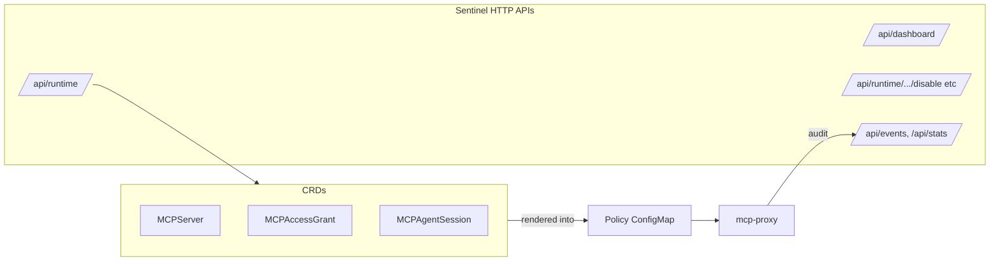
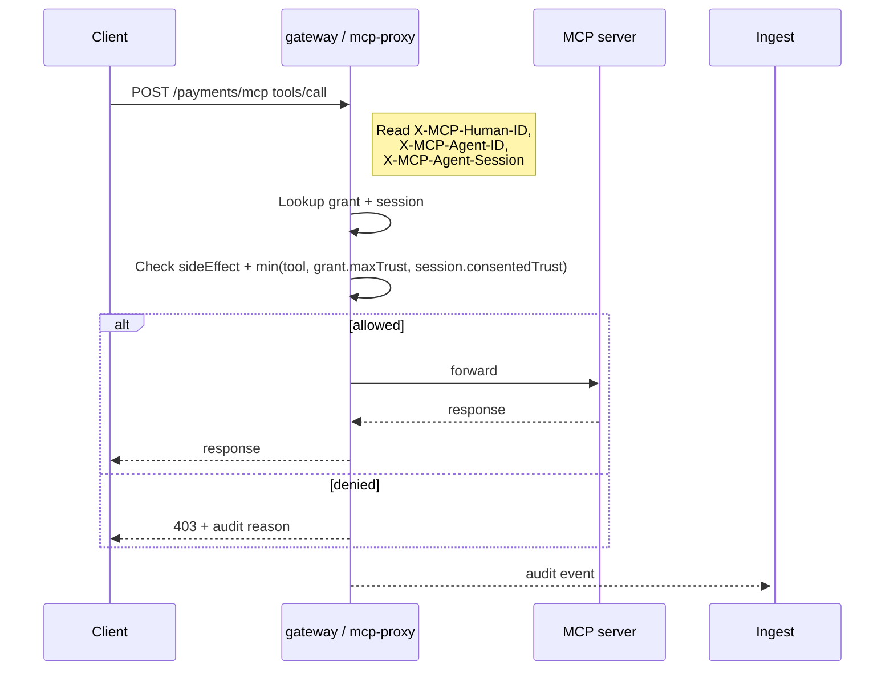

# API Reference

The MCP Runtime API surface comes in three layers:

1. **CRDs** under `mcpruntime.org/v1alpha1`: `MCPServer`, `MCPAccessGrant`, `MCPAgentSession`.
2. **Gateway headers** carried on live MCP requests when `gateway.enabled`.
3. **Sentinel HTTP APIs** exposed by `services/api`: dashboard, runtime governance, governance actions, analytics.



## Core resources

| Kind | Purpose |
|---|---|
| **MCPServer** | Runtime deployment spec plus gateway, auth, policy, session, tool inventory, rollout, and analytics settings. |
| **MCPAccessGrant** | Who can use which server, for which side-effect classes and tools, with what admin-side maximum trust. |
| **MCPAgentSession** | Server-side consented trust, expiry, revocation, and upstream token references per agent session. |

## MCPServer surface

| Group | Fields |
|---|---|
| **Workload + routing** | `image`, `imageTag`, `registryOverride`, `replicas`, `port`, `servicePort`, `publicPathPrefix`, `ingressPath`, `ingressHost`, `ingressClass`, `ingressAnnotations` |
| **Resources + env** | CPU/memory `requests`/`limits`, literal `envVars`, secret-backed `secretEnvVars`, `imagePullSecrets` |
| **Identity + policy** | `tools[]`, `auth`, `policy`, `session`, `gateway` |
| **Delivery** | `analytics`, `rollout`, `useProvisionedRegistry` |
| **Advanced knobs** | `gateway.stripPrefix`, `session.upstreamTokenHeader`, `analytics.apiKeySecretRef`, `rollout.maxUnavailable`, `rollout.maxSurge` |

### Enums and semantics

| Enum | Values | Notes |
|---|---|---|
| **auth.mode** | `none`, `header`, `oauth` | Working path today is `header` (identity extraction at the gateway). |
| **policy.mode** | `allow-list`, `observe` | `allow-list` enforces deny-by-default; `observe` keeps the decision path visible. |
| **trust** | `low`, `medium`, `high` | Used on tools, grants, sessions. Effective trust = min(grant, session). |
| **tool sideEffect** | `read`, `write`, `destructive` | Required on each listed tool. Grants must include the tool's side effect in `allowedSideEffects` before a tool call can pass. |
| **rollout.strategy** | `RollingUpdate`, `Recreate`, `Canary` | Available on `spec.rollout`. |

### Validation rules in code

- `analytics.enabled` requires `gateway.enabled`.
- `gateway.port` must differ from `spec.port`.
- Every listed `tools[]` entry must declare `sideEffect`.
- Canary rollouts require positive `canaryReplicas` strictly less than total replicas.

### Status

`MCPServer.status` exposes `phase`, `message`, `conditions[]`, and per-resource readiness booleans for `deployment`, `service`, `ingress`, `gateway`, `policy`. `MCPAccessGrant` and `MCPAgentSession` expose `phase`, `message`, and `conditions[]`.

### MCPServer example

```yaml
apiVersion: mcpruntime.org/v1alpha1
kind: MCPServer
metadata:
  name: payments
  namespace: mcp-servers
spec:
  teamID: 7d0a0b8f-7c25-4761-a632-3cf0108e31d6
  description: Payments MCP server for invoice lookup and refund workflows.
  image: registry.example.com/payments-mcp
  port: 8088
  publicPathPrefix: payments
  gateway:
    enabled: true
  auth:
    mode: header
    humanIDHeader: X-MCP-Human-ID
    agentIDHeader: X-MCP-Agent-ID
    teamIDHeader: X-MCP-Team-ID
    sessionIDHeader: X-MCP-Agent-Session
  policy:
    mode: allow-list
    defaultDecision: deny
    enforceOn: call_tool
    policyVersion: v1
  session:
    required: true
    store: kubernetes
    headerName: X-MCP-Agent-Session
    maxLifetime: 24h
    idleTimeout: 1h
  tools:
    - name: list_invoices
      description: List invoices for a customer account.
      requiredTrust: low
      sideEffect: read
    - name: refund_invoice
      description: Issue a refund for an invoice.
      requiredTrust: high
      sideEffect: destructive
  analytics:
    enabled: true
    ingestURL: http://mcp-sentinel-ingest.mcp-sentinel.svc.cluster.local:8081/events
  rollout:
    strategy: Canary
    canaryReplicas: 1
```

## Grants and sessions

`MCPAccessGrant.spec.disabled` and `MCPAgentSession.spec.revoked` are the hard kill switches — they turn off access without deleting the underlying object's history.

`MCPServer.spec.teamID` records the owning platform team. `SubjectRef` has
`humanID`, `agentID`, and `teamID`; the gateway matches every non-empty subject
field exactly. A grant with only `subject.teamID` applies to any authenticated
principal from that team when trusted header or OAuth team identity is present.
See [Multi-team isolation](multi-team.md).

The platform API enforces the namespace boundary for access writes. Grants and
sessions must live in the same namespace as their `serverRef`; non-admin
callers cannot write access resources into the shared `mcp-servers` catalog
namespace and can only operate in namespaces authorized on their principal.
Team namespace server writes default and validate `spec.teamID` against the
authenticated principal namespace. Grant/session writes default missing
`subject.teamID` from the referenced server team, while preserving an explicit
foreign `subject.teamID` for delegated cross-team access. The gateway still
matches every non-empty subject field exactly.

### MCPAccessGrant

`allowedSideEffects` is independent from `toolRules`: tool rules select names,
and side-effect allowances select risk kind. A call must pass both.

```yaml
apiVersion: mcpruntime.org/v1alpha1
kind: MCPAccessGrant
metadata:
  name: payments-ops-agent
  namespace: mcp-servers
spec:
  serverRef:
    name: payments
  subject:
    humanID: user-123
    agentID: ops-agent
    teamID: 7d0a0b8f-7c25-4761-a632-3cf0108e31d6
  maxTrust: high
  allowedSideEffects:
    - read
    - destructive
  policyVersion: v1
  toolRules:
    - name: list_invoices
      decision: allow
      requiredTrust: low
    - name: refund_invoice
      decision: allow
      requiredTrust: high
```

### MCPAgentSession

```yaml
apiVersion: mcpruntime.org/v1alpha1
kind: MCPAgentSession
metadata:
  name: sess-8f1b9d
  namespace: mcp-servers
spec:
  serverRef:
    name: payments
  subject:
    humanID: user-123
    agentID: ops-agent
    teamID: 7d0a0b8f-7c25-4761-a632-3cf0108e31d6
  consentedTrust: medium
  expiresAt: "2026-03-26T12:00:00Z"
  upstreamTokenSecretRef:
    name: payments-upstream-token
    key: access-token
```

## Security and auth

### Implemented today

- **Header-based identity** at the gateway (default path).
- **Optional bearer-token validation** against JWKS / issuer / audience on `mcp-sentinel` API + ingest services.
- `spec.auth.mode: oauth` exists on the type as a forward-looking shape.

### Not yet implemented

No `/authorize`, `/token`, `/.well-known/oauth-authorization-server`, PKCE, or Dynamic Client Registration endpoint in this release.

### Practical model

- Use the **gateway** for human, agent, and session identity headers.
- Use **MCPAccessGrant + MCPAgentSession** for side-effect permissions, trust, and revocation.
- Use **OIDC-issued bearer tokens** only where Sentinel services validate them.

## Authentication API

These routes are served by `services/api`. Platform identity routes require the
Postgres-backed platform store (`POSTGRES_DSN` or `DATABASE_URL`) and
`PLATFORM_JWT_SECRET`.

```text
POST /api/auth/signup
POST /api/auth/login
POST /api/auth/oidc
GET  /api/auth/me
```

| Route | Body / response |
|---|---|
| `POST /api/auth/signup` | Body: `email`, `password`, optional `role`. Returns `201` with `access_token`, `token_type`, `expires_in`, and `user`. Admin signup requires an admin principal. |
| `POST /api/auth/login` | Body: `email`, `password`. Returns `200` with `access_token`, `token_type`, `expires_in`, and `user`. |
| `POST /api/auth/oidc` | Body: `id_token`. Requires configured issuer, audience, and JWKS. Returns `200` with `access_token`, `token_type`, `expires_in`, and `user`. |
| `GET /api/auth/me` | Requires auth. Returns `authenticated=true` and the current principal. |

## Gateway flow and headers



- **Enforcement point:** authorization is evaluated at `call_tool` / `tools/call`, not at discovery time.
- **Allow-list first:** missing grants deny by default unless the policy explicitly overrides the default decision. Empty `toolRules` means name-unrestricted access, still constrained by `allowedSideEffects` and trust.
- **Side-effect guard:** `allowedSideEffects` is fail-closed. If it is omitted or empty, no tool side-effect class is allowed by that grant.
- **Audit on allow and deny:** the gateway emits decision, reason, trust levels, required side effect, human, agent, session, server, cluster, and namespace fields.

```text
X-MCP-Human-ID:    user-123
X-MCP-Agent-ID:    ops-agent
X-MCP-Agent-Session: sess-8f1b9d
```

## Dashboard API

Overview statistics and usage analytics for the admin dashboard.

```text
GET /api/dashboard/summary
GET /api/analytics/usage?limit=10
```

Requires admin authentication. For direct curl/API clients, send an
`x-api-key` value that is present in both `API_KEYS` and `ADMIN_API_KEYS`.
`setup` keeps `UI_API_KEY` in both lists for browser/API-key admin login.
`INGEST_API_KEYS` is only for event ingestion and is not accepted here.

`/api/dashboard/summary` returns: `total_events`, `active_servers`,
`active_grants`, `active_sessions`, `latest_source`, `last_event_type`,
`last_event_time`.

`/api/analytics/usage` reads the ClickHouse event stream and returns admin
usage rollups for the dashboard: totals, top MCP servers, top human/agent
pairs, top tools, and decision counts. Query: `limit` (1-50, default 10).

## Runtime Governance API

Manage access grants, sessions, and view runtime state. All `/api/runtime/*`
routes require an authenticated platform bearer token or `x-api-key`; requests
without authentication receive `401`. `POST` requests create or update the
Kubernetes CRs that the operator renders into the gateway policy ConfigMap.

For `POST /api/runtime/grants` and `POST /api/runtime/sessions`, the API resolves `serverRef` to an `MCPServer` in the cluster. If that server does not exist, the call returns `400` with a clear `unknown serverRef` message. The server lookup is **not** part of a single distributed transaction with the grant/session write — a concurrent delete can leave a stale reference (same as `kubectl apply`). Kubernetes apply errors are surfaced with the status the API server would use, when available.

```text
GET  /api/runtime/servers              # List authenticated MCP catalog entries
POST /api/runtime/servers              # Create/update MCPServer in an authorized namespace
DELETE /api/runtime/servers/{namespace}/{name} # Retire one MCPServer
GET  /api/runtime/server-events?namespace=&server= # Recent analytics events for one server
GET  /api/runtime/grants               # List MCPAccessGrant resources
GET  /api/runtime/grants/{namespace}/{name}   # Get one MCPAccessGrant
POST /api/runtime/grants               # Create or update an MCPAccessGrant (x-api-key)
DELETE /api/runtime/grants/{namespace}/{name} # Delete one MCPAccessGrant
GET  /api/runtime/sessions             # List MCPAgentSession resources
GET  /api/runtime/sessions/{namespace}/{name} # Get one MCPAgentSession
POST /api/runtime/sessions             # Create or update an MCPAgentSession (x-api-key)
DELETE /api/runtime/sessions/{namespace}/{name} # Delete one MCPAgentSession
GET  /api/runtime/teams                # Admin: all teams; user: caller memberships
POST /api/runtime/teams                # Admin-only team + namespace provisioning
GET  /api/runtime/teams/{team}         # Team metadata (admin/member)
POST /api/runtime/teams/{team}/members # Admin/team-owner membership upsert
DELETE /api/runtime/teams/{team}/members/{userID}
GET  /api/runtime/namespaces           # Allowed namespaces + org catalog metadata
GET  /api/runtime/namespaces/{namespace}
GET  /api/runtime/components           # Sentinel component health status
GET  /api/runtime/policy?namespace=&server=   # Get rendered policy for a server
```

For non-admin users, runtime scope depends on `PLATFORM_MODE` / setup
`--platform-mode`. In `tenant` mode, `GET /api/runtime/servers` without a
`namespace` query returns MCPs in their own user/team tenant namespaces. In
`org` mode, signed-in users can use the org catalog namespace and their
owned/team namespaces. In `public` mode, anonymous users can list the
`mcp-servers-public` catalog, while signed-in users can publish to the public
catalog and their owned/team namespaces. Admin callers can inspect any
namespace. Passing `namespace=<name>` narrows the list to an authorized
namespace for the active mode.

`POST /api/runtime/servers` is governed by the platform publish policy. Admins
configure `PLATFORM_MCP_ACTIVE_SERVER_LIMIT` (default `5`, set `0` to disable)
and `PLATFORM_MCP_PUSH_COOLDOWN` (Go duration such as `30m`, default `0s` to
disable). A quota or cooldown denial returns `429` with a clear error; cooldown
responses include `next_allowed_at` and `Retry-After`. `GET /api/runtime/servers`
includes `publish_policy` so UI clients can show the active limit and count.
`DELETE /api/runtime/servers/{namespace}/{name}` retires a server and frees one
active-server slot for the owning publisher. The active-server limit is enforced
by the platform API before Kubernetes apply; strict serialization of concurrent
publishes would require a shared reservation or admission-control layer.

### Grant apply body

```json
{
  "name": "payments-ops-agent",
  "namespace": "mcp-servers",
  "serverRef": {"name": "payments", "namespace": "mcp-servers"},
  "subject": {"humanID": "user-123", "agentID": "ops-agent"},
  "maxTrust": "high",
  "allowedSideEffects": ["read", "destructive"],
  "policyVersion": "v1",
  "toolRules": [
    {"name": "read_invoice", "decision": "allow"},
    {"name": "refund_invoice", "decision": "allow", "requiredTrust": "high"}
  ]
}
```

### Session apply body

```json
{
  "name": "sess-8f1b9d",
  "namespace": "mcp-servers",
  "serverRef": {"name": "payments", "namespace": "mcp-servers"},
  "subject": {"humanID": "user-123", "agentID": "ops-agent"},
  "consentedTrust": "medium",
  "policyVersion": "v1",
  "expiresAt": "2030-12-31T23:59:00Z"
}
```

## Governance Actions API

Safe operational actions for grants, sessions, and components.

```text
POST /api/runtime/grants/{namespace}/{name}/disable
POST /api/runtime/grants/{namespace}/{name}/enable
POST /api/runtime/sessions/{namespace}/{name}/revoke
POST /api/runtime/sessions/{namespace}/{name}/unrevoke
POST /api/runtime/actions/restart     # Body: {component: "api"} or {all: true}
```

| Action | Effect |
|---|---|
| **Grant Toggle** | Enable / disable an `MCPAccessGrant` without deleting it. Disabled grants deny access at the gateway. |
| **Session Revoke** | Revoke / unrevoke an `MCPAgentSession`. Revoked sessions cannot be used for tool calls. |
| **Component Restart** | Rolling restart of Sentinel components (`api`, `ingest`, `processor`, `gateway`, `ui`) or all. |

## Platform Admin and User API

Additional authenticated routes exposed by the API service:

```text
GET  /api/deployments                  # User-scoped deployment list
POST /api/deployments                  # Apply a platform-managed Deployment + Service
DELETE /api/deployments/{namespace}/{name}
GET  /api/admin/namespaces             # Admin-only namespace inventory
GET  /api/admin/deployments            # Admin-only deployment inventory
GET  /api/admin/audit                  # Admin-only audit timeline; supports user/since/until/limit
GET  /api/admin/operations             # Admin-only user, image, deployment, and timeline view
GET  /api/user/api-keys                # List caller-owned API keys
POST /api/user/api-keys                # Create caller-owned API key
POST /api/user/api-keys/{id}/revoke    # Revoke caller-owned API key
GET  /api/user/registry-credentials    # List caller-owned registry credentials
POST /api/user/registry-credentials    # Create a registry credential
POST /api/user/registry-credentials/{id}/revoke
POST /api/user/activity/image-publish  # Record a successful user image publish event
```

User API-key creation returns the cleartext key once as both `api_key` and
`one_time_key`; clients should store it immediately.

Deployment apply body:

```json
{
  "name": "payments",
  "image": "registry.example.com/payments-mcp",
  "version": "v1.0.0",
  "port": 8088,
  "replicas": 1,
  "namespace": "team-a"
}
```

For non-admin users, deployment operations are scoped to the caller's namespace.
Admins may pass `namespace`; if omitted, admin list calls can span namespaces.
Successful and failed platform deployment, API key, registry credential, login,
and image publish actions are written to platform audit logs where platform
identity storage is enabled. `GET /api/admin/operations` returns a filtered
operations snapshot with `users`, `audit_logs`, `images`, and `deployments`.
Filters: `user` (email, user ID, namespace, resource, or image match), `since`,
`until` (RFC3339 or `YYYY-MM-DD`), and `limit` (1-200). Image activity includes
CLI-reported `registry push` events when the CLI has platform credentials plus
currently deployed image references from platform-managed Kubernetes
deployments; the bundled Docker registry does not emit a full raw push ledger.

## Analytics API

Read API over the ClickHouse-backed event stream.

```text
GET /api/events?limit=100
GET /api/stats
GET /api/sources
GET /api/event-types
GET /api/analytics/usage?limit=10
GET /api/events/filter?server=payments&decision=deny&agent_id=ops-agent&limit=50
```

| Group | Fields |
|---|---|
| **Filter fields** | `source`, `event_type`, `server`, `namespace`, `cluster`, `human_id`, `agent_id`, `session_id`, `decision`, `tool_name` |
| **Audit payload fields** | `decision`, `reason`, `policy_version`, `required_trust`, `required_side_effect`, `admin_trust`, `consented_trust`, `effective_trust` |
| **Transport fields** | `method`, `path`, `status`, `latency_ms`, `bytes_in`, `bytes_out`, `rpc_method` |

## Setup integration

`mcp-runtime setup` builds the runtime operator image, the gateway proxy image, the analytics service images, and deploys the bundled analytics stack by default. Use `--without-sentinel` to skip the request-path stack and keep only the runtime / operator footprint.

## Next

- [Sentinel](sentinel.md) — what each HTTP surface above maps to.
- [Architecture](architecture.md) — how requests flow through the gateway.
- [internals/api-types.md](internals/api-types.md) — contributor-oriented guide to the CRD Go types and generated API contract.
