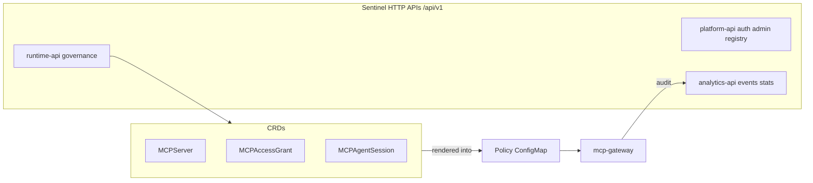
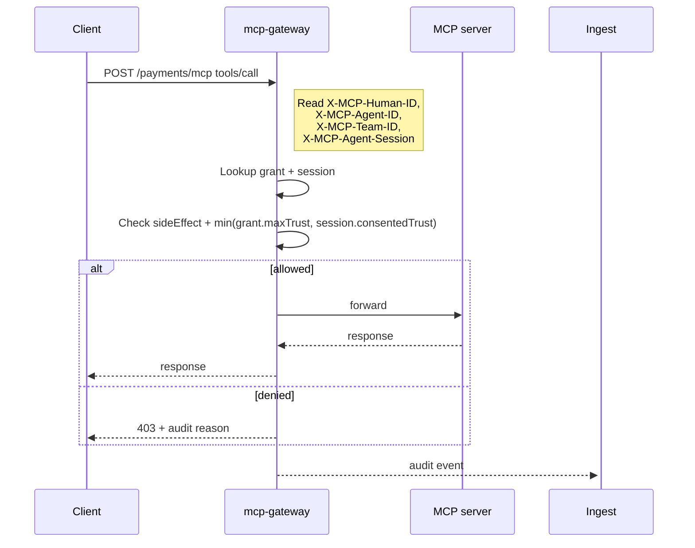

# API Reference

The MCP Runtime API has three layers:

1. **CRDs** under `mcpruntime.org/v1alpha1`: `MCPServer`, `MCPAccessGrant`, `MCPAgentSession`.
2. **Gateway headers** carried on live MCP requests when `gateway.enabled`.
3. **Sentinel HTTP APIs** exposed by **platform-api**, **runtime-api**, and **analytics-api** (routed at `/api/v1/*` via Traefik): platform identity, runtime governance, governance actions, and analytics.

> **Path prefix:** Public HTTP routes use `/api/v1/*` only. Legacy `/api/*` paths return `404`. Traefik routes each prefix to **platform-api**, **runtime-api**, or **analytics-api**; see [route ownership](#route-ownership) below and [`docs/sentinel.md`](sentinel.md).

### Route ownership

Traefik ingress (`internal/cli/setup/ingressmanifest/paths.go`, `k8s/10-gateway.yaml`) maps prefixes to Deployments. A direct port-forward to one service works for debugging but does not match public routing.

| Service | Deployment | Owns (prefix examples) |
|---|---|---|
| **platform-api** | `mcp-platform-api` | `/api/v1/auth/*`, `/api/v1/users`, `/api/v1/registry/authz`, `/api/v1/user/registry-credentials`, `/api/v1/user/activity/*`, `/api/v1/admin/namespaces`, `/api/v1/admin/audit` |
| **runtime-api** | `mcp-runtime-api` | `/api/v1/runtime/*`, `/api/v1/deployments`, `/api/v1/dashboard/*`, `/api/v1/user/api-keys`, `/api/v1/admin/deployments`, `/api/v1/admin/operations` |
| **analytics-api** | `mcp-analytics-api` | `/api/v1/events`, `/api/v1/stats`, `/api/v1/sources`, `/api/v1/event-types`, `/api/v1/analytics/*`, `/api/v1/user/analytics/*` |

Platform login (`POST /api/v1/auth/login`) issues JWTs whose `aud` claim includes `platform-api`, `runtime-api`, and `analytics-api` so one bearer token works across the split surface (`pkg/platformauth`).

Each API service also serves unauthenticated `GET /health` and `GET /ready` outside `/api/v1`. `/ready` reports dependency health and returns `503` when it is missing: Postgres for platform-api, the Kubernetes client for runtime-api, and ClickHouse for analytics-api. The `mcp-gateway` sidecar has its own `/health`, `/ready`, `/config/status`, and `/metrics` endpoints; see [`docs/runtime.md`](runtime.md#gateway-policy-snapshots).


```mermaid
flowchart LR
    subgraph CRDs
        Server[MCPServer]
        Grant[MCPAccessGrant]
        Session[MCPAgentSession]
    end
    subgraph HTTP["Sentinel HTTP APIs /api/v1"]
        Plat[platform-api auth admin registry]
        Run[runtime-api governance]
        Ana[analytics-api events stats]
    end
    CRDs -- rendered into --> Policy[Policy ConfigMap]
    Policy --> Gateway[mcp-gateway]
    Gateway -->|audit| Ana
    Run --> CRDs
```

## Core resources

| Kind | Purpose |
|---|---|
| **MCPServer** | Runtime deployment spec plus gateway, auth, policy, session, tool inventory, rollout, and analytics settings. |
| **MCPAccessGrant** | Who can use which server, for which side-effect classes and tools, with what admin-side maximum trust. |
| **MCPAgentSession** | Server-side consented trust, expiry, revocation, and upstream token references per agent session. |

## MCPServer surface

| Group | Fields |
|---|---|
| **Workload + routing** | `image`, `imageTag`, `registryOverride`, `replicas`, `port`, `servicePort`, `publicPathPrefix`, `ingressPath`, `ingressHost`, `ingressClass`, `ingressAnnotations` |
| **Resources + env** | CPU/memory `requests`/`limits`, literal `envVars`, secret-backed `secretEnvVars`, `imagePullSecrets` |
| **Identity + policy** | `tools[]`, `auth`, `policy`, `session`, `gateway` |
| **Delivery** | `analytics`, `rollout`, `useProvisionedRegistry` |
| **Advanced knobs** | `gateway.stripPrefix`, `session.upstreamTokenHeader`, `analytics.apiKeySecretRef`, `rollout.maxUnavailable`, `rollout.maxSurge` |

### Enums and semantics

| Enum | Values | Notes |
|---|---|---|
| **auth.mode** | `none`, `header`, `oauth` | `header` is the default identity-extraction path. `oauth` enables MCP protected-resource metadata and JWT validation at the gateway. Adapter certificates authenticate adapters on OAuth-configured routes; clients without a certificate use OAuth. |
| **policy.mode** | `allow-list`, `observe` | `allow-list` enforces deny-by-default. `observe` skips identity, grant, session, side-effect, and trust enforcement. Calls are forwarded, and audit events still record the tool and risk level. |
| **trust** | `low`, `medium`, `high` | Used on tools, grants, sessions. Effective trust = min(grant `maxTrust`, session `consentedTrust`); required trust = max(tool `requiredTrust`, matching tool rule `requiredTrust`). |
| **tool sideEffect** | `read`, `write`, `destructive` | Required on each listed tool. Grants must include the tool's side effect in `allowedSideEffects` before a tool call can pass. |
| **tool riskLevel** | `low`, `medium`, `high` | Optional informational catalog/audit badge. If omitted, the platform computes a default from trust and side effect. It does not gate calls. |
| **rollout.strategy** | `RollingUpdate`, `Recreate`, `Canary` | Available on `spec.rollout`. |

### Validation rules in code

- Analytics emission requires `gateway.enabled`. To opt out per server, set `analytics.disabled: true` or omit the analytics block.
- `gateway.port` must differ from `spec.port`.
- Every listed `tools[]` entry must declare `sideEffect`. A tool called at runtime that the server never declared has no side effect to check, so the gateway fails closed with `403 tool_side_effect_unknown`.
- Canary rollouts require positive `canaryReplicas` strictly less than total replicas.
- Persisted `auth.mode: mtls` values are rejected; migrate the MCPServer to `auth.mode: oauth` with `gateway.enabled: true`, `issuerURL`, and `audience`.
- `auth.mode: oauth` derives an unset `auth.audience` from the canonical public MCP URL. An explicit audience must be an absolute URI without a fragment. `auth.issuerURL` is defaulted from the configured bundled issuer when available; otherwise it is required with the gateway enabled.

### Status

`MCPServer.status` exposes `phase`, `message`, `conditions[]`, and per-resource readiness booleans `deploymentReady`, `serviceReady`, `ingressReady`, `gatewayReady`, `policyReady`, plus `canaryReady` for canary rollouts. `MCPAccessGrant` and `MCPAgentSession` expose `phase`, `message`, and `conditions[]`.

### MCPServer example

```yaml
apiVersion: mcpruntime.org/v1alpha1
kind: MCPServer
metadata:
  name: payments
  namespace: mcp-servers
spec:
  teamID: 7d0a0b8f-7c25-4761-a632-3cf0108e31d6
  description: Payments MCP server for invoice lookup and refund workflows.
  image: registry.example.com/payments-mcp
  port: 8088
  publicPathPrefix: payments
  gateway:
    enabled: true
  auth:
    mode: header
    humanIDHeader: X-MCP-Human-ID
    agentIDHeader: X-MCP-Agent-ID
    teamIDHeader: X-MCP-Team-ID
    sessionIDHeader: X-MCP-Agent-Session
  policy:
    mode: allow-list
    defaultDecision: deny
    enforceOn: call_tool
    policyVersion: v1
  session:
    required: true
    store: kubernetes
    headerName: X-MCP-Agent-Session
    maxLifetime: 24h
    idleTimeout: 1h
  tools:
    - name: list_invoices
      description: List invoices for a customer account.
      requiredTrust: low
      sideEffect: read
      riskLevel: low
    - name: refund_invoice
      description: Issue a refund for an invoice.
      requiredTrust: high
      sideEffect: destructive
      riskLevel: high
  rollout:
    strategy: Canary
    canaryReplicas: 1
```

## Grants and sessions

`MCPAccessGrant.spec.expiresAt` can bound a delegation. At or after that time
the gateway ignores the grant and the Runtime API will not issue or refresh a
session from it. Session expiry is capped by the grant expiry. Set
`MCPAccessGrant.spec.disabled` to revoke earlier; it and
`MCPAgentSession.spec.revoked` are hard kill switches that keep object history.

`MCPServer.spec.teamID` records the owning platform team. `SubjectRef` has
`humanID`, `agentID`, and `teamID`; the gateway matches every non-empty subject
field exactly. An all-empty `subject` is a wildcard grant (the validating
webhook emits a warning): the gateway matches any authenticated principal for
the server, while adapter session creation still requires subject alignment
with the caller. A grant with only `subject.teamID` applies to any authenticated
principal from that team when trusted header or OAuth team identity is present.
See [Multi-team isolation](multi-team.md).

The platform API enforces the namespace boundary for access writes. Grants and
sessions must live in the same namespace as their `serverRef`; non-admin
callers cannot write access resources into the shared `mcp-servers` catalog
namespace and can only operate in namespaces authorized on their principal.
Team namespace server writes default and validate `spec.teamID` against the
authenticated principal namespace. Grant/session writes default missing
`subject.teamID` from the referenced server team, while preserving an explicit
foreign `subject.teamID` for delegated cross-team access. The gateway still
matches every non-empty subject field exactly.

### MCPAccessGrant

`allowedSideEffects` and `toolRules` are independent. Tool rules select names;
side-effect allowances select risk kind. A call must pass both. The
Runtime Governance API and UI require at least one `allowedSideEffects` entry
when creating or updating a grant; direct CRD objects that omit it still
evaluate fail-closed.

```yaml
apiVersion: mcpruntime.org/v1alpha1
kind: MCPAccessGrant
metadata:
  name: payments-ops-agent
  namespace: mcp-servers
spec:
  serverRef:
    name: payments
  subject:
    humanID: user-123
    agentID: ops-agent
    teamID: 7d0a0b8f-7c25-4761-a632-3cf0108e31d6
  maxTrust: high
  expiresAt: "2030-12-31T23:59:00Z"
  allowedSideEffects:
    - read
    - destructive
  policyVersion: v1
  toolRules:
    - name: list_invoices
      decision: allow
      requiredTrust: low
    - name: refund_invoice
      decision: allow
      requiredTrust: high
```

### MCPAgentSession

```yaml
apiVersion: mcpruntime.org/v1alpha1
kind: MCPAgentSession
metadata:
  name: sess-8f1b9d
  namespace: mcp-servers
spec:
  serverRef:
    name: payments
  subject:
    humanID: user-123
    agentID: ops-agent
    teamID: 7d0a0b8f-7c25-4761-a632-3cf0108e31d6
  consentedTrust: medium
  expiresAt: "2026-03-26T12:00:00Z"
  upstreamTokenSecretRef:
    name: payments-upstream-token
    key: access-token
```

## Security and auth

### Implemented today

- **Header-based identity** at the gateway (default path).
- **Optional bearer-token validation** against JWKS / issuer / audience on the split Sentinel API services (`platform-api`, `runtime-api`, `analytics-api`) and on ingest.
- `spec.auth.mode: oauth` enables the gateway as an MCP OAuth protected resource. It publishes Protected Resource Metadata, validates issuer and audience/resource binding (against the configured `auth.audience`), and strips the client bearer token before forwarding upstream.
- OAuth authentication failures return `401` with an authorization challenge. Authenticated OAuth policy denials return `403` without an `insufficient_scope` challenge because Runtime policy decisions are not OAuth scope negotiation. See the [MCP Authorization specification](https://modelcontextprotocol.io/specification/2026-07-28/basic/authorization).

### Optional bundled authorization server

The optional bundled `mcp-auth-server` image is an OAuth authorization server for MCP
clients. Enable it explicitly with `mcp-runtime setup --with-mcp-auth-server`
in test or production mode, or deploy an equivalent authorization server
separately. Production mode requires an HTTPS issuer and resource, a selected
OIDC connector, a TLS Secret, and a persistent signing-key Secret.

When its public issuer is `https://auth.example.com/mcp-auth`, it exposes:

- `GET https://auth.example.com/.well-known/oauth-authorization-server/mcp-auth`. RFC 8414 inserts the well-known segment before the issuer path, so the discovery document is outside the issuer URL. OIDC discovery compatibility paths are also served.
- `GET /oauth/jwks.json`
- `GET, POST /oauth/authorize` with mandatory S256 PKCE
- `POST /oauth/token` for authorization-code and rotating refresh-token grants
- `POST /oauth/register` for deprecated Dynamic Client Registration compatibility

Use OAuth Client ID Metadata Documents (CIMD) where possible. The server
fetches and validates an HTTPS `client_id` URL when the client is not
pre-registered. Clients that cannot use CIMD fall back to DCR at
`/oauth/register`. Redirect URIs are exact-match, except that native loopback
clients may select an ephemeral port. All other URI components must match, and
non-loopback redirects must use HTTPS. Access tokens are RS256 JWTs
with the MCP `resource` as their audience; the gateway validates that audience
and never forwards the bearer token to an upstream MCP server.

### MCP SDK boundary

Use the official MCP SDK in an application service for Streamable HTTP,
JSON-RPC, tool/resource dispatch, and client-side OAuth flows. The SDK's
server authorization middleware verifies tokens; it does not issue them. MCP
Runtime terminates OAuth at the gateway, which applies resource audience checks,
grants, agent sessions, scopes, and token stripping before forwarding a request
to the SDK-backed application. Do not add a
second bearer-token gate to the upstream application unless that application
is intentionally exposed outside the gateway.

Configure the MCP server's external `auth.issuerURL` and `auth.audience` to
match the authorization server and canonical MCP resource. The operator can
default both from its configured bundled issuer and public MCP route.
`auth.audience` is the single resource identifier for the server. It must be an
absolute URI without a fragment. The gateway publishes it as `resource` in
Protected Resource Metadata and validates the token's audience against it, so a
client that follows the metadata requests a token the gateway accepts.
Do not enable insecure HTTP or ephemeral signing keys outside local
development.

For local Cursor testing, set `OAUTH_ALLOWED_REDIRECT_URI_SCHEMES=cursor`.
This allow-lists Cursor's native `cursor://anysphere.cursor-mcp/oauth/callback`
redirect. Other custom URI schemes are rejected. Leave the setting empty in
production.

Gateway pods use `OAUTH_INTERNAL_ISSUER_URL` for authorization-server
discovery and JWKS retrieval when the public issuer is reachable only through a
workstation port-forward. The public issuer remains unchanged for JWT issuer
validation. Setup sets this backchannel to the in-cluster `mcp-auth-server`
service when its opt-in fixture is enabled.

### Practical model

- Use the **gateway** for human, agent, and session identity headers.
- Use **MCPAccessGrant + MCPAgentSession** for side-effect permissions, trust, and revocation.
- Use **OIDC-issued bearer tokens** only where Sentinel services validate them.

## Authentication API

These routes are served by the split API services (`platform-api`, `runtime-api`, `analytics-api`) at `/api/v1/*`. Platform identity routes require the
Postgres-backed platform store (`POSTGRES_DSN` or `DATABASE_URL`) and
`JWT_SECRET`.

```text
POST /api/v1/auth/signup
POST /api/v1/auth/login
POST /api/v1/auth/oidc
GET  /api/v1/auth/me
```

| Route | Body / response |
|---|---|
| `POST /api/v1/auth/signup` | Body: `email`, `password`, optional `role`. Returns `201` with `access_token`, `token_type`, `expires_in`, and `user`. Admin signup requires an admin principal. |
| `POST /api/v1/auth/login` | Body: `email`, `password`. Returns `200` with `access_token`, `token_type`, `expires_in`, and `user`. |
| `POST /api/v1/auth/oidc` | Body: `id_token`. Requires configured issuer and audience; JWKS is read from issuer discovery when `OIDC_JWKS_URL` is unset. Returns `200` with `access_token`, `token_type`, `expires_in`, and `user`. |
| `GET /api/v1/auth/me` | Requires auth. Returns `authenticated=true` and the current principal. |

`setup` writes OIDC settings through `mcp-sentinel-config`. For Google sign-in,
set `GOOGLE_CLIENT_ID` before setup; when the issuer, audience, and JWKS URL are
empty, setup derives the standard Google OIDC values from that client ID. For
other OIDC providers, set `OIDC_ISSUER` and `OIDC_AUDIENCE`; the services
discover the JWKS URL from the issuer when `OIDC_JWKS_URL` is unset. Set
`OIDC_JWKS_URL` explicitly for providers without OIDC discovery. Non-test
public TLS setup fails fast unless one of those browser login configurations
is present.

## Gateway flow and headers


```mermaid
sequenceDiagram
    participant Client
    participant Gateway as mcp-gateway
    participant Server as MCP server
    Client->>Gateway: POST /payments/mcp tools/call
    Note right of Gateway: Read X-MCP-Human-ID,<br/>X-MCP-Agent-ID,<br/>X-MCP-Team-ID,<br/>X-MCP-Agent-Session
    Gateway->>Gateway: Lookup grant + session
    Gateway->>Gateway: Check sideEffect + min(grant.maxTrust, session.consentedTrust)
    alt allowed
        Gateway->>Server: forward
        Server-->>Gateway: response
        Gateway-->>Client: response
    else denied
        Gateway-->>Client: 403 + audit reason
    end
    Gateway-->>+Ingest: audit event
```

- **Enforcement point:** authorization is evaluated at `call_tool` / `tools/call`, not at discovery time.
- **Allow-list first:** missing grants deny by default unless the policy explicitly overrides the default decision. Empty `toolRules` means name-unrestricted access, still constrained by `allowedSideEffects` and trust.
- **Side-effect guard:** `allowedSideEffects` is fail-closed. If it is omitted or empty, no tool side-effect class is allowed by that grant. A tool that the server did not declare in `tools[]` is denied for the same reason: there is no declared side effect to authorize.
- **Observe mode:** `policy.mode: observe` returns an allow before identity, session, grant, side-effect, and trust checks run. Traffic is still proxied and audited. Use it for visibility only; it enforces nothing.
- **Audit on allow and deny:** the gateway emits decision, reason, trust levels, required side effect, human, agent, session, server, cluster, and namespace fields.

```text
X-MCP-Human-ID:    user-123
X-MCP-Agent-ID:    ops-agent
X-MCP-Team-ID:     7d0a0b8f-7c25-4761-a632-3cf0108e31d6
X-MCP-Agent-Session: sess-8f1b9d
```

On OAuth routes, adapters may also present a session-bound client certificate.
Traefik verifies it before forwarding; the gateway still requires OAuth and
binds the token subject to the session encoded by the certificate. Clients
without a certificate use OAuth normally. Set
`MCP_ADAPTER_CERTIFICATES=true` with platform-wide `MCP_MTLS_CLUSTER_ISSUER`
and `MCP_TRUST_DOMAIN` to enable adapter enrollment.

## Dashboard API

Overview statistics and usage analytics for the admin and user dashboards.

```text
GET /api/v1/dashboard/summary                                    # admin only
GET /api/v1/analytics/usage?limit=10                             # admin only
GET /api/v1/user/analytics/usage?window_days=7&server=payments   # any authenticated user
```

The admin dashboard endpoints require admin authentication. For direct
curl/API clients, send an
`x-api-key` value that is present in both `API_KEYS` and `ADMIN_API_KEYS`.
`setup` keeps `UI_API_KEY` in both lists for browser/API-key admin login.
`INGEST_API_KEYS` is only for event ingestion and is not accepted here.

`/api/v1/dashboard/summary` returns: `total_events`, `active_servers`,
`active_grants`, `active_sessions`, `latest_source`, `last_event_type`,
`last_event_time`.

`/api/v1/analytics/usage` reads the ClickHouse event stream and returns admin
usage rollups for the dashboard: totals, top MCP servers, top human/agent
pairs, top tools, decision counts, recent activity, and request buckets.
Query: `limit` (1-50, default 10), `window_days` (1-365, default 30),
`namespace`, `team_id`, `server`, `decision`, and `tool_name`.

`/api/v1/user/analytics/usage` is available to normal platform users. It returns
the same analytics shape, but the API enforces scope before querying
ClickHouse: non-admin callers can see only events from team namespaces they
belong to, and the shared `mcp-servers` catalog is excluded from user
analytics. Query: `window_days`, `limit`, `namespace`, `server`, `decision`,
and `tool_name`. Passing `namespace` narrows the result only when the caller
owns that namespace or belongs to that team.

## Runtime Governance API

Manage access grants, sessions, and view runtime state. All `/api/v1/runtime/*`
routes require an authenticated platform bearer token or `x-api-key`; requests
without authentication receive `401`. `POST` requests create the Kubernetes CRs
that the operator renders into the gateway policy ConfigMap. Server redeploys
must opt in with `update: true`; grants and sessions remain create-or-update.

For `POST /api/v1/runtime/grants` and admin-only direct `POST /api/v1/runtime/sessions`, the API resolves `serverRef` to an `MCPServer` in the cluster. If that server does not exist, the call returns `400` with an `unknown serverRef` message. The server lookup is **not** in the same transaction as the grant/session write, so a concurrent delete can leave a stale reference (same as `kubectl apply`). Kubernetes apply errors are surfaced with the status the API server would use, when available. Non-admin grant mutations and session item mutations require the caller to be the server owner or a team owner for the server namespace; normal adapter flows use `POST /api/v1/runtime/adapter/sessions`.

```text
GET  /api/v1/runtime/servers              # List authenticated MCP catalog entries
GET  /api/v1/runtime/tools                # Tool inventory rows across visible servers
GET  /api/v1/runtime/servers/{namespace}/{name} # Get one MCPServer catalog entry
POST /api/v1/runtime/servers              # Create MCPServer; set update=true to redeploy an existing one
DELETE /api/v1/runtime/servers/{namespace}/{name} # Retire one MCPServer
GET  /api/v1/runtime/server-events?namespace=&server= # Recent analytics events for one administered server
GET  /api/v1/runtime/grants               # List MCPAccessGrant resources
GET  /api/v1/runtime/grants/{namespace}/{name}   # Get one MCPAccessGrant
POST /api/v1/runtime/grants               # Create or update an MCPAccessGrant (x-api-key)
DELETE /api/v1/runtime/grants/{namespace}/{name} # Delete one MCPAccessGrant
GET  /api/v1/runtime/sessions             # List MCPAgentSession resources
GET  /api/v1/runtime/sessions/{namespace}/{name} # Get one MCPAgentSession
POST /api/v1/runtime/sessions             # Admin/internal direct MCPAgentSession apply
DELETE /api/v1/runtime/sessions/{namespace}/{name} # Delete one MCPAgentSession
POST /api/v1/runtime/adapter/sessions     # Issue/reuse an adapter MCPAgentSession for a human/user principal
POST /api/v1/runtime/adapter/certificates # Sign an adapter CSR for an owned session (mTLS enrollment)
GET  /api/v1/runtime/observability/links  # Scoped Prometheus/Grafana links for one server
GET  /api/v1/runtime/observability/grafana/dashboard  # Scoped Grafana dashboard for one server
GET  /api/v1/runtime/observability/prometheus/query   # Allowlisted PromQL query IDs for one server
GET  /api/v1/runtime/teams                # Admin: all teams; user: caller memberships
POST /api/v1/runtime/teams                # Admin-only team + namespace provisioning
GET  /api/v1/runtime/teams/{team}         # Team metadata (admin/member)
GET  /api/v1/runtime/teams/{team}/members # List team memberships (admin/member)
PUT  /api/v1/runtime/teams/{team}/members/{userID} # Admin/team-owner membership upsert
DELETE /api/v1/runtime/teams/{team}/members/{userID}
GET  /api/v1/runtime/teams/{team}/agents # List/search team agents (admin/member)
POST /api/v1/runtime/teams/{team}/agents # Create agent (admin/team owner)
GET  /api/v1/runtime/agents/{id} # Read agent (admin/team member)
PATCH /api/v1/runtime/agents/{id} # Rename agent (admin/team owner)
POST /api/v1/runtime/agents/{id}/deactivate # Deactivate agent (admin/team owner)
POST /api/v1/runtime/agents/{id}/reactivate # Reactivate agent (admin/team owner)
POST /api/v1/runtime/registry/push        # Multipart docker-save upload; in-cluster skopeo push to platform registry
GET  /api/v1/runtime/namespaces           # Allowed namespaces + org catalog metadata
GET  /api/v1/runtime/namespaces/{namespace}
GET  /api/v1/runtime/components           # Admin-only Sentinel component health status
GET  /api/v1/runtime/policy?namespace=&server=   # Get rendered policy for an administered server
```

Agent list accepts `status=active|inactive`, a name substring in `q`, an opaque
`cursor`, and `limit` from 1 to 200 (default 50). New records receive immutable
IDs in the `agt_<26-character lowercase ULID>` format. Names are trimmed,
internal whitespace is collapsed, and names are unique case-insensitively per
team, including inactive records. This directory records governance identity;
it does not authenticate an agent runtime. Runtime API grant and session writes,
adapter session issuance, and adapter certificate enrollment reject unknown,
inactive, malformed, or wrong-team agent IDs. Deactivation marks the agent
inactive and revokes its active sessions across namespaces; each revoked
session produces an audit event. If revocation is incomplete, the API returns
an error and a retry completes the remaining revocations.

Direct Kubernetes writes do not pass through these directory checks. In
particular, a cluster administrator can create an `MCPAgentSession` directly;
use the runtime API for session creation when directory enforcement is
required. Admission-time directory validation is not currently installed.

For non-admin users, runtime scope depends on `PLATFORM_MODE` / setup
`--platform-mode`. In `tenant` mode, `GET /api/v1/runtime/servers` without a
`namespace` query returns MCPs in the caller's team namespaces. In `org` mode,
signed-in users can use the org catalog namespace and their team namespaces.
In `public` mode, anonymous users can list the `mcp-servers-public` catalog,
while signed-in users can publish to the public catalog and their team
namespaces. Admin callers can inspect any
namespace. Passing `namespace=<name>` narrows the list to an authorized
namespace for the active mode. `POST /api/v1/runtime/servers` also accepts
`scope: "tenant" | "org" | "public"` in the JSON body. `scope: "public"`
requires public platform mode and resolves the active public catalog namespace;
`scope: "org"` requires org mode and resolves the active org catalog namespace;
`scope: "tenant"` uses the caller's team namespace unless the request passes an
authorized team `namespace`. If an `MCPServer` with the same name already
exists in the target namespace, the API returns `409` unless the request body
sets `update: true`.

`POST /api/v1/runtime/servers` is governed by the platform publish policy. Admins
configure `PLATFORM_MCP_ACTIVE_SERVER_LIMIT` (default `5`, set `0` to disable)
and `PLATFORM_MCP_PUSH_COOLDOWN` (Go duration such as `30m`, default `0s` to
disable). A quota or cooldown denial returns `429` with an error; cooldown
responses include `next_allowed_at` and `Retry-After`. `GET /api/v1/runtime/servers`
includes `publish_policy` so UI clients can show the active limit and count.
Server list/get responses keep CRD `tools`, `prompts`, `resources`, and
`tasks` as governance metadata and add `liveInventory` from the running MCP
server when runtime-api's short-TTL gateway probe has completed. On a cold
cache miss or probe failure, `liveInventory` is `null` and
`liveInventoryError` contains a short reason. For HTTP identity-authenticated
servers, probes use the server's configured `spec.auth.humanIDHeader` and
`spec.auth.agentIDHeader`; mTLS probes authenticate with their client
certificate. `DELETE /api/v1/runtime/servers/{namespace}/{name}` retires a server and frees one
active-server slot for the owning publisher. The active-server limit is
enforced by runtime-api before Kubernetes apply; strict serialization of
concurrent publishes would require a shared reservation or admission-control
layer.

Adapter session minting requires an authenticated principal with a subject or
email, such as a platform login bearer token or user API key. Service-only
setup keys authenticate but cannot mint adapter sessions because they do not
identify the human principal that should own the `MCPAgentSession`.

### Grant apply body

```json
{
  "name": "payments-ops-agent",
  "namespace": "mcp-servers",
  "serverRef": {"name": "payments", "namespace": "mcp-servers"},
  "subject": {"humanID": "user-123", "agentID": "ops-agent"},
  "maxTrust": "high",
  "allowedSideEffects": ["read", "destructive"],
  "policyVersion": "v1",
  "toolRules": [
    {"name": "read_invoice", "decision": "allow"},
    {"name": "refund_invoice", "decision": "allow", "requiredTrust": "high"}
  ]
}
```

### Session apply body

```json
{
  "name": "sess-8f1b9d",
  "namespace": "mcp-servers",
  "serverRef": {"name": "payments", "namespace": "mcp-servers"},
  "subject": {"humanID": "user-123", "agentID": "ops-agent"},
  "consentedTrust": "medium",
  "policyVersion": "v1",
  "expiresAt": "2030-12-31T23:59:00Z"
}
```

## Governance Actions API

Safe operational actions for grants, sessions, and components.

```text
PATCH /api/v1/runtime/grants/{namespace}/{name}
PATCH /api/v1/runtime/sessions/{namespace}/{name}
POST /api/v1/runtime/actions/restart     # Body: {component: "platform-api"} or {all: true}
```

| Action | Effect |
|---|---|
| **Grant Toggle** | Enable / disable an `MCPAccessGrant` without deleting it. Disabled grants deny access at the gateway. |
| **Session Revoke** | Revoke / unrevoke an `MCPAgentSession`. Revoked sessions cannot be used for tool calls. |
| **Component Restart** | Rolling restart of Sentinel components (`platform-api`, `runtime-api`, `analytics-api`, `ingest`, `processor`, `gateway`, `ui`) or all. |

## Platform admin and user API

Additional authenticated routes on the split API services (see [route ownership](#route-ownership)):

```text
POST /api/v1/users                        # platform-api: admin-only password user create
GET  /api/v1/deployments                  # User-scoped deployment list
POST /api/v1/deployments                  # Apply a platform-managed Deployment + Service
DELETE /api/v1/deployments/{namespace}/{name}
GET  /api/v1/admin/namespaces             # Admin-only namespace inventory
GET  /api/v1/admin/deployments            # Admin-only deployment inventory
GET  /api/v1/admin/audit                  # Admin-only audit timeline; supports user/since/until/limit
GET  /api/v1/admin/operations             # Admin-only user, image, deployment, and timeline view
GET  /api/v1/user/api-keys                # List caller-owned API keys
POST /api/v1/user/api-keys                # Create caller-owned API key
DELETE /api/v1/user/api-keys/{id}         # Revoke caller-owned API key
GET  /api/v1/user/analytics/usage         # User/team-scoped MCP server analytics
GET  /api/v1/user/registry-credentials    # List caller-owned registry credentials
POST /api/v1/user/registry-credentials    # Create a registry credential
DELETE /api/v1/user/registry-credentials/{id}
*    /api/v1/registry/authz               # Traefik forward-auth for registry ingress
POST /api/v1/user/activity/image-publish  # Record a successful user image publish event
```

User API-key creation returns the cleartext key once as both `api_key` and
`one_time_key`. Store it immediately.

The bundled `registry.<domain>` ingress calls `/api/v1/registry/authz` before
proxying Docker Registry API traffic. Platform admin credentials (`x-api-key` or
Bearer token) keep global registry access. Normal user API keys and platform
Bearer tokens are accepted only for repository paths scoped to the caller's
team slug or team namespace, such as `/v2/acme/demo/...` or
`/v2/mcp-team-acme/demo/...`.
In `public` mode, signed-in users may also write `/v2/public/...` (or the
configured public catalog namespace). In `org` mode, signed-in users may write
`/v2/org/...` (or the configured org catalog namespace). Anonymous requests and
catalog requests for inactive modes are rejected.

Deployment apply body:

```json
{
  "name": "payments",
  "image": "registry.example.com/payments-mcp",
  "version": "v1.0.0",
  "port": 8088,
  "replicas": 1,
  "namespace": "team-a"
}
```

For non-admin users, deployment operations are scoped to the caller's namespace.
Admins may pass `namespace`; if omitted, admin list calls can span namespaces.
Successful and failed platform deployment, API key, registry credential, login,
and image publish actions are written to platform audit logs where platform
identity storage is enabled. `GET /api/v1/admin/operations` returns a filtered
operations snapshot with `users`, `audit_logs`, `images`, and `deployments`.
Filters: `user` (email, user ID, namespace, resource, or image match), `since`,
`until` (RFC3339 or `YYYY-MM-DD`), and `limit` (1-200). Image activity includes
CLI-reported `server push` events and currently deployed image references
from platform-managed Kubernetes deployments; the bundled Docker registry does
not emit a full raw push ledger.

## Analytics API

Read API over the ClickHouse-backed event stream.

The raw event, stats, source, event-type, and admin usage routes are
**admin-only**: they return unscoped cluster-wide data and require the `admin`
role. `GET /api/v1/user/analytics/usage` is the non-admin path, scoped to the
caller's team namespaces.

```text
GET /api/v1/events?limit=100          # admin only
GET /api/v1/stats                     # admin only
GET /api/v1/sources                   # admin only
GET /api/v1/event-types               # admin only
GET /api/v1/analytics/usage?limit=10  # admin only
GET /api/v1/user/analytics/usage      # any authenticated user, team-scoped
GET /api/v1/events?trace_id=<trace>&server=payments&decision=deny&agent_id=ops-agent&limit=50
```

| Group | Fields |
|---|---|
| **Filter fields** | `trace_id`, `source`, `event_type`, `server`, `namespace`, `cluster`, `human_id`, `agent_id`, `session_id`, `decision`, `tool_name` |
| **Audit payload fields** | `decision`, `reason`, `policy_version`, `required_trust`, `required_side_effect`, `admin_trust`, `consented_trust`, `effective_trust` |
| **Transport fields** | `method`, `path`, `status`, `latency_ms`, `bytes_in`, `bytes_out`, `rpc_method` |

## Setup integration

`mcp-runtime setup` builds the runtime operator image, the gateway proxy image, the analytics service images, and deploys the bundled analytics stack by default. Use `--without-sentinel` to skip the request-path stack and keep only the runtime / operator footprint.

## Next

- [Sentinel](sentinel.md): what each HTTP surface above maps to.
- [Architecture](architecture.md): how requests flow through the gateway.
- [internals/api-types.md](internals/api-types.md): contributor guide to the CRD Go types and generated API contract.
