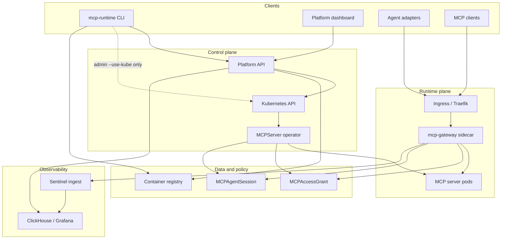

# Architecture

MCP Runtime is a Kubernetes-native platform for publishing, governing, and
observing MCP servers. This page is the high-level map; deeper detail lives in
the linked guides below.

## Planes

## What each layer owns

| Layer | Owns | Read next |
|-------|------|-----------|
| **Runtime** | Bootstrap, setup, registry workflow, `MCPServer` reconciliation, grants/sessions, rollout | [Runtime](runtime.md) |
| **Sentinel** | Gateway sidecar policy enforcement, analytics ingest, dashboards | [Sentinel](sentinel.md) |
| **Platform API** | Teams, identity, platform-backed deploy/push, adapter sessions | [API](api.md) |
| **Multi-team** | Namespace isolation, team RBAC, Traefik watch scope | [Multi-Team Isolation](multi-team.md) |

## Typical request path

1. An MCP client (or agent adapter) calls `https://mcp.<domain>/<server>/mcp`.
2. Ingress routes to the server pod; the **mcp-gateway** sidecar evaluates
   `MCPAccessGrant` + `MCPAgentSession` policy before forwarding to the app.
3. Allowed tool calls emit analytics events through ingest → Kafka → processor
   → ClickHouse; Grafana surfaces usage and traces.

Control-plane changes (setup, `auth login`, `server init`, `server deploy`,
`access grant init`, `access session init`) flow through the CLI or platform API
into Kubernetes; the operator materializes Deployments, Services, Ingress, and
policy ConfigMaps. Admin-only `--use-kube` or `kubectl apply` bypasses platform
auth and requires operator RBAC.

See [Request Flows](internals/request-flows.md) for allow/deny sequence diagrams,
component-level paths, and E2E scenario mapping.

## Deployment shapes

| Shape | When to use | Guide |
|-------|-------------|-------|
| Kind + `--test-mode` | Local contributor development | [Contributor Local Kind](contributor/local-kind.md) |
| k3s lab (HTTP registry) | Single-node evaluation | [Deployment Targets - k3s lab](deployment-targets.md#k3s-lab-example) |
| k3s / on-prem + bundled HTTPS | Public domain with Let's Encrypt | [Deployment Targets](deployment-targets.md), [k3s Deployment Runbook](k3s-deployment-runbook.md) |
| Managed Kubernetes + external registry | EKS, GKE, AKS | [Deployment Targets - Managed Kubernetes](deployment-targets.md#managed-kubernetes) |

## Related reading

- [Home / product overview](README.md) — positioning vs MCP directories and catalogs
- [Getting Started](getting-started.md) — install and first server
- [Publish an MCP Server](publish-mcp-server.md) — metadata, build, push, deploy
- [Agent Adapters](agent-adapters.md) — stdio and HTTP proxy shims
- [CLI](cli.md) — command reference
- [Cluster Readiness](cluster-readiness.md) — registry, DNS, TLS, node trust checks
