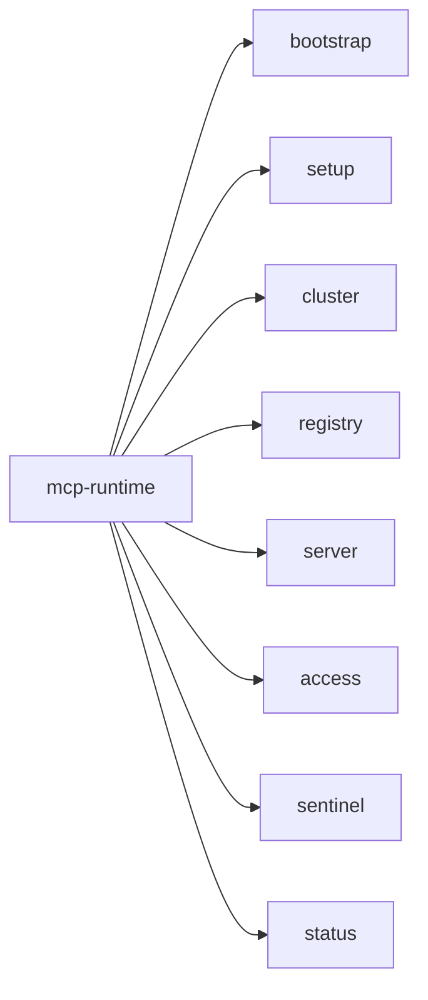

# CLI

The `mcp-runtime` CLI is the operator-facing front door. It bootstraps clusters, manages registries, applies `MCPServer` manifests, operates access grants and sessions, and inspects the runtime + sentinel stack.



## Fast path

```bash
make deps
make build

./bin/mcp-runtime setup
./bin/mcp-runtime status

./bin/mcp-runtime auth login --api-url https://platform.example.com --token-stdin < token.txt
./bin/mcp-runtime auth status

./bin/mcp-runtime server init payments --tool list_invoices
./bin/mcp-runtime server build image payments --tag v1
./bin/mcp-runtime registry push --image <image-ref-you-built-locally>
./bin/mcp-runtime server deploy payments --scope tenant --metadata-dir .mcp

./bin/mcp-runtime access grant init payments-ops --server payments --agent-id ops-agent --tool list_invoices --output grant.yaml
./bin/mcp-runtime access grant apply --file grant.yaml
```

For a new workstation, run `make deps-install` first where supported, then `STRICT_DEPS_CHECK=1 make deps-check`. Required host tools are Go `1.26+`, Make, Docker with a reachable daemon, `kubectl` configured for the cluster, plus `curl`, `jq`, and `python3` for documented dev flows. `kind` is required only for local Kind clusters.

Use the built-in help for the exact description, flags, and defaults of any command:

```bash
mcp-runtime --help
mcp-runtime <group> --help
mcp-runtime <group> <subcommand> --help
```

## Command map

| Group | What it covers | Important subcommands |
|---|---|---|
| `bootstrap` | Preflight checks for cluster prerequisites (DNS, default StorageClass, ingress class, MetalLB). With `--apply` on k3s only, install bundled CoreDNS + local-path manifests. | `bootstrap`, `--apply`, `--provider auto\|k3s\|rke2\|kubeadm\|generic` |
| `setup` | Install the platform stack, wire registry and ingress, deploy the operator, optionally include sentinel. | `setup`, `--with-tls`, `--without-sentinel` |
| `auth` | Save and inspect platform API credentials for non-kubeconfig platform flows. | `login`, `logout`, `status`, `use` |
| `cluster` | Initialize clusters, inspect health, configure kubeconfig and ingress, provision clusters, manage cert-manager. | `init`, `status`, `config`, `provision`, `cert status\|apply\|wait`, `doctor` |
| `registry` | Inspect the internal registry, configure an external one, push images. | `status`, `info`, `provision`, `push` |
| `server` | Manage `MCPServer` resources and operator-facing actions. | `init`, `list`, `get`, `create`, `apply`, `deploy`, `generate`, `export`, `patch`, `delete`, `logs`, `status`, `policy inspect`, `build image` |
| `access` | Manage `MCPAccessGrant` and `MCPAgentSession` resources that feed the gateway policy layer. | `grant init/list/get/apply/delete/disable/enable`, `session init/list/get/apply/delete/revoke/unrevoke` |
| `adapter` | HTTP proxy and stdio shims that inject governance identity/session headers for agents. | `proxy`, `stdio` |
| `team` | Manage internal platform teams, team password users, and Kubernetes team namespaces. | `list`, `create`, `user list`, `user create`, `init` |
| `sentinel` | Inspect and operate the bundled analytics, gateway, and observability stack. | `status`, `events`, `logs`, `port-forward`, `restart` |
| `status` | Aggregated platform health (cluster, registry, operator, servers, sentinel). | `status` |
| `completion` | Generate shell completion (bash, zsh, fish). | `completion bash\|zsh\|fish` |

The root command exposes `--debug` and `--version`. Subcommands inherit `--debug`; use `mcp-runtime --version` at the top level.

## bootstrap

Validate kubectl connectivity, CoreDNS, default `StorageClass`, Traefik `IngressClass`, and MetalLB. Missing pieces are warnings — the command surfaces them so you can decide what to install.

```bash
mcp-runtime bootstrap
mcp-runtime bootstrap --provider k3s
mcp-runtime bootstrap --apply --provider k3s   # Only k3s is automated
```

When to run it: on a fresh cluster before `setup`. Skip if your platform team already provides DNS, default storage, ingress, and load balancing.

## setup

The broad install path: runtime namespace, internal registry, operator, ingress wiring, bundled sentinel stack.

```bash
mcp-runtime setup
mcp-runtime setup --with-tls                   # cert-manager TLS for registry
mcp-runtime setup --platform-mode public       # anonymous public preview catalog
mcp-runtime setup --without-sentinel           # skip request-path stack
mcp-runtime setup --test-mode                  # local Kind/dev build+push path
mcp-runtime setup --parallel-builds            # build/publish setup images concurrently
mcp-runtime setup --registry-mode external --external-registry-url registry.example.com
```

Flags: `--registry-type`, `--registry-storage`, `--registry-mode`, `--external-registry-url`, `--external-registry-username`, `--external-registry-password`, `--platform-mode`, `--ingress`, `--ingress-manifest`, `--force-ingress-install`, `--with-tls`, `--test-mode`, `--parallel-builds`, `--without-sentinel`, plus operator overrides `--operator-leader-elect`, `--operator-metrics-addr`, `--operator-probe-addr`.

`--registry-mode` accepts `auto`, `bundled-http`, `bundled-https`, or
`external`. `auto` preserves the legacy behavior: use a provisioned registry
config when one exists, otherwise install the bundled registry. `bundled-http`
uses the bundled registry over HTTP for platform image pulls and requires node
insecure-registry config. `bundled-https` makes the bundled registry pod serve
HTTPS and requires `--with-tls` plus node trust for the issuing CA.
`external` skips the bundled registry and uses `--external-registry-url`,
`PROVISIONED_REGISTRY_URL`, or `mcp-runtime registry provision`.

Setup-built images default to the Linux architecture reported by the cluster
nodes. Override with `MCP_IMAGE_PLATFORM=linux/amd64` or
`MCP_IMAGE_PLATFORM=linux/arm64` when the build host differs from the target
cluster.

For non-test public/TLS setup, configure the platform hostnames before running
setup: set `MCP_PLATFORM_DOMAIN` to derive `platform.<domain>`,
`registry.<domain>`, and `mcp.<domain>`, or set
`MCP_PLATFORM_INGRESS_HOST`, `MCP_REGISTRY_INGRESS_HOST`, and
`MCP_MCP_INGRESS_HOST` explicitly. For bundled HTTPS with a public domain,
set `MCP_REGISTRY_ENDPOINT=registry.<domain>` so node pulls match the TLS
certificate — do not use the registry Service ClusterIP or `MCP_REGISTRY_HOST`
as the pull URL. Production setup also requires an
admin allowlist through `MCP_PLATFORM_ADMIN_EMAIL` or `ADMIN_USERS`; that
allowlist is what promotes Google/OIDC logins to platform admin.

`--platform-mode` selects the namespace model. `tenant` is the default and
scopes signed-in users to team namespaces for teams they belong to; `org` uses
`mcp-servers-org` for signed-in org-wide publishing while preserving team
namespace access; `public` uses `mcp-servers-public`, exposes anonymous catalog
reads, and lets signed-in users publish public preview MCP servers while
preserving team namespace access. `MCP_PLATFORM_MODE` provides the same
value when the flag is not set. Non-test public TLS setup also requires
`GOOGLE_CLIENT_ID` / `MCP_GOOGLE_CLIENT_ID` or the complete custom OIDC trio:
`OIDC_ISSUER`, `OIDC_AUDIENCE`, and `OIDC_JWKS_URL`.

`--test-mode` relaxes production guardrails, but it still builds and pushes the
operator, gateway proxy, and Sentinel images with `latest` tags to the
configured or bundled registry. With the bundled plain HTTP registry, cluster
nodes still need containerd/Docker trust for the exact image host they pull
from.

`--parallel-builds` keeps cluster, registry, TLS, and rollout sequencing
unchanged, but builds and publishes the runtime and Sentinel setup images
concurrently.

Setup is reconcile-oriented and refuses known control-plane conflicts before
applying more state. Registry TLS is owned by the explicit
`registry/registry-cert` Certificate for the `registry-tls` Secret; the
registry Ingress does not request a second ingress-shim certificate. If an old
`registry/registry-tls` Certificate or another Certificate already references
that Secret, delete or rename the extra Certificate before re-running setup.
For ingress, setup reuses an existing external Traefik such as k3s'
`kube-system/traefik` and refuses to force-install the repo-managed
`traefik/traefik` stack on top of it.

For local development where ingress traffic is exposed through port-forward or NodePort and the ingress controller does not publish load-balancer status, set `MCP_INGRESS_READINESS_MODE=permissive` before `setup`. The default is strict and waits for `Ingress.status.loadBalancer.ingress[]`.

## auth

Use `auth` for platform API credentials, not for Kubernetes cluster access.

Use cases:

- saving a platform API token locally for day-to-day platform flows
- saving multiple platform identities, such as an admin profile plus team user profiles
- recording a registry host alongside that token
- checking whether local platform credentials are already configured

Do not use `auth` for:

- `setup`
- cluster bootstrap
- cluster admin operations
- raw Kubernetes access

Examples:

```bash
# Save a token interactively
mcp-runtime auth login --api-url https://platform.example.com

# Save a token non-interactively
cat token.txt | mcp-runtime auth login \
  --api-url https://platform.example.com \
  --token-stdin

# Email/password login when the platform supports it
mcp-runtime auth login \
  --api-url https://platform.example.com \
  --email admin@example.com \
  --password '...' \
  --profile admin

# `--username` is accepted as an alias for `--email`
mcp-runtime auth login \
  --api-url https://platform.example.com \
  --username globex@example.com \
  --password '...' \
  --profile globex

# Record the platform registry host too
mcp-runtime auth login \
  --api-url https://platform.example.com \
  --token-stdin \
  --registry-host registry.example.com < token.txt

# Switch between saved profiles
mcp-runtime auth use admin
mcp-runtime auth use globex

# Check current auth state
mcp-runtime auth status

# Remove saved local credentials
mcp-runtime auth logout
```

Notes:

- saved credentials are local to the workstation
- each login is saved as a named profile; `auth login` makes that profile current
- `MCP_PLATFORM_API_PROFILE` selects a saved profile without changing the current profile
- `MCP_PLATFORM_API_TOKEN` overrides any saved token when set
- `MCP_PLATFORM_API_URL` can provide the default API base URL
- kubeconfig-based cluster commands are separate from platform auth

## Platform API vs `--use-kube`

Most `server` and `access` commands use the **platform API** by default. Run
`mcp-runtime auth login --api-url <platform-url>` (or set
`MCP_PLATFORM_API_TOKEN` plus `MCP_PLATFORM_API_URL`) before those flows.

`--use-kube` is **admin/dev/test only**. It bypasses platform auth and talks to
the Kubernetes API through your kubeconfig. Use it only when you have
admin/operator RBAC and intentionally want direct CRD/manifest operations.

| Default (platform API) | Requires `--use-kube` (admin only) |
|---|---|
| `access grant/session` list, get, apply, delete, enable/disable, revoke/unrevoke | same commands with `--use-kube` for raw kubectl CRUD |
| `server list`, `get`, `delete`, `status`, `policy inspect`, `deploy` | `server create`, `apply`, `export`, `patch`, `logs` |
| `registry push` (always platform API) | `kubectl apply -f` for manifests (separate from CLI flag) |

Notes:

- `server get` without `--use-kube` returns a platform API summary; full
  MCPServer YAML needs `--use-kube`.
- `server status` without `--use-kube` lists servers from the platform API;
  pod-level detail needs `--use-kube`.
- `server logs` always requires `--use-kube`; use `kubectl logs` or
  `sentinel logs gateway` when you only have platform credentials.
- `--team` is a platform API resolver and is rejected with `--use-kube`.

## status

```bash
mcp-runtime status
mcp-runtime cluster status
mcp-runtime registry status
mcp-runtime sentinel status
```

## registry

```bash
# Inspect / configure
mcp-runtime registry status
mcp-runtime registry info
mcp-runtime registry provision --url registry.example.com
mcp-runtime registry provision \
  --url registry.example.com \
  --operator-image registry.example.com/mcp-runtime-operator:latest

# Push images through the platform API (multipart upload + in-cluster skopeo helper)
mcp-runtime registry push --image <resolved-registry-host>/payments:v1
mcp-runtime registry push --image payments:v1 --name payments-api
mcp-runtime registry push --scope public --image payments:v1
mcp-runtime registry push --scope tenant --image payments:v1
```

`registry push` requires platform credentials from `mcp-runtime auth login` or
`MCP_PLATFORM_API_TOKEN` plus `MCP_PLATFORM_API_URL`; unauthenticated pushes are
rejected before the CLI saves the local image archive. The CLI uploads the docker
save tar to `POST /api/runtime/registry/push`; the platform API pushes it to the
registry from inside the cluster. When you use
`server build image`, push the exact image ref it produced. That ref can include
a resolved registry host instead of a short local name. `--scope public` and
`--scope org` prefix the target repository with `public/` or `org/`; `--scope
tenant` prefixes unscoped repositories with the authenticated user's active
team slug. Explicit tenant repository prefixes must match one of the user's
teams.

## server init

```bash
# Scaffold .mcp/servers.yaml for a metadata-driven server
mcp-runtime server init payments --tool list_invoices --tool refund_invoice
mcp-runtime server init payments \
  --tool list_invoices \
  --tool-spec refund_invoice:high:destructive
```

`server init` creates or appends to `.mcp/servers.yaml`. It defaults `image` to
the server name, `imageTag` to `latest`, `scope` to `tenant`, and the route to
`/<name>/mcp`. It also writes governed defaults: header auth, allow-list policy
with deny default, required adapter-issued sessions, and `gateway.enabled:
true`. Repeated `--tool` flags seed read/low tool metadata. Use repeated
`--tool-spec name:low|medium|high:read|write|destructive` when tools need mixed
trust levels or side-effect classes. If a metadata entry with the same server
name already exists, `server init` fails unless `--force` is passed.

Typical platform path after `server init`:

```bash
mcp-runtime auth login --api-url https://platform.example.com
mcp-runtime server build image payments --tag v1
mcp-runtime registry push --scope tenant --image <exact-image-ref-from-build>
mcp-runtime server deploy payments --scope tenant --metadata-dir .mcp
mcp-runtime server deploy payments --scope tenant --metadata-dir .mcp --update   # repeat deploys
```

## server generate

```bash
# Generate MCPServer manifests from metadata for review/GitOps
mcp-runtime server generate --metadata-dir .mcp --output manifests
mcp-runtime server generate --metadata-file .mcp/payments.yaml --output manifests
```

For the full build, push, deploy, and verify flow, see [Publish an MCP Server](publish-mcp-server.md).

## access

Scaffold manifests with `init`, then apply through the platform API (default).
Add `--use-kube` only for admin/operator direct Kubernetes flows.

```bash
mcp-runtime auth login --api-url https://platform.example.com

# Grants
mcp-runtime access grant init payments-globex-cursor \
  --namespace mcp-team-acme \
  --server payments \
  --team-id <globex-team-id> \
  --agent-id cursor \
  --tool list_invoices \
  --tool-rule refund_invoice:allow:high \
  --tool-rule delete_invoice:deny:high \
  --side-effect read \
  --side-effect destructive \
  --output grant.yaml
mcp-runtime access grant list
mcp-runtime access grant list --namespace mcp-team-acme
mcp-runtime access grant get payments-admin --namespace mcp-servers
mcp-runtime access grant apply --file grant.yaml
mcp-runtime access grant disable payments-admin
mcp-runtime access grant enable payments-admin

# Sessions
mcp-runtime access session init cursor-session \
  --namespace mcp-team-acme \
  --server payments \
  --human-id <user-id> \
  --agent-id cursor \
  --trust medium \
  --expires-in 1h \
  --output session.yaml
mcp-runtime access session init cursor-session \
  --namespace mcp-team-acme \
  --server payments \
  --team-id <team-id> \
  --agent-id cursor \
  --trust high \
  --expires-at 2026-05-25T12:00:00Z \
  --upstream-token-secret upstream-token \
  --upstream-token-key token \
  --output session.yaml
mcp-runtime access session list
mcp-runtime access session get ops-agent --namespace mcp-servers
mcp-runtime access session apply --file session.yaml
mcp-runtime access session revoke ops-agent
mcp-runtime access session unrevoke ops-agent
```

`grant list` and `session list` default to `--all-namespaces`; pass `--namespace` to narrow scope.

`access grant init` writes a reviewable YAML file with tool rules and
`allowedSideEffects`. `--tool` is shorthand for an allow rule at `--trust`
(default `low`). Use `--tool-rule name:allow|deny:low|medium|high` for mixed
decisions. `access session init` is for explicit/admin session manifests; adapter
`--auto-refresh` usually creates sessions automatically at runtime.

For multi-team deployments, namespace scoping controls who can write resources
and `teamID` controls who can use them. Put each team's grants and sessions in
the same namespace as its servers, set `subject.teamID`, and use `--namespace`
when inspecting or operating one team's policy resources.

## team

```bash
mcp-runtime team list
mcp-runtime team create acme --name "Acme"
mcp-runtime team user create globex \
  --username globex@example.com \
  --password '...' \
  --role member
mcp-runtime team user list globex
mcp-runtime team init acme --group acme-mcp-admins
mcp-runtime team init acme --dry-run
```

`team list`, `team create`, and `team user` use the platform API, so run
`auth login` or set platform API credentials first. `team create` creates a
platform team and managed namespace, including quota/limits, default-deny
NetworkPolicy, service account, and repo-managed Traefik watch wiring when
bundled Traefik is present. `team user create` is admin-only. It creates or
updates a password-login user and adds that user to the team as `member` or
`owner`; use `auth login --username/--email --password` for the user login.

`team init` uses local `kubectl`. It creates the team namespace, restricted
workload service account, default quota and limits, default-deny NetworkPolicy,
same-namespace and bundled-Traefik ingress allowances, MCP Runtime team-admin
RBAC, bundled Traefik watch RBAC, and patches the repo-managed
`traefik/traefik` Deployment watch list unless
`--skip-traefik-watch` is set. Use `--namespace`, `--group`, `--user`, or
`--service-account` when the defaults do not match your cluster identity system.
See
[Multi-team isolation](multi-team.md).

## server

```bash
# Normal platform path
mcp-runtime auth login --api-url https://platform.example.com
mcp-runtime server list
mcp-runtime server deploy payments --scope public --image payments --tag v1
mcp-runtime server get payments
mcp-runtime server policy inspect payments

# Admin/operator direct Kubernetes path
mcp-runtime server create payments --image repo/payments --tag latest --use-kube
mcp-runtime server create payments --file server.yaml --use-kube
mcp-runtime server apply --file server.yaml --use-kube
mcp-runtime server export payments --file payments.yaml --use-kube

# Patch / inspect (platform API)
mcp-runtime server status --namespace mcp-servers
mcp-runtime server policy inspect payments

# Admin/operator only — requires --use-kube
mcp-runtime server patch payments --patch '{"spec":{"imageTag":"v2"}}' --use-kube
mcp-runtime server logs payments --follow --use-kube

# Build (push lives under registry)
mcp-runtime server build image payments --tag v1 --platform linux/amd64
mcp-runtime registry push --scope public --image <exact-image-ref-from-build>
```

When `--use-kube` is absent, the supported `server` and `access` commands above
use the platform API and require `mcp-runtime auth login --api-url
<platform-url>` or `MCP_PLATFORM_API_TOKEN` plus `MCP_PLATFORM_API_URL`.
In `--use-kube` mode, use `--namespace` and expect kubeconfig/RBAC failures
unless the current principal has admin/operator cluster access.

`server patch` accepts inline `--patch` or `--patch-file` with `merge`, `json`, or `strategic` modes.

`server build image` updates matching `.mcp` metadata. It defaults Docker builds to `linux/amd64` so images can run on typical amd64 Kubernetes nodes; override with `--platform` or `MCP_DOCKER_PLATFORM` for another node architecture. It prefers an explicit registry host, then the cluster's `registry/registry` Ingress host, before falling back to the registry Service address. That keeps metadata images on a node-pullable public host such as `registry.example.com/public/payments:v1` when the cluster exposes one. Tenant metadata still uses the authenticated team repository prefix when platform credentials are configured. Push that exact ref after logging in to the platform. The command does not deploy by itself; push and deploy are separate steps. `server deploy --scope public` and `--scope org` let the platform resolve the active catalog namespace; `--scope tenant` uses the authenticated user's team namespace unless `--team` or `--namespace` selects one explicitly. Deploy accepts a short image name and expands it through the platform API to the configured node-pullable registry endpoint plus the active scope prefix. `server deploy --metadata-dir .mcp` includes the matching server inventory, including tool side-effect metadata used by governed tool calls. A repeat deploy with the same server name fails by default; pass `--update` when you intentionally want to redeploy an existing server.

## sentinel

```bash
# Health + recent Kubernetes events
mcp-runtime sentinel status
mcp-runtime sentinel events
mcp-runtime sentinel restart gateway
mcp-runtime sentinel restart --all

# Logs (--follow / --previous / --tail / --since)
mcp-runtime sentinel logs ingest --since 15m --follow
mcp-runtime sentinel logs grafana --tail 500

# Port-forward (--port / --address)
mcp-runtime sentinel port-forward ui
mcp-runtime sentinel port-forward api --port 18080
```

**Component keys for `logs` and `restart`:** `clickhouse`, `zookeeper`, `kafka`, `ingest`, `api`, `processor`, `ui`, `gateway`, `prometheus`, `grafana`, `otel-collector`, `tempo`, `loki`, `promtail`.

**Port-forward shortcuts** are built in for: `api`, `ui`, `prometheus`, `grafana`.

## cluster

```bash
# Initialize / re-target
mcp-runtime cluster init
mcp-runtime cluster init --kubeconfig ~/.kube/config --context dev

# Configure ingress, kubeconfig, providers
mcp-runtime cluster config --ingress traefik
mcp-runtime cluster config --provider eks --name mcp-runtime --region us-west-1

# Provision
mcp-runtime cluster provision --provider kind --nodes 3
mcp-runtime cluster provision --provider eks --name prod-mcp

# cert-manager helpers
mcp-runtime cluster cert status
mcp-runtime cluster cert apply
mcp-runtime cluster cert wait --timeout 10m

# Doctor — post-install diagnostics or setup preflight
mcp-runtime cluster doctor
mcp-runtime cluster doctor --for-setup
```

**Provider status today:** `kind` and `eks` are active. `gke` and `aks` flags exist but their kubeconfig and provisioning helpers return planned/not-implemented paths in the current code.

For `kind` provisioning, the CLI validates `--nodes`, checks that the Docker daemon is reachable when `KIND_EXPERIMENTAL_PROVIDER=docker` is set, lets kind auto-detect the container runtime when that env var is unset, and refuses to overwrite an existing kind cluster with the same `--name`.

## Common flows

```bash
# Local kind cluster
mcp-runtime cluster provision --provider kind --nodes 3
mcp-runtime setup
mcp-runtime auth login --api-url http://localhost:18080

# Push a server image
mcp-runtime server init payments --tool list_invoices
mcp-runtime server build image payments
mcp-runtime registry push --scope tenant --image <exact-image-ref-from-build>

# Deploy from metadata
mcp-runtime server deploy payments --scope tenant --metadata-dir .mcp

# Scaffold and apply access policy
mcp-runtime access grant init payments-ops --server payments --agent-id ops-agent \
  --tool list_invoices --output grant.yaml
mcp-runtime access session init payments-ops-session --server payments \
  --agent-id ops-agent --trust high --output session.yaml
mcp-runtime access grant apply --file grant.yaml
mcp-runtime access session apply --file session.yaml
mcp-runtime server policy inspect payments

# Open the sentinel UI locally
mcp-runtime sentinel port-forward ui
mcp-runtime sentinel logs api --since 10m

# Patch a running server (admin/operator — requires --use-kube)
mcp-runtime server patch payments --patch '{"spec":{"imageTag":"v2"}}' --use-kube
mcp-runtime server status
mcp-runtime status
```

## Next

- [API](api.md) — exact resource fields the CLI is wrapping.
- [Publish an MCP Server](publish-mcp-server.md) — manifest, metadata, image push, deploy, and verification flow.
- [Sentinel](sentinel.md) — how `sentinel logs / events / restart` map to the bundled stack.
- [Cluster readiness](cluster-readiness.md) — distro-specific prerequisites.
