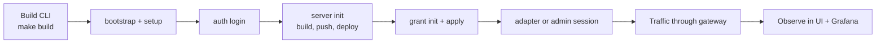

# Getting Started

This guide installs MCP Runtime on your own Kubernetes cluster. If you want to
try the platform in under 10 minutes without a cluster, see the
[Quickstart](quickstart.md) instead.

## Prerequisites

- Go `1.26+` (matches the repository `go.mod` files)
- `make`
- Docker or a Docker-compatible client, with the daemon running and reachable
- `kubectl` on `PATH`, configured for the target cluster
- `curl`, `jq`, and `python3` for documented dev and traffic-generation flows
- A Kubernetes cluster (k3s, kind, minikube, Docker Desktop Kubernetes, EKS, GKE, AKS, or equivalent). If you are choosing a target, start with [Deployment Targets](deployment-targets.md), then use [Cluster Readiness](cluster-readiness.md) for distribution-specific prep.

Host bootstrap:

```bash
make deps-install              # best-effort install for supported macOS/Linux hosts
STRICT_DEPS_CHECK=1 make deps-check
```

`make deps-install` is intentionally best-effort: it can install some packages with Homebrew or apt, but it cannot enable Docker Desktop, create cloud credentials, or configure your kubeconfig. Re-run `STRICT_DEPS_CHECK=1 make deps-check` until the required host tools pass.

## 1. Install the CLI

**Option A — Download a release binary** (no Go required):

```bash
# macOS Apple Silicon
curl -Lo mcp-runtime https://github.com/Agent-Hellboy/mcp-runtime/releases/download/v0.1.0/mcp-runtime-darwin-arm64
chmod +x mcp-runtime && sudo mv mcp-runtime /usr/local/bin/

# macOS Intel
curl -Lo mcp-runtime https://github.com/Agent-Hellboy/mcp-runtime/releases/download/v0.1.0/mcp-runtime-darwin-amd64
chmod +x mcp-runtime && sudo mv mcp-runtime /usr/local/bin/

# Linux amd64
curl -Lo mcp-runtime https://github.com/Agent-Hellboy/mcp-runtime/releases/download/v0.1.0/mcp-runtime-linux-amd64
chmod +x mcp-runtime && sudo mv mcp-runtime /usr/local/bin/
```

**Option B — Build from source** (requires Go 1.26+):

```bash
make deps
make build
```

This produces `./bin/mcp-runtime`.

## 2. Confirm cluster readiness

```bash
./bin/mcp-runtime bootstrap
```

Before setup, confirm the target Kubernetes cluster is ready for registry
pushes, image pulls, ingress, storage, and TLS. See
[Deployment Targets](deployment-targets.md) to choose the right install shape
for self-managed or managed Kubernetes, then
[cluster-readiness.md](cluster-readiness.md) for distribution-specific
preparation.

`setup` installs MCP Runtime resources into an already-running cluster. It does
not configure node DNS, containerd or Docker registry trust, public DNS, TLS
issuers, image pull credentials, or storage classes. Fix those prerequisites
with your platform tooling before continuing.

`bootstrap` validates kubectl connectivity, CoreDNS, the default
`StorageClass`, Traefik `IngressClass`, and MetalLB namespace. Warnings only —
fix gaps with your platform tooling, or `bootstrap --apply --provider k3s` to
install bundled CoreDNS / local-path on k3s. After setup, run `cluster doctor`
to validate the installed MCP Runtime resources, registry pulls, ingress,
Sentinel, and operator readiness.

## 3. Contributor test-mode cluster (local Kind)

For local development, CI, or contributing to the repo, use the Kind-based
test-mode path. The contributor docs own this path completely:

- [Contributor Guide](contributor/README.md)
- [Local Kind and Test Mode](contributor/local-kind.md)

Quick path:

```bash
make deps && make build
kind create cluster --name mcp-runtime
./bin/mcp-runtime setup --test-mode --ingress-manifest config/ingress/overlays/http
kubectl port-forward -n traefik svc/traefik 18080:8000
./bin/mcp-runtime cluster doctor
```

Local surfaces: platform `http://localhost:18080/`, MCP routes `http://localhost:18080/<server-name>/mcp`.


## 5. Production-style install

Use this path when the cluster is not just a disposable contributor environment.
That includes staging, internal shared clusters, externally reachable installs,
or anything that needs stable registry, DNS, TLS, storage, and ingress
ownership.

Before `setup`, make these decisions explicitly:

- Registry: bundled registry with TLS, or a provisioned external registry
- DNS: stable hostnames for `registry`, `mcp`, and `platform`
- TLS: Let's Encrypt, enterprise `ClusterIssuer`, or preinstalled cert flow
- Ingress: repo-managed Traefik or an existing platform ingress controller
- Storage and retention: registry and Sentinel persistence choices
- Image pull auth: pull secrets, workload identity, or node-native registry auth

Read these first:

- [Deployment Targets](deployment-targets.md)
- [Cluster readiness](cluster-readiness.md)
- [Sentinel Kubernetes awareness and hardening](sentinel.md#kubernetes-awareness-and-hardening)
- [Multi-team isolation](multi-team.md) if multiple teams will publish or govern servers on one cluster

For production-oriented setup, choose the registry path explicitly. With a
provisioned registry:

```bash
./bin/mcp-runtime bootstrap
./bin/mcp-runtime setup --registry-mode external --external-registry-url registry.example.com --with-tls --strict-prod
```

With the bundled registry serving internal HTTPS, setup generates an internal
CA secret for the registry pod certificate unless you provide an existing
ClusterIssuer. Configure every node to trust that CA for image pulls. Public
ingress TLS can still use ACME:

```bash
./bin/mcp-runtime bootstrap
./bin/mcp-runtime setup --registry-mode bundled-https --with-tls --acme-email ops@example.com --strict-prod
```

If you want hostnames derived from one domain, set:

```bash
export MCP_PLATFORM_DOMAIN=example.com
export MCP_PLATFORM_ADMIN_EMAIL=admin@example.com
./bin/mcp-runtime setup --registry-mode external --external-registry-url registry.example.com --with-tls --strict-prod
```

That derives:

- `registry.example.com`
- `mcp.example.com`
- `platform.example.com`

If you already have an external registry, provision it before setup so the
cluster pulls from the same hardened image host you intend to keep:

```bash
./bin/mcp-runtime registry provision --url registry.example.com
./bin/mcp-runtime setup --registry-mode external --with-tls --strict-prod
```

For public/TLS setup, setup validates the host env even without
`--strict-prod`. Use `MCP_PLATFORM_DOMAIN` or set
`MCP_PLATFORM_INGRESS_HOST`, `MCP_REGISTRY_INGRESS_HOST`, and
`MCP_MCP_INGRESS_HOST` explicitly. For bundled HTTPS with a public domain,
set `MCP_REGISTRY_ENDPOINT=registry.<domain>` so kubelet pulls match the TLS
certificate (not the registry ClusterIP). Set `MCP_PLATFORM_ADMIN_EMAIL` or
`ADMIN_USERS` so the first OIDC login for that email is promoted to platform
admin; `--acme-email` is only the certificate contact email.

When building setup images from a machine with a different CPU architecture
than the cluster, set `MCP_IMAGE_PLATFORM` to the target node platform, for
example `MCP_IMAGE_PLATFORM=linux/amd64` for standard VPS/k3s nodes.

You can also skip the saved provision step and pass
`--external-registry-url registry.example.com` directly to `setup`.

If you use an internal CA instead of ACME, install the issuer first and point
setup at it:

```bash
./bin/mcp-runtime setup --with-tls --tls-cluster-issuer <issuer-name> --strict-prod
```

What `--strict-prod` is for:

- requires TLS
- rejects dev-only registry assumptions such as `registry.local`
- forces you onto a stable production-style registry endpoint

Do not use the contributor `--test-mode` flow as a production install guide.
`--test-mode` is for local development and CI-like validation; it still builds
and pushes local images and assumes the contributor registry and ingress shape.

## 6. Install the platform stack

```bash
./bin/mcp-runtime setup
```

`setup` installs the platform pieces companies need for MCP operations: CRDs,
`mcp-runtime` and catalog namespaces, the internal Docker registry, ingress
wiring, the operator, and the bundled Sentinel stack for gateway policy,
analytics, audit, and observability.

`--platform-mode` selects the namespace model:

| Mode | Default namespace behavior | Behavior |
|---|---|---|
| `tenant` | Principal team namespace | Default private mode. Signed-in users publish through team namespaces for teams they belong to. |
| `org` | `mcp-servers-org` | Signed-in users publish and browse the org-wide catalog and can still work in team namespaces. |
| `public` | `mcp-servers-public` | Anonymous users can browse the public preview catalog; signed-in users publish public preview MCP servers and can still work in team namespaces. |

For browser Google sign-in, provide the OAuth client ID before setup. Non-test
public TLS installs (`--platform-mode public --with-tls`) fail fast unless
`GOOGLE_CLIENT_ID` / `MCP_GOOGLE_CLIENT_ID` is set, or `OIDC_ISSUER`,
`OIDC_AUDIENCE`, and `OIDC_JWKS_URL` are all set for another provider. For
Google, setup uses the client ID as the OIDC audience and fills the standard
Google issuer and JWKS URL when those values are not set explicitly:

```bash
export GOOGLE_CLIENT_ID=<client>.apps.googleusercontent.com
export MCP_PLATFORM_ADMIN_EMAIL=admin@example.com
./bin/mcp-runtime setup --with-tls --platform-mode public
```

For a non-Google OIDC provider, set `OIDC_ISSUER`, `OIDC_AUDIENCE`, and
`OIDC_JWKS_URL` before setup. Reruns preserve existing values in
`mcp-sentinel/mcp-sentinel-config`.

For multi-team or tenant-separated deployments, keep setup as the platform
install and provision one namespace per team with `mcp-runtime team create
<slug>` (platform API). Use the platform API to default team IDs, or set
`spec.teamID` and `subject.teamID` directly in YAML; an explicit foreign
`subject.teamID` delegates access to another team while the gateway still
matches every non-empty subject field. See
[Multi-team isolation](multi-team.md).

Common variants:

```bash
./bin/mcp-runtime setup --with-tls            # cert-manager TLS for the registry
./bin/mcp-runtime setup --platform-mode public # public preview catalog namespace
./bin/mcp-runtime setup --without-sentinel    # skip the request-path stack
./bin/mcp-runtime setup --test-mode           # local Kind/dev build+push path
```

### Local development notes

For Kind or other local setups where traffic reaches Traefik through `kubectl port-forward` or a NodePort but the ingress controller does not publish `Ingress.status.loadBalancer.ingress[]`, run setup with permissive ingress readiness:

```bash
export MCP_INGRESS_READINESS_MODE=permissive
./bin/mcp-runtime setup --test-mode --ingress-manifest config/ingress/overlays/http
kubectl port-forward -n traefik svc/traefik 18080:8000
```

Then use `http://127.0.0.1:18080/<publicPathPrefix>/mcp` for local MCP traffic. Keep the default strict readiness mode for production clusters that rely on published load-balancer status.

## 7. Confirm health

```bash
./bin/mcp-runtime status
./bin/mcp-runtime cluster status
./bin/mcp-runtime registry status
./bin/mcp-runtime sentinel status
```

## 8. Deploy your first server

The server deploy flow (init → validate → build → push → deploy → grant → adapter)
is covered step-by-step in the learning modules:

- [Module 2 — Your first governed server](learn/module-2-first-server.md) — end-to-end hands-on
- [Module 3 — Multi-team setup](learn/module-3-multi-team.md) — two teams, cross-team grants

Quick reference:

```bash
mcp-runtime server init my-server --from-server http://localhost:8088
mcp-runtime server validate --metadata-dir .mcp
mcp-runtime server build image my-server --tag v1
mcp-runtime registry push --image ... --scope tenant
mcp-runtime server deploy my-server --scope tenant --metadata-dir .mcp
```


## 10. Observe live traffic and policy

Use the platform dashboard and API first:

```bash
./bin/mcp-runtime auth login --api-url <platform-url>
./bin/mcp-runtime status
# Dashboard: http://localhost:18080/ (Kind) or https://platform.<domain>/
```

Admin/operator kubectl diagnostics (`sentinel *` requires admin cluster access):

```bash
./bin/mcp-runtime sentinel port-forward ui          # Governance + dashboard
./bin/mcp-runtime sentinel port-forward grafana     # Metrics + traces + logs
./bin/mcp-runtime sentinel logs gateway --follow    # Tail the proxy
```

## End-to-end flow



## Next steps

- [Publish an MCP Server](publish-mcp-server.md) — write manifests or `.mcp` metadata, build, push, deploy, and verify.
- [Multi-team isolation](multi-team.md) — team IDs, namespaces, RBAC, and ingress guidance.
- [Architecture](architecture.md) — how the pieces fit together.
- [CLI](cli.md) — full command reference.
- [API](api.md) — every CRD field and HTTP endpoint.
- [Sentinel](sentinel.md) — request-path governance, audit, observability.


---

**Next:** [Concepts](concepts.md) — understand Grants, Sessions, Trust levels, and Side effects before deploying servers.
