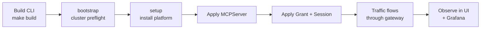

# Getting Started

The shortest path from an empty Kubernetes cluster to a governed MCP endpoint: install the control plane, registry, broker, and Sentinel stack; deploy one MCP server; grant access; and observe live traffic.

## Prerequisites

- Go `1.25+` (matches the repository `go.mod` files)
- `make`
- Docker or a Docker-compatible client, with the daemon running and reachable
- `kubectl` on `PATH`, configured for the target cluster
- `curl`, `jq`, and `python3` for documented dev and traffic-generation flows
- A Kubernetes cluster (k3s, kind, minikube, Docker Desktop Kubernetes, EKS — see [cluster-readiness.md](cluster-readiness.md) for distribution-specific prep)

Host bootstrap:

```bash
make deps-install              # best-effort install for supported macOS/Linux hosts
STRICT_DEPS_CHECK=1 make deps-check
```

`make deps-install` is intentionally best-effort: it can install some packages with Homebrew or apt, but it cannot enable Docker Desktop, create cloud credentials, or configure your kubeconfig. Re-run `STRICT_DEPS_CHECK=1 make deps-check` until the required host tools pass.

## 1. Build the CLI

```bash
make deps
make build
```

This produces `./bin/mcp-runtime`.

## 2. Confirm cluster readiness

```bash
./bin/mcp-runtime bootstrap
```

Before setup, confirm the target Kubernetes cluster is ready for registry
pushes, image pulls, ingress, storage, and TLS. See
[cluster-readiness.md](cluster-readiness.md) for distribution-specific
preparation.

`setup` installs MCP Runtime resources into an already-running cluster. It does
not configure node DNS, containerd or Docker registry trust, public DNS, TLS
issuers, image pull credentials, or storage classes. Fix those prerequisites
with your platform tooling before continuing.

`bootstrap` validates kubectl connectivity, CoreDNS, the default
`StorageClass`, Traefik `IngressClass`, and MetalLB namespace. Warnings only —
fix gaps with your platform tooling, or `bootstrap --apply --provider k3s` to
install bundled CoreDNS / local-path on k3s. After setup, run `cluster doctor`
to validate the installed MCP Runtime resources, registry pulls, ingress,
Sentinel, and operator readiness.

## 3. Choose your install path

This page now branches on purpose:

- Use the contributor path for local development, Kind, `--test-mode`, seeded logins, and fast service iteration.
- Use the production-style path for a real cluster, real DNS/TLS decisions, registry planning, and stricter setup validation.

| Path | Use it when | Start here |
|---|---|---|
| Local development | You are working on the repo, using Kind, or validating changes with disposable infra | [Contributor test-mode cluster](#4-contributor-test-mode-cluster) |
| Production-style install | You are evaluating or deploying MCP Runtime on a shared, persistent, or externally reachable cluster | [Production-style install](#5-production-style-install) |

The rest of this page keeps both flows in one place, but the detailed
contributor runbooks still live under [docs/contributor/](contributor/README.md)
and the distribution-specific production prerequisites still live in
[cluster-readiness.md](cluster-readiness.md).

## 4. Contributor test-mode cluster

For local contributor work, use the dedicated contributor docs instead of the
generic install flow in this page. The contributor path owns the Kind cluster
shape, local registry mirror, test-mode install, seeded logins, service rebuild
loops, tenant smoke checks, and troubleshooting.

Start here:

- [Contributor Guide](contributor/README.md)
- [Local Kind and Test Mode](contributor/local-kind.md)
- [Service Iteration](contributor/service-iteration.md)
- [Runtime MCP Testing](contributor/runtime-mcp-testing.md)

The shortest contributor bring-up path is:

```bash
make deps
make build

cat > /tmp/mcp-runtime-kind.yaml <<'EOF'
kind: Cluster
apiVersion: kind.x-k8s.io/v1alpha4
containerdConfigPatches:
  - |-
    [plugins."io.containerd.grpc.v1.cri".registry.mirrors."registry.registry.svc.cluster.local:5000"]
      endpoint = ["http://127.0.0.1:32000"]
EOF

kind create cluster --name mcp-runtime --config /tmp/mcp-runtime-kind.yaml
kubectl config use-context kind-mcp-runtime

./bin/mcp-runtime bootstrap

MCP_SETUP_WAIT_TIMEOUT=900 \
  ./bin/mcp-runtime setup --test-mode \
  --ingress-manifest config/ingress/overlays/http

kubectl port-forward -n traefik svc/traefik 18080:8000
```

Then verify the stack:

```bash
./bin/mcp-runtime status
./bin/mcp-runtime cluster doctor
```

Local surfaces:

- Platform UI: `http://localhost:18080/`
- Platform API: `http://localhost:18080/api`
- MCP route shape: `http://localhost:18080/<server-name>/mcp`

Important contributor notes:

- `setup --test-mode` still builds and pushes the operator, gateway proxy, and Sentinel images. It is not a no-build path.
- The documented Kind cluster must include the `registry.registry.svc.cluster.local:5000` mirror before setup runs, or image pulls will fail.
- The maintained source of truth for contributor commands is `docs/contributor/`; keep this section short and update the contributor pages when that workflow changes.

| Symptom | First checks |
|---------|--------------|
| Pod is not ready or image pulls fail | `kubectl describe pod`, namespace events, `cluster doctor` |
| Grant or session does not affect traffic | `kubectl get mcpaccessgrant,mcpagentsession`, `server policy inspect`, raw policy ConfigMap |
| Policy renders but tool calls are denied | `kubectl logs ... -c mcp-gateway`, request headers, `Mcp-Session-Id` / `X-MCP-Agent-Session` values |
| Requests work but analytics are missing | `sentinel logs ingest`, `sentinel logs processor`, analytics secret and ingest URL |
| Dashboard, API, or MCP route returns 404 | `kubectl get ingress -A`, Sentinel ingress YAML, Traefik logs |

Useful local platform checks:

```bash
./bin/mcp-runtime cluster doctor
./bin/mcp-runtime sentinel status
./bin/mcp-runtime sentinel events
./bin/mcp-runtime sentinel logs api --since 10m
./bin/mcp-runtime sentinel logs ui --since 10m
./bin/mcp-runtime sentinel logs gateway --since 10m
./bin/mcp-runtime sentinel logs ingest --since 10m
./bin/mcp-runtime sentinel logs processor --since 10m

kubectl get pods -n mcp-runtime -o wide
kubectl get pods -n mcp-sentinel -o wide
kubectl rollout status deploy/mcp-sentinel-api -n mcp-sentinel --timeout=90s
kubectl rollout status deploy/mcp-sentinel-ingest -n mcp-sentinel --timeout=90s
kubectl rollout status deploy/mcp-sentinel-processor -n mcp-sentinel --timeout=90s
kubectl rollout status deploy/mcp-sentinel-ui -n mcp-sentinel --timeout=90s
kubectl rollout status deploy/mcp-sentinel-gateway -n mcp-sentinel --timeout=90s
kubectl logs -n mcp-runtime deploy/mcp-runtime-operator-controller-manager --since=10m
kubectl logs -n traefik deploy/traefik --tail=120
kubectl get ingress -A
kubectl get ingress -n mcp-sentinel -o yaml
```

Apply an access grant and session for the local request:

```bash
cat > /tmp/go-example-access.yaml <<'EOF'
apiVersion: mcpruntime.org/v1alpha1
kind: MCPAccessGrant
metadata:
  name: go-example-local
  namespace: mcp-servers
spec:
  serverRef:
    name: go-example-mcp
  subject:
    humanID: local-user
    agentID: local-agent
  maxTrust: high
  allowedSideEffects:
    - read
  policyVersion: v1
  toolRules:
    - name: add
      decision: allow
    - name: upper
      decision: allow
---
apiVersion: mcpruntime.org/v1alpha1
kind: MCPAgentSession
metadata:
  name: local-session
  namespace: mcp-servers
spec:
  serverRef:
    name: go-example-mcp
  subject:
    humanID: local-user
    agentID: local-agent
  consentedTrust: high
  policyVersion: v1
EOF

kubectl apply -f /tmp/go-example-access.yaml

until ./bin/mcp-runtime server policy inspect go-example-mcp --namespace mcp-servers | grep -q local-session; do
  sleep 2
done

# The proxy sidecar reloads rendered policy on a short polling loop, so give the
# gateway a few seconds to observe the new access session before the first tool call.
sleep 6
```

Make a local MCP JSON-RPC request through Traefik and the Sentinel gateway:

```bash
BASE=http://localhost:18080/go-example-mcp/mcp
PROTO=2025-06-18

SESSION="$(
  curl -si \
    -H "content-type: application/json" \
    -H "accept: application/json, text/event-stream" \
    -H "Mcp-Protocol-Version: $PROTO" \
    -H "X-MCP-Human-ID: local-user" \
    -H "X-MCP-Agent-ID: local-agent" \
    -H "X-MCP-Agent-Session: local-session" \
    -d '{"jsonrpc":"2.0","id":1,"method":"initialize","params":{}}' \
    "$BASE" | awk -F': ' 'tolower($1)=="mcp-session-id"{print $2}' | tr -d '\r'
)"

curl -sS \
  -H "content-type: application/json" \
  -H "accept: application/json, text/event-stream" \
  -H "Mcp-Protocol-Version: $PROTO" \
  -H "Mcp-Session-Id: $SESSION" \
  -H "X-MCP-Human-ID: local-user" \
  -H "X-MCP-Agent-ID: local-agent" \
  -H "X-MCP-Agent-Session: local-session" \
  -d '{"jsonrpc":"2.0","method":"notifications/initialized"}' \
  "$BASE" >/dev/null

curl -sS \
  -H "content-type: application/json" \
  -H "accept: application/json, text/event-stream" \
  -H "Mcp-Protocol-Version: $PROTO" \
  -H "Mcp-Session-Id: $SESSION" \
  -H "X-MCP-Human-ID: local-user" \
  -H "X-MCP-Agent-ID: local-agent" \
  -H "X-MCP-Agent-Session: local-session" \
  -d '{"jsonrpc":"2.0","id":2,"method":"tools/call","params":{"name":"add","arguments":{"a":2,"b":3}}}' \
  "$BASE" | jq .

curl -sS \
  -H "content-type: application/json" \
  -H "accept: application/json, text/event-stream" \
  -H "Mcp-Protocol-Version: $PROTO" \
  -H "Mcp-Session-Id: $SESSION" \
  -H "X-MCP-Human-ID: local-user" \
  -H "X-MCP-Agent-ID: local-agent" \
  -H "X-MCP-Agent-Session: local-session" \
  -d '{"jsonrpc":"2.0","id":3,"method":"tools/call","params":{"name":"upper","arguments":{"message":"hello world"}}}' \
  "$BASE" | jq .
```

You should see successful `tools/call` responses containing `5` and
`HELLO WORLD`. Then verify Sentinel health and query the analytics API:

The bundled Go example server also exposes `upper`, `lower`, `echo`, and
`slugify`, and each of those tools expects a `message` field in `arguments`
instead of `input` or `text`.

For agent frameworks or IDEs that cannot attach the governance headers
directly, use the built-in `mcp-runtime adapter proxy` or `mcp-runtime adapter
stdio` subcommands. The recommended flow is platform-issued sessions —
the adapter calls the platform API at startup and the session/identity
headers are derived from your login principal and an existing
`MCPAccessGrant`:

```bash
./bin/mcp-runtime auth login --api-url http://localhost:18080
./bin/mcp-runtime adapter stdio \
  --runtime-url http://localhost:18080/go-example-mcp/mcp \
  --server go-example-mcp \
  --agent ticket-triage-agent \
  --auto-refresh
```

The closed-environment path is still supported: copy
`MCP_RUNTIME_HUMAN_ID`, `MCP_RUNTIME_AGENT_ID`, `MCP_RUNTIME_TEAM_ID`, and
`MCP_RUNTIME_SESSION_ID` straight from `/tmp/go-example-access.yaml` if you
do not want the platform to pick the grant. See
[Agent Adapters](agent-adapters.md) for the full configuration reference,
including auto-refresh, anonymous mode, mTLS, and the proxy's
`/livez`/`/readyz`/`/metrics` endpoints.

Set `MCP_RUNTIME_LOG_LEVEL=info` while debugging governed-agent demos when
you want adapter stderr to show runtime denials such as `trust_too_low`.

```bash
./bin/mcp-runtime sentinel status
./bin/mcp-runtime sentinel events

ADMIN_KEY="$(
  kubectl get secret mcp-sentinel-secrets -n mcp-sentinel \
    -o jsonpath='{.data.UI_API_KEY}' | base64 -d
)"

curl -sS -H "x-api-key: $ADMIN_KEY" \
  http://localhost:18080/api/dashboard/summary | jq .

curl -sS -H "x-api-key: $ADMIN_KEY" \
  "http://localhost:18080/api/analytics/usage?limit=10" | jq .

curl -sS -H "x-api-key: $ADMIN_KEY" \
  "http://localhost:18080/api/events/filter?server=go-example-mcp&tool_name=add&limit=5" | jq .
```

`mcp-runtime sentinel events` shows Kubernetes events for the Sentinel
namespace. Use `/api/dashboard/summary`, `/api/events`, or
`/api/analytics/usage` to verify request analytics. The admin Dashboard tab
uses `/api/analytics/usage` for its MCP server, human/agent, tool, and decision
rollups.

To exercise policy isolation between two `MCPServer` resources and per-subject
grant enforcement on the same cluster, see
[Sentinel → Verifying per-server policy isolation](sentinel.md#verifying-per-server-policy-isolation).

## 5. Production-style install

Use this path when the cluster is not just a disposable contributor environment.
That includes staging, internal shared clusters, externally reachable installs,
or anything that needs stable registry, DNS, TLS, storage, and ingress
ownership.

Before `setup`, make these decisions explicitly:

- Registry: bundled registry with TLS, or a provisioned external registry
- DNS: stable hostnames for `registry`, `mcp`, and `platform`
- TLS: Let's Encrypt, enterprise `ClusterIssuer`, or preinstalled cert flow
- Ingress: repo-managed Traefik or an existing platform ingress controller
- Storage and retention: registry and Sentinel persistence choices
- Image pull auth: pull secrets, workload identity, or node-native registry auth

Read these first:

- [Cluster readiness](cluster-readiness.md)
- [Sentinel Kubernetes awareness and hardening](sentinel.md#kubernetes-awareness-and-hardening)
- [Multi-team isolation](multi-team.md) if multiple teams will publish or govern servers on one cluster

For production-oriented setup, choose the registry path explicitly. With a
provisioned registry:

```bash
./bin/mcp-runtime bootstrap
./bin/mcp-runtime setup --registry-mode external --external-registry-url registry.example.com --with-tls --strict-prod
```

With the bundled registry serving internal HTTPS, setup generates an internal
CA secret for the registry pod certificate unless you provide an existing
ClusterIssuer. Configure every node to trust that CA for image pulls. Public
ingress TLS can still use ACME:

```bash
./bin/mcp-runtime bootstrap
./bin/mcp-runtime setup --registry-mode bundled-https --with-tls --acme-email ops@example.com --strict-prod
```

If you want hostnames derived from one domain, set:

```bash
export MCP_PLATFORM_DOMAIN=example.com
./bin/mcp-runtime setup --registry-mode external --external-registry-url registry.example.com --with-tls --strict-prod
```

That derives:

- `registry.example.com`
- `mcp.example.com`
- `platform.example.com`

If you already have an external registry, provision it before setup so the
cluster pulls from the same hardened image host you intend to keep:

```bash
./bin/mcp-runtime registry provision --url registry.example.com
./bin/mcp-runtime setup --registry-mode external --with-tls --strict-prod
```

For public/TLS setup, setup validates the host env even without
`--strict-prod`. Use `MCP_PLATFORM_DOMAIN` or set
`MCP_PLATFORM_INGRESS_HOST`, `MCP_REGISTRY_INGRESS_HOST`, and
`MCP_MCP_INGRESS_HOST` explicitly. If you use the bundled registry, also set
`MCP_REGISTRY_ENDPOINT` or `MCP_REGISTRY_HOST` to the exact registry host:port
that Kubernetes nodes can pull.

You can also skip the saved provision step and pass
`--external-registry-url registry.example.com` directly to `setup`.

If you use an internal CA instead of ACME, install the issuer first and point
setup at it:

```bash
./bin/mcp-runtime setup --with-tls --tls-cluster-issuer <issuer-name> --strict-prod
```

What `--strict-prod` is for:

- requires TLS
- rejects dev-only registry assumptions such as `registry.local`
- forces you onto a stable production-style registry endpoint

Do not use the contributor `--test-mode` flow as a production install guide.
`--test-mode` is for local development and CI-like validation; it still builds
and pushes local images and assumes the contributor registry and ingress shape.

## 6. Install the platform stack

```bash
./bin/mcp-runtime setup
```

`setup` installs the platform pieces companies need for MCP operations: CRDs,
`mcp-runtime` and catalog namespaces, the internal Docker registry, ingress
wiring, the operator, and the bundled Sentinel stack for gateway policy,
analytics, audit, and observability.

`--platform-mode` selects the namespace model:

| Mode | Default namespace behavior | Behavior |
|---|---|---|
| `tenant` | Principal team namespace | Default private mode. Signed-in users publish through team namespaces for teams they belong to. |
| `org` | `mcp-servers-org` | Signed-in users publish and browse the org-wide catalog and can still work in team namespaces. |
| `public` | `mcp-servers-public` | Anonymous users can browse the public preview catalog; signed-in users publish public preview MCP servers and can still work in team namespaces. |

For browser Google sign-in, provide the OAuth client ID before setup. For
Google, setup uses the client ID as the OIDC audience and fills the standard
Google issuer and JWKS URL when those values are not set explicitly:

```bash
export GOOGLE_CLIENT_ID=<client>.apps.googleusercontent.com
./bin/mcp-runtime setup --with-tls --platform-mode public
```

For a non-Google OIDC provider, set `OIDC_ISSUER`, `OIDC_AUDIENCE`, and
`OIDC_JWKS_URL` before setup. Reruns preserve existing values in
`mcp-sentinel/mcp-sentinel-config`.

For multi-team or tenant-separated deployments, keep setup as the platform
install and provision one namespace per team with `mcp-runtime team init <slug>`
or the platform API `mcp-runtime team create <slug>` flow. Both repo-managed
paths wire bundled Traefik for the team namespace. Use the platform API to
default team IDs, or set `spec.teamID` and `subject.teamID` directly in YAML; an
explicit foreign `subject.teamID` delegates access to another team while the
gateway still matches every non-empty subject field. See
[Multi-team isolation](multi-team.md).

Common variants:

```bash
./bin/mcp-runtime setup --with-tls            # cert-manager TLS for the registry
./bin/mcp-runtime setup --platform-mode public # public preview catalog namespace
./bin/mcp-runtime setup --without-sentinel    # skip the request-path stack
./bin/mcp-runtime setup --test-mode           # local Kind/dev build+push path
```

### Local development notes

For Kind or other local setups where traffic reaches Traefik through `kubectl port-forward` or a NodePort but the ingress controller does not publish `Ingress.status.loadBalancer.ingress[]`, run setup with permissive ingress readiness:

```bash
export MCP_INGRESS_READINESS_MODE=permissive
./bin/mcp-runtime setup --test-mode --ingress-manifest config/ingress/overlays/http
kubectl port-forward -n traefik svc/traefik 18080:8000
```

Then use `http://127.0.0.1:18080/<publicPathPrefix>/mcp` for local MCP traffic. Keep the default strict readiness mode for production clusters that rely on published load-balancer status.

## 7. Confirm health

```bash
./bin/mcp-runtime status
./bin/mcp-runtime cluster status
./bin/mcp-runtime registry status
./bin/mcp-runtime sentinel status
```

## 8. Connect your first MCP server

### Option A — direct manifest

```yaml
# payments.yaml
apiVersion: mcpruntime.org/v1alpha1
kind: MCPServer
metadata:
  name: payments
  namespace: mcp-servers
spec:
  image: registry.example.com/payments-mcp
  imageTag: v1.0.0
  port: 8088
  publicPathPrefix: payments
  gateway:
    enabled: true
```

```bash
./bin/mcp-runtime server apply --file payments.yaml
./bin/mcp-runtime server status
```

#### How to write the manifest

Start with the smallest useful `MCPServer` and add features only when you need them.

- `metadata.name` becomes the server identity inside the platform.
- `metadata.namespace` is usually `mcp-servers` for a single-team setup. In a
  multi-team deployment, use the team's namespace, for example
  `mcp-team-acme`.
- `spec.teamID` is the stable platform team ID that owns the server.
- `spec.image` points at the container image the platform should run.
- `spec.imageTag` sets the tag when you do not include one directly in `spec.image`.
- `spec.port` is the port your MCP server process listens on inside the container.
- `spec.publicPathPrefix` controls the public route prefix. `payments` becomes `/payments/mcp`.
- `spec.gateway.enabled` turns on brokered access and policy enforcement.
- Analytics emission is on by default for governed traffic when the operator has an analytics ingest URL configured. Set `spec.analytics.disabled: true` to opt this server out, or pass an explicit `spec.analytics.ingestURL` to override the operator default.

Use this minimal pattern for most first deployments:

```yaml
apiVersion: mcpruntime.org/v1alpha1
kind: MCPServer
metadata:
  name: my-server
  namespace: mcp-servers
spec:
  image: registry.example.com/my-server
  imageTag: v1.0.0
  port: 8088
  publicPathPrefix: my-server
  gateway:
    enabled: true
```

Common edits:

- Set `spec.ingressHost` if you use host-based routing instead of the default path-based shape.
- Set `spec.servicePort` if you need a Service port other than `80`.
- Add `spec.envVars` or `spec.secretEnvVars` when the server needs configuration or credentials.
- Add `spec.imagePullSecrets` if the image registry requires explicit pull auth.
- Add `spec.tools`, `spec.auth`, `spec.policy`, `spec.session`, or `spec.rollout` when you are ready to describe stricter governance or delivery behavior. Every listed tool must declare `sideEffect: read`, `write`, or `destructive`.

For the full field surface, use the [API reference](api.md).

### Option B — metadata-driven pipeline

Author lightweight metadata YAML, generate CRDs, and deploy:

```bash
./bin/mcp-runtime server build image my-server --tag v1.0.0 --platform linux/amd64
./bin/mcp-runtime registry push --scope tenant --image <exact-image-ref-from-build>
./bin/mcp-runtime pipeline generate --dir .mcp --output manifests/
./bin/mcp-runtime pipeline deploy --dir manifests/
```

`<exact-image-ref-from-build>` may be a resolved registry endpoint such as
`10.43.109.51:5000/my-server:v1.0.0` or, for `scope: tenant` metadata after
platform login, `10.43.109.51:5000/<team-slug>/my-server:v1.0.0`. Use
`--scope public` or `--scope org` when the metadata targets those platform
catalog scopes.

The server lands at `/{server-name}/mcp` on the configured ingress host, behind the same platform surface you use for future MCP servers.

#### Publish to the platform: what to do, and what happens next

There are two ways to get a server into the platform:

1. Build and push an image, then apply an `MCPServer` manifest directly.
2. Build and push an image, then generate and deploy `MCPServer` manifests from `.mcp` metadata.

The end-to-end flow is the same either way:

1. Build the image for your server.
2. Push that image to the platform registry or another registry the cluster can pull from.
3. Apply an `MCPServer` resource that points at the image.
4. Let the operator reconcile the runtime objects for that server.

After the manifest is applied, the platform does the following:

1. Validates and stores the `MCPServer` resource in Kubernetes.
2. Resolves the final image reference using `spec.image`, `spec.imageTag`, and any registry override behavior.
3. Creates or updates a `Deployment` for the MCP server.
4. Creates or updates a `Service` for in-cluster traffic.
5. Creates or updates an `Ingress` so the server is reachable at `/{publicPathPrefix}/mcp` or the configured ingress path.
6. If `gateway.enabled` is set, wires traffic through the broker path and renders policy from matching grants and sessions.
7. If analytics are enabled, emits audit and traffic events into the Sentinel stack.
8. Reports readiness and status through `MCPServer.status`, `mcp-runtime server status`, and the platform UI.

Useful checks after publish:

```bash
./bin/mcp-runtime server status
./bin/mcp-runtime server get payments
./bin/mcp-runtime server policy inspect payments
./bin/mcp-runtime status
```

If the server does not come up, stay in the CLI first:

```bash
./bin/mcp-runtime server get payments
./bin/mcp-runtime server logs payments --follow
./bin/mcp-runtime sentinel logs gateway --follow
./bin/mcp-runtime status
```

## 9. Grant governed access (for gateway-enabled servers)

The target `MCPServer` should list the tools you want to govern, and every
listed tool must include `sideEffect: read`, `write`, or `destructive`. Grants
then declare which side-effect classes they allow.

```yaml
# grant.yaml
apiVersion: mcpruntime.org/v1alpha1
kind: MCPAccessGrant
metadata:
  name: payments-ops-agent
  namespace: mcp-servers
spec:
  serverRef:
    name: payments
  subject:
    humanID: user-123
    agentID: ops-agent
  maxTrust: high
  allowedSideEffects:
    - read
    - destructive
  toolRules:
    - name: list_invoices
      decision: allow
      requiredTrust: low
    - name: refund_invoice
      decision: allow
      requiredTrust: high
```

```yaml
# session.yaml (MCPAgentSession)
apiVersion: mcpruntime.org/v1alpha1
kind: MCPAgentSession
metadata:
  name: payments-ops-agent-session
  namespace: mcp-servers
spec:
  serverRef:
    name: payments
  subject:
    humanID: user-123
    agentID: ops-agent
  consentedTrust: high
  policyVersion: v1
```

```bash
./bin/mcp-runtime access grant apply --file grant.yaml
./bin/mcp-runtime access session apply --file session.yaml
./bin/mcp-runtime server policy inspect payments
```

## 10. Observe live traffic and policy

```bash
./bin/mcp-runtime sentinel port-forward ui          # Governance + dashboard
./bin/mcp-runtime sentinel port-forward grafana     # Metrics + traces + logs
./bin/mcp-runtime sentinel logs gateway --follow    # Tail the proxy
```

## End-to-end flow



## Next steps

- [Publish an MCP Server](publish-mcp-server.md) — write manifests or `.mcp` metadata, build, push, deploy, and verify.
- [Multi-team isolation](multi-team.md) — team IDs, namespaces, RBAC, and ingress guidance.
- [Architecture](architecture.md) — how the pieces fit together.
- [CLI](cli.md) — full command reference.
- [API](api.md) — every CRD field and HTTP endpoint.
- [Sentinel](sentinel.md) — request-path governance, audit, observability.
