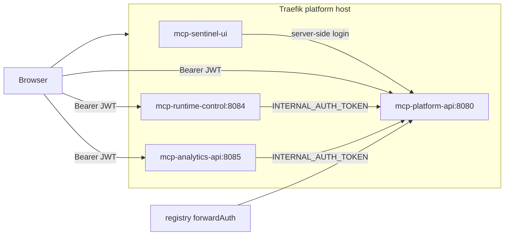

# API service split: `services/api` → three services

Authoritative implementation spec for splitting the Sentinel API monolith into
least-privilege services. Incorporates review amendments (2026-06-15).

**Amendment (no backward compatibility):** `/api/v1/*` is the single public surface.
There is no compat `/api/*` aliasing, no dual-emit ingress rules, and no
"transition window" — clients move directly to v1. Route-ownership lists below
omit the `/api/v1` prefix for brevity.

## Context

[`services/api`](../services/api) (`mcp-sentinel-api`, namespace `mcp-sentinel`) is a
monolith serving identity (Postgres), Kubernetes runtime control (broad
ClusterRole), and analytics (ClickHouse). A single ServiceAccount holds
impersonation and cluster mutation rights even though only runtime endpoints need
them.

**Locked decisions**

| Topic | Decision |
|-------|----------|
| Auth | HS256 with shared `JWT_SECRET`; platform-api signs multi-`aud` JWTs; runtime/analytics verify locally via `pkg/platformauth` |
| Routing | Traefik path-prefix on `platform.<domain>`; UI serves `/` only; canonical `/api/v1/*` is the only public surface (no compat `/api/*` — clients move to v1) |
| Migration | Big-bang cutover (alpha, single-cluster) |
| Runtime ↔ Postgres | Hybrid: runtime-control has zero Postgres; audit/identity via platform-api `/internal/*` |
| Admin routes | **Ingress split** (see below) |
| API contract | Unified envelope, stable codes, strict query validation, cursor pagination, OpenAPI per service — implemented in [`pkg/apihttp`](../../pkg/apihttp); Milestone 2 pre-flip for handler migration |

## API design contract

All three public services share one HTTP contract via [`pkg/apihttp`](../../pkg/apihttp).
OpenAPI specs are the published source of truth; handlers must match them.

### Versioning and base path

| Surface | Path | Notes |
|---------|------|-------|
| Canonical | `/api/v1/...` | The **only** public surface; all clients, CLI, and docs use this prefix. No legacy `/api/*` aliases. |
| Internal | `/internal/...` | In-cluster only; never on ingress; not versioned |
| Ops | `/health`, `/ready` | Unversioned; not part of the product API |
| Contract | `GET /api/v1/openapi.yaml` | Per-service OpenAPI 3.1 document |

### Resource naming

- Use **nouns** and **plural collections**: `/api/v1/runtime/servers`, `/api/v1/users`.
- **Item routes** use path segments, not query IDs: `/api/v1/runtime/servers/{namespace}/{name}`.
- Prefer **query filters** on collection GET over extra path endpoints (e.g. fold
  `/api/events/filter` into `GET /api/v1/events?trace_id=&namespace=`).
- No legacy-path compatibility: v1 adopts the cleanest shapes directly. Breaking
  changes from the old monolith paths are intentional and documented in OpenAPI.

### HTTP semantics

| Method | Use |
|--------|-----|
| `GET` | Read; safe; cacheable where appropriate |
| `POST` | Create or non-idempotent actions (login, registry push, team create) |
| `PUT` | Full replace of a sub-resource (team membership upsert) |
| `PATCH` | Partial update (grant disable, session revoke) |
| `DELETE` | Remove resource |

Return `Allow` on `405` via `apihttp.WriteMethodNotAllowed`.

### Status codes

| Code | When |
|------|------|
| `200` | Success with body |
| `201` | Resource created (`signup`, collection POST) |
| `204` | Success with no body (registry forward-auth allow) |
| `400` | Invalid JSON, unknown fields where strict, bad query params |
| `401` | Missing or invalid credentials |
| `403` | Authenticated but not authorized for this resource/namespace |
| `404` | Resource not found or not visible to caller |
| `409` | Conflict (duplicate team slug, optimistic lock) |
| `413` | Body over `ApplyMaxBytes` |
| `405` | Wrong HTTP method |
| `503` | Dependency unavailable (`runtime-control` K8s not ready) |

Never use `401` for authorization failures when the caller is authenticated
(use `403`).

### JSON conventions

- `Content-Type: application/json` on requests with bodies.
- Field names: **snake_case** (match existing payloads).
- Timestamps: **RFC3339** UTC in JSON strings.
- Success lists wrap the collection key (`events`, `teams`, `servers`) plus
  optional `pagination` (see below). Do not mix envelope styles per endpoint.

### Error envelope

Every error response:

```json
{"error":"<stable_code>","message":"<human-readable description>"}
```

- `error` is a **stable machine code** from [`pkg/apihttp/codes.go`](../../pkg/apihttp/codes.go).
- `message` is safe for operators; never leak stack traces or SQL.
- **Do not** derive codes from message text (remove `runtimeapi.errorCode`).

Handlers call `apihttp.WriteError` or return `*apihttp.Error`.

### Query parameters

- Invalid values → `400` with `invalid_query_param` (use `apihttp.QueryInt`,
  `apihttp.ParseLimit`, `apihttp.ParseCursor`).
- **No silent clamp or fallback** for malformed input.
- Document defaults and max bounds in OpenAPI (`limit` default 50, max 200 for
  admin lists; analytics events max 1000).

### Pagination (list endpoints)

Collection GETs that can grow unbounded use **cursor pagination**:

```json
{
  "events": [ ... ],
  "pagination": {
    "limit": 50,
    "next_cursor": "opaque-token",
    "has_more": true,
    "next": "/api/v1/events?cursor=opaque-token&limit=50"
  }
}
```

- `cursor` query param: opaque base64url JSON (`offset` internally for v1;
  switch to keyset cursors when ordering by non-sequential fields).
- Empty page → omit `next_cursor`, `has_more: false`.
- Helpers: `apihttp.ParseLimit`, `apihttp.ParseCursor`, `apihttp.ListMeta`,
  `apihttp.NextLink`.

### Authentication

| Mechanism | Header | Used for |
|-----------|--------|----------|
| Platform JWT | `Authorization: Bearer <token>` | UI, CLI, user sessions |
| User API key | `X-Api-Key: <key>` | Automation scoped to user |
| Service key | `X-Api-Key: <key>` | Ingest-style service callers; `ADMIN_API_KEYS` → admin role |
| Internal | `Authorization: Bearer <INTERNAL_AUTH_TOKEN>` | `/internal/*` only |

JWT: HS256, `iss=mcp-runtime`, multi-value `aud` per service. Downstream services
verify locally from enriched claims (no Postgres on read path).

### Liveness vs readiness

| Endpoint | Service | Purpose |
|----------|---------|---------|
| `GET /health` | All | **Liveness** — process up; always `200 {"ok":true}` when serving |
| `GET /ready` | platform-api | Postgres reachable |
| `GET /ready` | analytics-api | ClickHouse reachable |
| `GET /ready` | runtime-control | K8s client initialized; `503` + `runtime_error` when not |

Kubernetes probes: liveness → `/health`; readiness → `/ready`.

### Internal APIs

Same JSON and error envelope as public APIs. Additional rules:

- JSON request/response bodies only; no form encoding.
- `POST /internal/audit` accepts `{"events":[...]}`; returns `202 Accepted` after
  enqueue (platform-api persists asynchronously).
- `POST /internal/auth/resolve` returns `200` + principal or `401`.
- Identity mutations return `201` + resource or `409` on conflict.

### OpenAPI

- One `openapi.yaml` per service under `services/*/openapi.yaml`.
- Served at `GET /api/v1/openapi.yaml` on that service.
- CI: breaking-change check against previous spec (optional alpha: manual review).
- Document every query param, error code, and auth scheme.

### Anti-patterns (remove during migration)

| Today | Target |
|-------|--------|
| `{"error":"description"}` single field | `error` + `message` |
| `errorCode(message)` slug from text | Exported constants in `pkg/apihttp` |
| Silent `limit` clamp | `400 invalid_query_param` |
| `/health` gates runtime on monolith | Split `/health` vs `/ready` per service |
| Postgres hit on every JWT verify | Enriched JWT + `pkg/platformauth` |


| Service | Module / image | HTTP / metrics | Owns | K8s RBAC |
|---------|----------------|----------------|------|----------|
| **platform-api** | `mcp-platform-api` | 8080 / 9090 | Postgres, JWT, OIDC, users/teams/namespaces identity, credentials, registry-authz, migrations, bootstrap, admin namespaces/audit reads | Namespace Role for user-key secret only (drop if K8s key store removed) |
| **runtime-control** | `mcp-runtime-control` | 8084 / 9094 | MCPServer, grants, sessions, adapters, certs, policies, deployments, registry-push, dashboard summary (CH read), team K8s reconcile, admin operations/deployments | Broad ClusterRole (moved from `mcp-sentinel-api`) |
| **analytics-api** | `mcp-analytics-api` | 8085 / 9095 | ClickHouse queries (events, stats, usage) | None |



## Route ownership

Source of truth today: [`services/api/routes.go`](../../services/api/routes.go).

All public paths below are served under the `/api/v1` prefix (omitted for brevity);
there is no compat `/api/*` surface.

### platform-api

- `/api/auth/{login,oidc,signup,me}`
- `/api/users`
- `/api/user/api-keys[/]`
- `/api/user/registry-credentials[/]`
- `/api/user/activity/image-publish`
- `/api/registry/authz`
- `/api/admin/namespaces` — Postgres `ListNamespaces` only
- `/api/admin/audit` — Postgres `ListAuditLogs` only
- `/health` — liveness only (see API design contract)
- `/ready` — Postgres reachable
- `/internal/auth/resolve`, `/internal/identity/resolve-ids`, `/internal/audit`
- Internal team/namespace identity CRUD (not public URLs unless mirrored for admin)

### analytics-api

- `/api/events`, `/api/events/filter`, `/api/stats`, `/api/sources`, `/api/event-types`
- `/api/analytics/usage`, `/api/user/analytics/usage`
- `/health` — liveness only
- `/ready` — ClickHouse reachable

### runtime-control

- All `/api/v1/runtime/*`
- `/api/deployments[/]`
- `/api/admin/operations` — hybrid (see Admin routing)
- `/api/admin/deployments`
- `/api/dashboard/summary`
- `/internal/registry-push/tar` — in-cluster only, never on ingress
- `/health` — liveness only
- `/ready` — K8s runtime initialized (`503` + `runtime_error` when not)

### Admin routing (ingress split)

Do **not** route all `/api/admin/*` to runtime-control.

| Route | Service | Rationale |
|-------|---------|-----------|
| `/api/admin/namespaces` | **platform-api** | [`admin.HandleNamespaces`](../../services/api/admin/handlers.go) — Postgres only |
| `/api/admin/audit` | **platform-api** | [`admin.HandleAudit`](../../services/api/admin/handlers.go) — Postgres only |
| `/api/admin/operations` | **runtime-control** | Merges PG slices (via platform internal client) + `ListAdminDeploymentSummaries` (K8s) |
| `/api/admin/deployments` | **runtime-control** | K8s deployments package |

Ingress rule order (after registry push exact rule): platform admin paths before
the generic `/api/v1/admin` runtime prefix.

### Traefik path rules (platform host)

Most-specific first; one rule per prefix under `/api/v1/...` (no compat `/api/*`):

1. `/api/v1/runtime/registry/push` (Exact) → `mcp-runtime-control:8084`
2. `/api/v1/auth`, `/api/v1/users`, `/api/v1/registry/authz`, `/api/v1/user/api-keys`,
   `/api/v1/user/registry-credentials`, `/api/v1/user/activity`,
   `/api/v1/admin/namespaces`, `/api/v1/admin/audit` → `mcp-platform-api:8080`
3. `/api/v1/user/analytics`, `/api/v1/events`, `/api/v1/event-types`, `/api/v1/stats`,
   `/api/v1/sources`, `/api/v1/analytics` → `mcp-analytics-api:8085`
4. `/api/v1/runtime`, `/api/v1/deployments`, `/api/v1/admin`, `/api/v1/dashboard` →
   `mcp-runtime-control:8084`
5. `/` (Prefix) → `mcp-sentinel-ui:8082` (last)

**Registry forwardAuth** (not K8s Ingress — Traefik file middleware):

Update [`config/ingress/base/dynamic-config.yaml`](../../config/ingress/base/dynamic-config.yaml)
and [`config/ingress/overlays/http/dynamic-config.yaml`](../../config/ingress/overlays/http/dynamic-config.yaml)
at **Milestone 2 cutover**:

```yaml
address: http://mcp-platform-api.mcp-sentinel.svc.cluster.local:8080/api/v1/registry/authz
```

Update [`registry_forward_auth_test.go`](../../test/manifest/registry_forward_auth_test.go)
(it checks the suffix) to `/api/v1/registry/authz`.

**UI**

- Remove browser `/api/*` proxy ([`services/ui/main.go`](../../services/ui/main.go) `apiProxy`).
- **Keep** `API_UPSTREAM` for server-side `/auth/login`, OIDC, `/auth/me`.
- Repoint [`k8s/09-ui.yaml`](../../k8s/09-ui.yaml) `API_UPSTREAM` to
  `http://mcp-platform-api.mcp-sentinel.svc.cluster.local:8080`.
- SPA uses `window.MCP_API_BASE`; Traefik routes `/api/v1/*` on the public host.

## Hybrid orchestration: runtime-control ↔ platform-api

Public URLs for teams/namespaces stay on **runtime-control** (`/api/v1/runtime/teams`,
`/api/v1/runtime/namespaces`). Postgres ownership moves to **platform-api**.

### Team create (orchestrated)

Today [`teams.go`](../../services/api/internal/runtimeapi/teams.go) does PG
`CreateTeam` → K8s `ensureTeamNamespace` → PG rollback on K8s failure.

**After split:**

1. Client `POST /api/v1/runtime/teams` → runtime-control (auth via enriched JWT).
2. Runtime-control `POST /internal/identity/teams` → platform-api (creates PG row).
3. Runtime-control `ensureTeamNamespace` (K8s namespace, quotas, network policies, RBAC).
4. On K8s failure: runtime-control `DELETE /internal/identity/teams/{slug}` →
   platform-api (compensating delete; same as today’s `DeleteTeamBySlug`).

### Team list / get

| Caller role | Data source |
|-------------|-------------|
| Admin list all | platform-api `GET /internal/identity/teams` or inlined PG list via internal API |
| User list | Enriched JWT `teams` claim when fresh; optional internal refresh if stale |
| Get by slug | platform-api internal get + authz check on runtime |

### Namespace list / get

| Path | Admin | Non-admin |
|------|-------|-----------|
| `GET /api/v1/runtime/namespaces` | platform-api `ListNamespaces` + catalog entries | Assemble from JWT `allowed_namespaces` / `teams` + synthetic catalog entries ([`namespaces.go`](../../services/api/internal/runtimeapi/namespaces.go)) — **no PG** |
| `GET /api/v1/runtime/namespaces/{ns}` | platform-api `GetNamespace` when not catalog synthetic | JWT scope check; PG get for team-linked namespaces |

### Internal API contract

All `/internal/*` bind in-cluster only; never on ingress. Auth:
`Authorization: Bearer <INTERNAL_AUTH_TOKEN>`.

| Method | Path | Request | Success |
|--------|------|---------|---------|
| POST | `/internal/auth/resolve` | `{"api_key":"..."}` | `200` + `Principal` JSON |
| POST | `/internal/identity/resolve-ids` | `{"user_ids":[],"team_ids":[]}` | `200` + `{"users":{},"teams":{}}` |
| POST | `/internal/audit` | `{"events":[...]}` | `202 Accepted` |
| POST | `/internal/identity/teams` | `{"slug","name","owner_user_id"}` | `201` + team |
| DELETE | `/internal/identity/teams/{slug}` | — | `204` or `404` |
| GET | `/internal/identity/teams` | — | `200` + `{"teams":[],"pagination":{...}}` |
| GET | `/internal/identity/teams/{slug}` | — | `200` + team or `404` |
| GET | `/internal/identity/namespaces` | — | `200` + paginated list |
| GET | `/internal/identity/namespaces/{name}` | — | `200` + record or `404` |

Errors use the same `{"error","message"}` envelope. `401` for bad internal token.

Runtime-control audit client: buffer + retry (brief platform-api outage must not
drop audit). Suggested defaults: queue 1000 events, exponential backoff
100ms–30s, drop oldest on overflow with metric.

User API key resolver on runtime/analytics: HTTP client to
`/internal/auth/resolve` with 30–60s in-process cache keyed by key hash.

## Health and readiness

| Service | `GET /health` | `GET /ready` |
|---------|---------------|--------------|
| **platform-api** | `200 {"ok":true}` | `200` when Postgres ping succeeds; else `503` |
| **analytics-api** | `200 {"ok":true}` | `200` when ClickHouse ping succeeds; else `503` |
| **runtime-control** | `200 {"ok":true}` | `200` when K8s runtime server initialized; `503` with `runtime_error` when not |

Liveness must not fail during brief dependency blips; readiness drives Service
endpoints and rollout gates.

## Secrets and environment

| Key | Consumers | Notes |
|-----|-----------|-------|
| `JWT_SECRET` | platform-api (sign), all three (verify) | Random 32+ bytes; generated in setup |
| `INTERNAL_AUTH_TOKEN` | runtime-control, analytics-api → platform-api | Random 32+ bytes; generated in setup |
| `POSTGRES_DSN` | platform-api only | |
| `API_KEYS`, `ADMIN_API_KEYS` | All three (service keys) | |

Read via [`auth.JWTSecretFromEnv`](../../services/api/auth/seed.go).

## Milestones

### Milestone 1 — foundations + three buildable binaries (no K8s cutover)

1. `pkg/platformauth`, [`pkg/apihttp`](../../pkg/apihttp) (envelope, codes, pagination, strict query helpers); Principal aliases; monolith still builds.
2. Enrich token mint; internal endpoints on monolith; UserKeyResolver HTTP client.
3. Carve `services/analytics-api`.
4. Carve `services/runtime-control` (platform HTTP clients, no `platformStore`).
5. Reduce `services/api` → `services/platform-api`; `pkg/svcboot`; Dockerfiles.
6. Mount handlers under `/api/v1/*` as the **only** public surface (no compat `/api/*`); pagination/OpenAPI land in Milestone 2.

### Milestone 2 — deployment and cutover

1. Manifests `08-platform-api.yaml`, `08-runtime-control.yaml`, `08-analytics-api.yaml` + RBAC split.
2. Setup/CLI (`images.go`, `analytics.go`, doctor, prometheus, bootstrap).
3. Ingress renderer rewrite + **registry forwardAuth** + **UI `API_UPSTREAM`** repoint.
4. **API contract pass:** migrate handlers to `pkg/apihttp`, stable codes, strict params, cursor pagination, per-service `openapi.yaml`; fold `/events/filter` into filtered `GET /events`.
5. Big-bang cutover; smoke; delete `mcp-sentinel-api`.

### Cutover grep (delete stragglers)

In addition to `mcp-sentinel-api` and `08-api`:

- [`pkg/sentinel/components.go`](../../pkg/sentinel/components.go)
- [`internal/cli/sentinel/manager.go`](../../internal/cli/sentinel/manager.go)
- [`test/smoketest.sh`](../../test/smoketest.sh)
- [`.trivyignore.yaml`](../../.trivyignore.yaml)
- [`internal/cli/platformstatus/workloads.go`](../../internal/cli/platformstatus/workloads.go)
- [`config/ingress/overlays/http/dynamic-config.yaml`](../../config/ingress/overlays/http/dynamic-config.yaml)
- NetworkPolicy egress: runtime-control and analytics-api → platform-api:8080

Rollback: re-apply previous `k8s/08-api.yaml` + `08-api-rbac.yaml` + old ingress from git history.

### Milestone 3 — contract hardening (post-cutover)

Run only after Milestone 2 is verified green. Restores cross-service compile/contract safety
lost when the services became separate modules — lightweight (no Pact broker). Detail in
[`api-service-split-handoff.md`](./api-service-split-handoff.md) §"Milestone 3".

1. Shared `pkg/internalapi/` DTOs for every `/internal/*` endpoint; provider + both consumers
   import them so a field rename is a compile error on all sides.
2. Per-service provider tests that validate real handler responses against the committed
   `openapi.yaml` (executable contract; spec drift fails CI).
3. CI wiring (per-service spec-validation jobs; optional `oasdiff` breaking-change check) and a
   **documented upgrade trigger**: adopt real consumer-driven contracts (`pact-go` + Pact
   Broker / PactFlow) only when external clients or independently released teams consume these APIs.

## Verification (additions)

- `go test ./test/manifest/...` after forwardAuth host change
- E2E [`api_platform_flows.py`](../../test/e2e/api_platform_flows.py) `/api/v1/registry/authz`
- Doctor: `mcp-runtime-control:8084` for runtime probes
- Admin smoke: namespaces + audit on platform-api; operations on runtime-control
- Team create rollback with injected K8s failure

## Related docs to update at cutover

- [`docs/sentinel.md`](../sentinel.md), [`request-flows.md`](request-flows.md),
  [`authz-matrix.md`](../security/authz-matrix.md), troubleshooting runbooks, skills
  (`mcp-runtime-troubleshooting`, `k3s-public-ops`, `qa-e2e-operations`,
  `k8s-hardening-audit`, `supply-chain-audit`).
