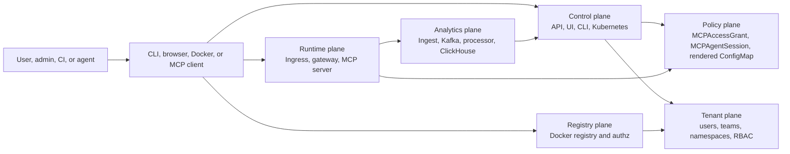
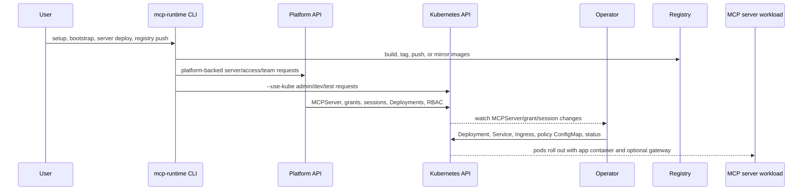
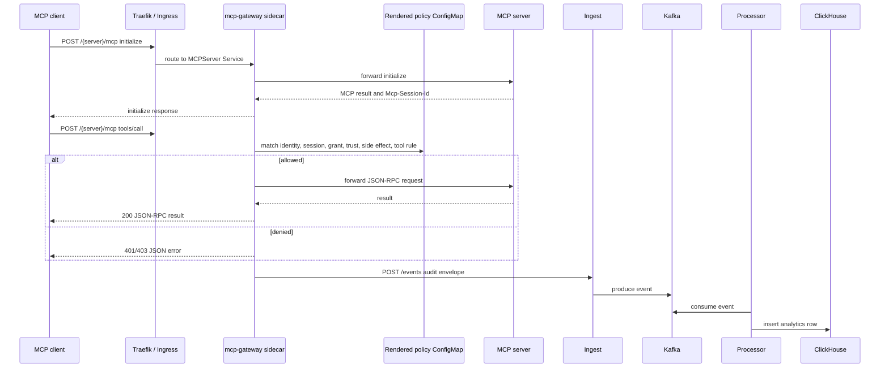
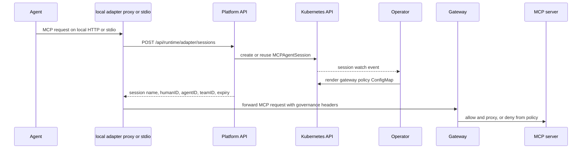
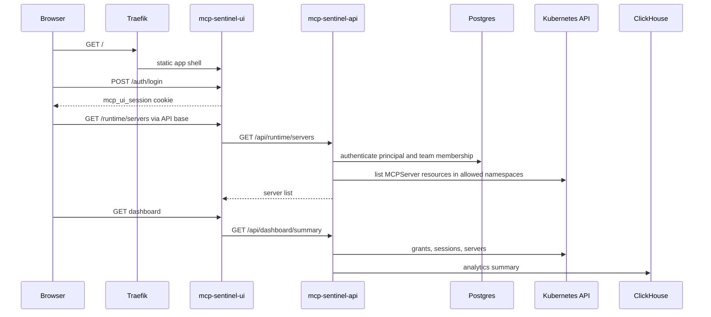
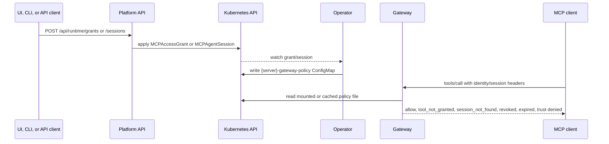
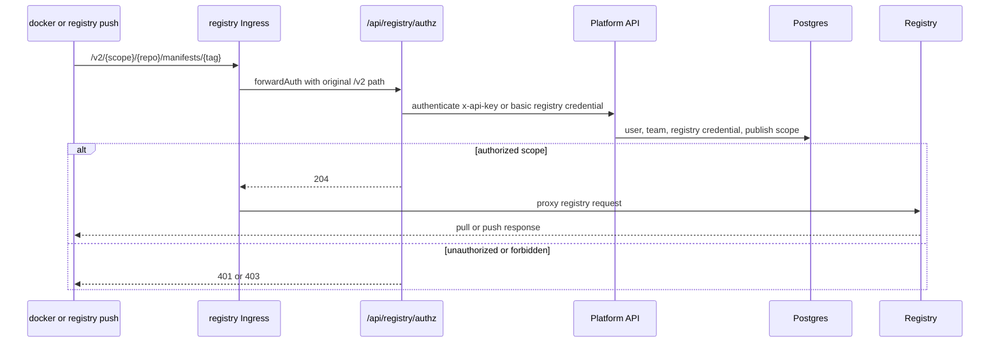
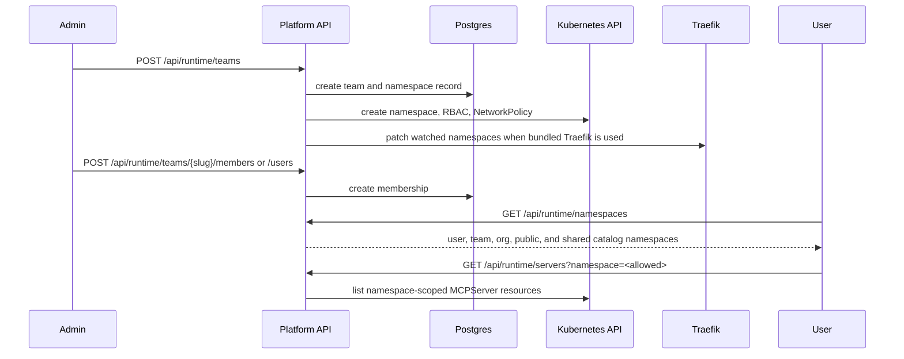
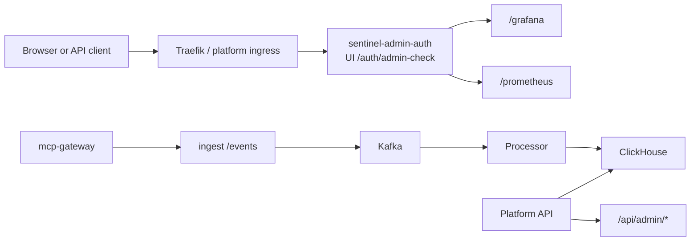

# Request Flows

This page maps MCP Runtime use cases to the components and request paths they
exercise. Use it when choosing PR E2E scenarios, designing pre-release
regression coverage, or debugging a request that crosses service boundaries.

## Flow Planes

Most use cases sit on one or more of these planes:

The important rule is that the request path is broader than the URL. A runtime
MCP request, for example, also exercises rendered policy, session state, audit
emission, ingest, Kafka, processor, and analytics query paths.

## Control Plane

Setup, server deployment, and server updates start in the CLI or platform API
and end when the operator reconciles Kubernetes resources.

Primary request paths:

- `mcp-runtime setup`, `bootstrap`, `cluster doctor`, `sentinel *`
- `mcp-runtime auth login/status/logout`
- `mcp-runtime registry status/info/provision/push`
- `mcp-runtime server list/get/create/apply/deploy/delete/logs/status/policy inspect`
- `GET/POST /api/runtime/servers`, `GET/DELETE /api/runtime/servers/{namespace}/{name}`
- `GET/POST /api/deployments`, `DELETE /api/deployments/{namespace}/{name}`

## Runtime MCP Requests

MCP traffic should not bypass the gateway when governance is enabled. The
gateway evaluates tool calls, forwards allowed requests, returns deny responses,
and emits audit events.

Primary request paths:

- `/{server}/mcp`
- JSON-RPC methods: `initialize`, `tools/list`, `tools/call`,
  `prompts/list`, `prompts/get`, `resources/list`, `resources/read`
- Governance headers: `X-MCP-Human-ID`, `X-MCP-Agent-ID`,
  `X-MCP-Team-ID`, `X-MCP-Agent-Session`
- Gateway health: `/health`

OAuth-protected MCP servers add:

- `/.well-known/oauth-protected-resource`
- `/.well-known/oauth-protected-resource/{server}/mcp`
- `Authorization: Bearer <token>` validation through issuer metadata and JWKS

## Adapter-Issued Sessions

Adapters let local agents use governed MCP routes without constructing grant and
session headers manually.

Primary request paths:

- `mcp-runtime adapter proxy --server <name> --agent <id>`
- `mcp-runtime adapter stdio --server <name> --agent <id>`
- `POST /api/runtime/adapter/sessions`
- Local adapter routes: `/mcp`, `/healthz`, `/livez`, `/readyz`, `/metrics`

## UI And Platform API

The browser first talks to the UI service. UI static assets are served locally,
while `/api/*` is proxied to the platform API using the active UI session or
configured upstream key.

Primary request paths:

- UI: `/`, `/config.js`, `/app.js`, `/styles.css`, `/health`
- UI auth: `/auth/login`, `/auth/logout`, `/auth/status`, `/auth/admin-check`
- API auth: `/api/auth/login`, `/api/auth/signup`, `/api/auth/oidc`,
  `/api/auth/me`
- Dashboard and analytics: `/api/dashboard/summary`, `/api/events`,
  `/api/events/filter`, `/api/stats`, `/api/sources`, `/api/event-types`,
  `/api/analytics/usage`, `/api/user/analytics/usage`

## Policy And Access Resources

Access resources are the bridge between platform intent and gateway enforcement.

Primary request paths:

- `GET/POST /api/runtime/grants`
- `GET/DELETE /api/runtime/grants/{namespace}/{name}`
- `POST /api/runtime/grants/{namespace}/{name}/enable`
- `POST /api/runtime/grants/{namespace}/{name}/disable`
- `GET/POST /api/runtime/sessions`
- `GET/DELETE /api/runtime/sessions/{namespace}/{name}`
- `POST /api/runtime/sessions/{namespace}/{name}/revoke`
- `POST /api/runtime/sessions/{namespace}/{name}/unrevoke`

## Registry Publish And Pull

Registry requests enter through the registry Ingress. Traefik calls the API as a
forward-auth service before the Docker registry receives the request.

Primary request paths:

- Registry: `/v2/`, `/v2/{scope}/{repo}/manifests/{tag}`,
  `/v2/{scope}/{repo}/blobs/*`, `/v2/{scope}/{repo}/tags/list`
- Authz: `/api/registry/authz`
- Credential lifecycle: `GET/POST /api/user/registry-credentials`,
  `POST /api/user/registry-credentials/{id}/revoke`
- Publish audit: `POST /api/user/activity/image-publish`

## Teams And Namespaces

Tenant and team flows decide which namespaces a principal can read, publish to,
or mutate.

Primary request paths:

- `GET/POST /api/runtime/teams`
- `GET /api/runtime/teams/{slug}`
- `GET/POST /api/runtime/teams/{slug}/members`
- `DELETE /api/runtime/teams/{slug}/members/{userID}`
- `POST /api/runtime/teams/{slug}/users`
- `GET /api/runtime/namespaces`
- `GET /api/runtime/namespaces/{namespace}`

## Observability And Admin

Observability uses both direct service routes and platform-guarded public routes.
Grafana and Prometheus public ingress paths are protected by UI admin forward
auth.

Primary request paths:

- Public observability: `/grafana/*`, `/prometheus/*`
- Service metrics: `/metrics` on API, ingest, processor, and adapter proxy
- Ingest: `GET /health`, `GET /live`, `GET /ready`, `POST /events`
- Processor: metrics server `/health`, `/metrics`
- Admin: `/api/admin/namespaces`, `/api/admin/audit`,
  `/api/admin/operations`, `/api/admin/deployments`

## Use Case Matrix

| Use case | Entry point | Components crossed | Primary contracts | E2E scenario |
|---|---|---|---|---|
| Bootstrap/install platform | `mcp-runtime bootstrap`, `setup` | CLI, Docker, registry, K8s, Traefik, API, UI, operator, Sentinel services | manifests, setup plan, image refs, rollouts | `smoke-auth`, `all` |
| Check platform health | `status`, `cluster doctor`, service `/health` | CLI, K8s, API/UI/ingest/processor/gateway health routes | workload status, secrets, ingress, registry | `smoke-auth`, `observability` |
| Log in to platform from CLI | `mcp-runtime auth login` | CLI, API, Postgres, authfile | JWT/API token, platform URL | `cli-platform`, `api-platform` |
| Browser login/logout | UI `/auth/*` | browser, UI, API key/session store | `mcp_ui_session`, admin check | `ui-auth` |
| List visible servers | UI/CLI/API `GET /api/runtime/servers` | API, Postgres principal, K8s MCPServer list | namespace scoping, public/org/team/user catalogs | `api-platform`, `multitenancy` |
| Publish MCP server | `server deploy`, `POST /api/runtime/servers` | CLI/API, registry, K8s, operator | MCPServer spec, image scope, ingress path | `cli-platform`, `api-platform`, `all` |
| Admin direct kube changes | `--use-kube` CLI | CLI, kubeconfig, Kubernetes API, operator | CRDs and RBAC, no platform auth boundary | targeted local/admin tests |
| Reconcile server workload | MCPServer change | K8s API, operator, Deployment, Service, Ingress, status | CRD defaults, service target port, gateway sidecar | `smoke-auth`, `all` |
| Render gateway policy | grant/session/server change | API/CLI, K8s CRs, operator, ConfigMap, gateway | `MCPAccessGrant`, `MCPAgentSession`, policy JSON | `governance`, `trust` |
| MCP initialize/list/call | MCP client `/{server}/mcp` | Ingress, Service, gateway sidecar, MCP server | Streamable HTTP, JSON-RPC, MCP session header | `smoke-auth` |
| Denied MCP call | `tools/call` without matching policy | gateway, policy evaluator, audit pipeline | deny reasons such as `tool_not_granted`, `session_not_found` | `governance`, `trust` |
| OAuth MCP call | bearer token MCP route | gateway, OIDC discovery/JWKS, policy, MCP server | OAuth protected resource metadata, JWT claims | `oauth` |
| Adapter proxy | `mcp-runtime adapter proxy` | local adapter, API, K8s session, operator, gateway | adapter session response, governance headers | `adapter-proxy` |
| Adapter stdio | `mcp-runtime adapter stdio` | stdio shim, API, gateway, MCP server | stdin/stdout JSON-RPC, session state | `adapter-proxy`, unit tests |
| Create/update grants | UI/CLI/API `/api/runtime/grants` | API, K8s, operator, gateway | grant validation, subject/team binding | `governance`, `api-platform` |
| Create/update sessions | UI/CLI/API `/api/runtime/sessions` | API, K8s, operator, gateway | session trust, expiry, revoked state | `governance`, `api-platform` |
| Revoke/disable access | item action paths | API, K8s, operator, gateway | enable/disable/revoke/unrevoke | `governance`, `api-platform` |
| Push or pull registry image | Docker `/v2/*` | registry ingress, Traefik forwardAuth, API, registry | scope authz, registry credentials | `api-platform`, `all` |
| Create registry credential | `/api/user/registry-credentials` | API, Postgres, registry authz | one-time credential, revoke flow | `api-platform` |
| Create user API key | `/api/user/api-keys` | API, Postgres, auth middleware | one-time key, revoke flow | `api-platform` |
| Create team namespace | `/api/runtime/teams` or `team init` | API/CLI, Postgres, K8s namespace/RBAC, Traefik watch | team slug, namespace, membership, RBAC | `multitenancy`, `api-platform` |
| Manage team members/users | `/api/runtime/teams/{slug}/*` | API, Postgres, namespace authorization | membership and user records | `multitenancy`, `api-platform` |
| Query analytics | `/api/events*`, `/api/analytics/usage` | API, ClickHouse, gateway/ingest history | event envelope, filters, usage rows | `observability`, `api-platform` |
| Direct ingest event | `POST /events` | ingest, auth, Kafka, processor, ClickHouse | event envelope and API key auth | `observability` |
| View Grafana/Prometheus | `/grafana/*`, `/prometheus/*` | ingress, UI admin-check, Grafana/Prometheus | cookie/API-key admin forward auth | `ui-auth`, `observability` |
| Admin audit/operations | `/api/admin/*` | API, Postgres, K8s, audit store | admin role checks, audit payloads | `api-platform` |
| Pre-release full sweep | manual workflow | static checks, tests, Kind modes, registry, API, UI, CLI, MCP, cache replay | tenant/org/public behavior, cache reuse | `all` with `E2E_DEEP_REQUEST_FLOWS=1` |

## Coverage Guidance

For normal PRs, run the shortest scenario that crosses the changed request
plane. If a change touches shared contracts, generated manifests, API auth,
policy evaluation, or namespace scoping, prefer the broader scenario or let CI
fall back to `all`.

For pre-release, cover every row in the matrix through `E2E_SCENARIOS=all` with
`E2E_DEEP_REQUEST_FLOWS=1`, in tenant, org, and public platform modes. Include
one cache replay so setup reuse, image reuse, adapter deterministic session
reuse, and retained cluster state are exercised before release.
