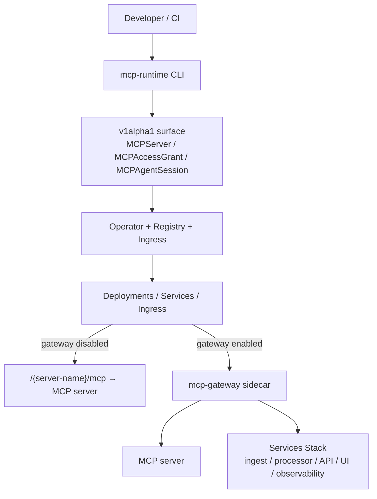
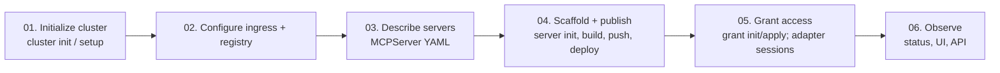

# Runtime

The runtime is the Kubernetes-native control plane for MCP servers. It owns the manager, registry, broker wiring, cluster bootstrap, ingress setup, operator reconciliation, deployment resources, rollout, and the access model that sits beside each server before requests reach the [Sentinel](sentinel.md) request path.

> Higher-level than ingress and service mesh. The runtime sits **above** lower-level networking infrastructure and models MCP-specific delivery, access, and rollout concerns. It is not a generic data plane for arbitrary cluster traffic.

## What the runtime owns

| Area | Responsibility |
|---|---|
| **Bootstrap** | `cluster` and `setup` initialize CRDs and namespaces, configure ingress, provision clusters, optionally wire cert-manager TLS. |
| **Registry workflow** | Registry commands and setup wiring give teams a controlled place to publish and pull MCP server images. |
| **Server delivery** | The operator reconciles `MCPServer` into Deployments, Services, and Ingress so each server lands at a stable route. |
| **Access and consent** | Grants and sessions are separate resources so policy, side-effect allowances, trust ceilings, consent, expiry, and revocation stay outside deployment-only YAML. |
| **Brokered rollout** | Servers can stay direct or run behind the proxy sidecar while rollout settings live on the same server resource. |

## Core resources

Three CRDs form the runtime surface: `MCPServer`, `MCPAccessGrant`, and `MCPAgentSession`.
`MCPServer` is referenced by many grants and sessions; grant + session are evaluated
together by the gateway policy layer on every tool call.

See the [API reference](api.md) for full field definitions and examples.

## Reconciliation outputs

For every `MCPServer`, the operator reconciles:

- **Deployment** — image, replicas, resource requests/limits, env, image-pull secrets.
- **Service** — ClusterIP exposing `spec.servicePort` → `spec.port`.
- **Ingress** — routes `spec.publicPathPrefix` as `/<prefix>/mcp`, or explicit `spec.ingressHost` + `spec.ingressPath`, to the Service with per-class annotations (Traefik / NGINX / Istio).
- **Policy ConfigMap** — rendered from the matching `MCPAccessGrant` + `MCPAgentSession` resources, consumed by the proxy sidecar when `gateway.enabled`.

`MCPServer.status` exposes:

- `phase` — `Pending` → `PartiallyReady` → `Ready`.
- `message` — human-readable progress.
- `conditions` — standard Kubernetes condition slice.
- Per-resource readiness booleans: `deploymentReady`, `serviceReady`, `ingressReady`, `gatewayReady`, `policyReady`.
- `ingressReady` defaults to strict mode: the Ingress must publish `status.loadBalancer.ingress[]`. Set operator env `MCP_INGRESS_READINESS_MODE=permissive` for dev or NodePort-style ingress controllers that route traffic without publishing load-balancer status; permissive mode treats an Ingress with rules as ready.

### Useful defaults

- Servers default to `/{server-name}/mcp`; set `spec.publicPathPrefix` to choose the public path prefix explicitly.
- Hostless path-based routing is supported through `spec.publicPathPrefix`; otherwise provide `spec.ingressHost` or configure the operator default host.
- Container port defaults to `8088`, service port to `80`.
- Gateway listens on `8091`.
- `setup` provisions `mcp-runtime` plus the active shared catalog namespace for
  shared modes: `mcp-servers-org` for `org` or `mcp-servers-public` for
  `public`.
- `tenant` mode uses team namespaces for the authenticated principal's team
  memberships. Place runtime CRDs in per-team namespaces and rely on Kubernetes
  RBAC and ingress watch configuration for isolation.
- Default ingress class is `traefik`; override via `spec.ingressClass`.

## Topology



## Install and delivery flow



| Step | Commands |
|---|---|
| Initialize cluster | `cluster init`, `setup`, `bootstrap` |
| Configure ingress + registry | `cluster config --ingress traefik`, `registry provision` |
| Describe servers | `server init`, hand-written `MCPServer` YAML, or metadata in `.mcp/` |
| Publish + deploy | `auth login`, `server build image`, `registry push`, `server deploy`, `server generate` for GitOps YAML |
| Grant access | `auth login`, `access grant init`, `access grant apply`; sessions via `adapter stdio|proxy --server … --agent …` or admin `access session init/apply` |
| Observe | `status`, platform UI/API; admin: `sentinel status`, `sentinel port-forward ui` |

## Traffic and enforcement model

| Mode | Behavior |
|---|---|
| **Direct** | No `gateway.enabled`. Service points at the MCP server directly. Server is exposed at `/{server-name}/mcp`. |
| **Gateway** | `spec.gateway.enabled: true`. Traffic flows through the proxy sidecar; identity, policy, audit, and telemetry happen in one place. |
| **Trust evaluation** | Tool `requiredTrust`, grant `maxTrust`, and session `consentedTrust` combine to determine effective trust at tool-call time. |
| **Side-effect evaluation** | Each listed tool must declare `sideEffect: read`, `write`, or `destructive`; a grant only authorizes tools whose side effect is present in `allowedSideEffects`. Omitted or empty `allowedSideEffects` allows no side-effect classes. |

### Gateway headers

These header names are defaults; override via `spec.auth.{humanIDHeader,agentIDHeader,teamIDHeader,sessionIDHeader}`.

```text
X-MCP-Human-ID:    user-123
X-MCP-Agent-ID:    ops-agent
X-MCP-Team-ID:     7d0a0b8f-7c25-4761-a632-3cf0108e31d6
X-MCP-Agent-Session: sess-8f1b9d
```

### Gateway policy snapshots

The operator renders `MCPServer` + `MCPAccessGrant` + `MCPAgentSession` state
into a JSON policy ConfigMap that the gateway sidecar mounts and reloads. The
rendered document carries document-level metadata distinct from the
authorization `policyVersion`:

| Field | Meaning |
|---|---|
| `schema_version` | Compatibility of the rendered JSON contract. The gateway rejects any version it does not support. |
| `revision` | Deterministic `sha256:` digest of the canonical policy content. Identical content always yields the same revision; it is computed with `generated_at` excluded so timestamps never change it. |
| `generated_at` | Informational only; set at write time and never affects `revision`. |

Both sides share `pkg/policy.Validate`: the operator validates a rendered
document **before** replacing the ConfigMap, and the gateway validates a decoded
document **before** activating it. Validation fails closed — unknown trust,
side-effect, decision, auth-mode, or policy-mode values, duplicate names, and
OAuth without an issuer are all rejected.

Activation is **last-known-good**: a malformed, unsupported, or invalid update
never replaces the active snapshot. The gateway keeps serving the previous valid
policy and records the failure, and snapshot swaps are atomic so concurrent
requests always observe a complete old or new policy, never a partial one.

Operators can confirm what is applied via the gateway endpoints:

- `GET /health` — liveness (always OK while serving).
- `GET /ready` — readiness; fails until the first valid policy snapshot loads.
- `GET /config/status` — sanitized `schema_version`, `revision`, `loaded_at`,
  and `last_reload_error` (no policy body).
- `GET /metrics` — `mcp_gateway_policy_reload_total{result}`,
  `mcp_gateway_policy_active_revision_info{revision,schema_version}`, and
  `mcp_gateway_policy_last_success_timestamp_seconds`.

### Agent adapters

Agent-side adapters are helper processes for frameworks and IDEs that cannot
attach governance headers directly. `mcp-runtime adapter proxy` accepts local
Streamable HTTP MCP traffic and `mcp-runtime adapter stdio` accepts stdio MCP
traffic; both forward to the governed runtime route with the issued
identity/session headers.

The recommended path is **platform-issued sessions**: passing `--server
<MCPServer name> --agent <id>` makes the adapter call `POST
/api/runtime/adapter/sessions` at startup. The platform derives `humanID` and
`teamID` from the logged-in principal, picks a matching enabled
`MCPAccessGrant` (highest `MaxTrust`, oldest creation as the tiebreak), and
writes (or reuses) an `MCPAgentSession` with a deterministic name —
`adapter-<sha256-prefix(humanID,agentID,teamID,serverName)>`. Adding
`--auto-refresh` rotates the issued identity ~5 min before expiry without
restarting the process. Explicit `--human-id` / `--agent-id` / `--session-id`
flags still take precedence over the issued values and survive every refresh.

For closed environments without the platform API, the adapters still accept
explicit `MCP_RUNTIME_*` env vars. Anonymous mode (`--anonymous` on stdio)
forwards to public/read-only routes with no identity headers and a method
allowlist.

Either way, the adapters present headers; the gateway is the policy
enforcement point. They do not bypass `MCPAccessGrant` or `MCPAgentSession`
checks.

Operational notes:

- The proxy exposes `/healthz`, `/livez`, `/readyz`, and an optional
  `/metrics` endpoint when wired with `ProxyConfig.MetricsHandler`.
- Idempotent reads (`tools/list`, `resources/list`, `prompts/list`, `ping`)
  retry on `502`/`504`/connection-reset; `tools/call` does not retry.
- The stdio shim caches `tools/list` for `--tools-cache-ttl`, invalidates on
  `notifications/tools/list_changed`, and keys the cache off the live
  governance identity so `--auto-refresh` rotations start fresh.
- Set `MCP_RUNTIME_LOG_LEVEL=info` on either adapter to print runtime 4xx
  denials to stderr.

See [Agent Adapters](agent-adapters.md) for build commands and full
integration examples.

## Operator internals (high-level)

The operator is a single-controller `controller-runtime` manager:

1. Watches `MCPServer` (and owns Deployment / Service / Ingress).
2. On reconcile, fills defaults via `setDefaults`, persists spec changes if defaults were added.
3. Resolves the image string (respecting `imageTag`, `registryOverride`, and `PROVISIONED_REGISTRY_URL`).
4. Builds image-pull secrets, including auto-creating a docker-config secret from provisioned-registry env vars.
5. Reconciles Deployment → Service → Ingress in order.
6. Computes per-resource readiness, sets phase and conditions, writes status.

Source walkthroughs live under [internals/cmd-operator.md](internals/cmd-operator.md).

## Current scope

Implemented and stable enough to evaluate:

- Deployment, routing, image pull, registry handling.
- Grants, sessions, gateway policy generation.
- Trust evaluation and audit-event flow.
- Multi-ingress class support (Traefik, NGINX, Istio, generic).

Not yet:

- Full OAuth 2.1 authorization server flows.
- Multi-cluster federation.

## Next

- [CLI](cli.md) — every command and flag.
- [API](api.md) — full CRD reference with examples.
- [Sentinel](sentinel.md) — what happens after traffic enters the gateway.
