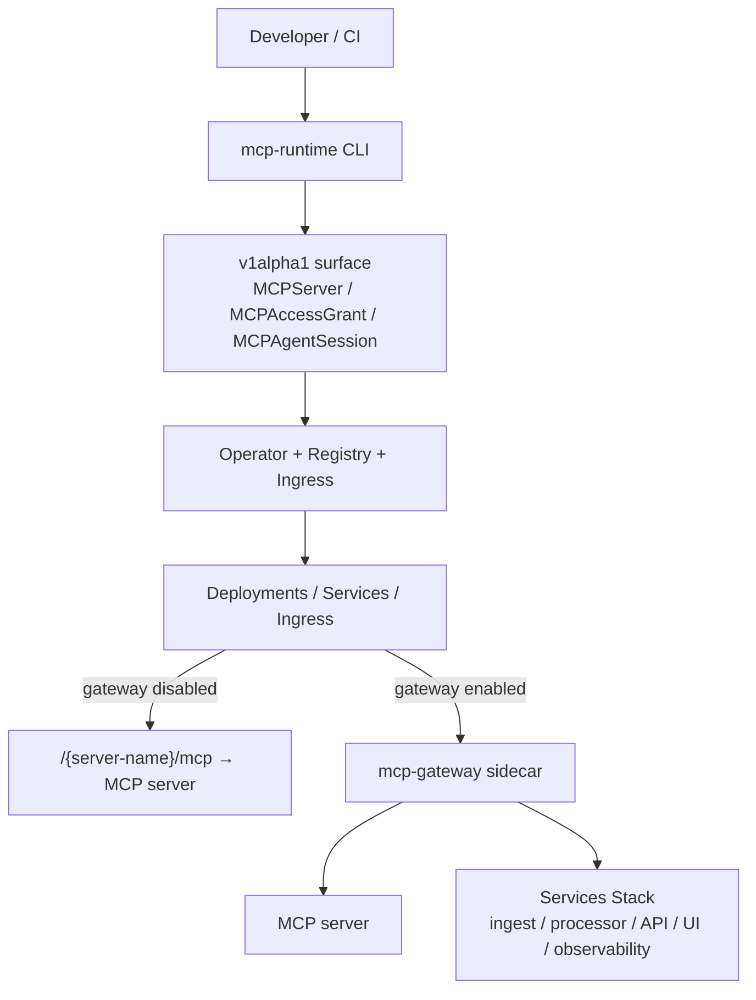
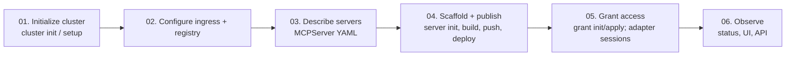

# Runtime

The runtime is the Kubernetes control plane for MCP servers. It handles cluster bootstrap, the registry, ingress setup, operator reconciliation, deployment resources, rollout, and the access model for each server. Requests then pass to the [Sentinel](sentinel.md) request path.

The runtime runs on top of your ingress and networking layer and handles MCP-specific delivery, access, and rollout. It does not route general cluster traffic.

## What the runtime owns

| Area | Responsibility |
|---|---|
| **Bootstrap** | `cluster` and `setup` initialize CRDs and namespaces, configure ingress, provision clusters, optionally wire cert-manager TLS. |
| **Registry workflow** | Registry commands and setup wiring provide a place to publish and pull MCP server images. |
| **Server delivery** | The operator reconciles `MCPServer` into Deployments, Services, and Ingress. Each server gets a stable route. |
| **Access and consent** | Grants and sessions are separate resources. They hold policy, side-effect allowances, trust ceilings, consent, expiry, and revocation, apart from the deployment YAML. |
| **Brokered rollout** | Servers run direct or behind the proxy sidecar. Rollout settings live on the same server resource. |

## Core resources

Three CRDs form the runtime surface: `MCPServer`, `MCPAccessGrant`, and `MCPAgentSession`.
Many grants and sessions can reference one `MCPServer`. The gateway policy layer evaluates the grant and session together on every tool call.

See the [API reference](api.md) for full field definitions and examples.

## Reconciliation outputs

For every `MCPServer`, the operator reconciles:

- **Deployment**: image, replicas, resource requests/limits, env, image-pull secrets.
- **Service**: ClusterIP exposing `spec.servicePort` → `spec.port`.
- **Ingress**: routes `spec.publicPathPrefix` as `/<prefix>/mcp`, or explicit `spec.ingressHost` + `spec.ingressPath`, to the Service with per-class annotations (Traefik / NGINX / Istio).
- **Policy ConfigMap**: rendered from the matching `MCPAccessGrant` + `MCPAgentSession` resources, consumed by the proxy sidecar when `gateway.enabled`.

`MCPServer.status` exposes:

- `phase`: `Pending` → `PartiallyReady` → `Ready`.
- `message`: human-readable progress.
- `conditions`: standard Kubernetes condition slice.
- Per-resource readiness booleans: `deploymentReady`, `serviceReady`, `ingressReady`, `gatewayReady`, `policyReady`, and `canaryReady` when a canary rollout is configured.
- `ingressReady` defaults to strict mode: the Ingress must publish `status.loadBalancer.ingress[]`. For dev or NodePort-style ingress controllers that route traffic without publishing load-balancer status, set operator env `MCP_INGRESS_READINESS_MODE=permissive`. Permissive mode treats an Ingress with rules as ready.

### Useful defaults

- Servers default to `/{server-name}/mcp`; set `spec.publicPathPrefix` to choose the public path prefix explicitly.
- Hostless path-based routing is supported through `spec.publicPathPrefix`; otherwise provide `spec.ingressHost` or configure the operator default host.
- Container port defaults to `8088`, service port to `80`.
- Gateway listens on `8091`.
- `setup` provisions `mcp-runtime` plus the active shared catalog namespace for
  shared modes: `mcp-servers-org` for `org` or `mcp-servers-public` for
  `public`.
- `tenant` mode uses team namespaces for the authenticated principal's team
  memberships. Place runtime CRDs in per-team namespaces and rely on Kubernetes
  RBAC and ingress watch configuration for isolation.
- Default ingress class is `traefik`; override via `spec.ingressClass`.

## Topology


```mermaid
flowchart TB
    Dev[Developer / CI] --> CLI[mcp-runtime CLI]
    CLI --> CRD[v1alpha1 surface<br/>MCPServer / MCPAccessGrant / MCPAgentSession]
    CRD --> Op[Operator + Registry + Ingress]
    Op --> K8s[Deployments / Services / Ingress]

    K8s -->|gateway disabled| Direct["/{server-name}/mcp → MCP server"]
    K8s -->|gateway enabled| Gateway[mcp-gateway sidecar]
    Gateway --> MCP[MCP server]
    Gateway --> Stack[Services Stack<br/>ingest / processor / API / UI / observability]
```

## Install and delivery flow


```mermaid
flowchart LR
    A[01. Initialize cluster<br/>cluster init / setup] --> B[02. Configure ingress + registry]
    B --> C[03. Describe servers<br/>MCPServer YAML]
    C --> D[04. Scaffold + publish<br/>server init, build, push, deploy]
    D --> E[05. Grant access<br/>grant init/apply; adapter sessions]
    E --> F[06. Observe<br/>status, UI, API]
```

| Step | Commands |
|---|---|
| Initialize cluster | `cluster init`, `setup`, `bootstrap` |
| Configure ingress + registry | `cluster config --ingress traefik`, `registry provision` |
| Describe servers | `server init`, hand-written `MCPServer` YAML, or metadata in `.mcp/` |
| Publish + deploy | `auth login`, `server build image`, `server push`, `server deploy`, `server generate` for GitOps YAML |
| Grant access | `auth login`, `access grant init`, `access grant apply`; sessions via `adapter stdio|proxy --server … --agent …` or admin `access session init/apply` |
| Observe | `status`, platform UI/API; admin: `sentinel status`, `sentinel port-forward ui` |

## Traffic and enforcement model

| Mode | Behavior |
|---|---|
| **Direct** | No `gateway.enabled`. Service points at the MCP server directly. Server is exposed at `/{server-name}/mcp`. |
| **Gateway** | `spec.gateway.enabled: true`. Traffic flows through the proxy sidecar, which handles identity, policy, audit, and telemetry. |
| **Trust evaluation** | At tool-call time, effective trust is `min(grant.maxTrust, session.consentedTrust)` and must meet the required trust, which is the higher of the tool's `requiredTrust` and the matching tool rule's `requiredTrust`. |
| **Side-effect evaluation** | Each listed tool must declare `sideEffect: read`, `write`, or `destructive`. A grant authorizes only tools whose side effect is in `allowedSideEffects`. Omitted or empty `allowedSideEffects` allows no side-effect classes. A tool the server never declared is denied, because it has no side effect to authorize. |
| **Observe mode** | `policy.mode: observe` allows the call before identity, session, grant, side-effect, and trust checks run. Requests are still proxied and audited, but nothing is enforced. |

### Gateway headers

These header names are defaults; override via `spec.auth.{humanIDHeader,agentIDHeader,teamIDHeader,sessionIDHeader}`.

```text
X-MCP-Human-ID:    user-123
X-MCP-Agent-ID:    ops-agent
X-MCP-Team-ID:     7d0a0b8f-7c25-4761-a632-3cf0108e31d6
X-MCP-Agent-Session: sess-8f1b9d
```

### Gateway policy snapshots

The operator renders `MCPServer` + `MCPAccessGrant` + `MCPAgentSession` state
into a JSON policy ConfigMap that the gateway sidecar mounts and reloads. The
rendered document carries this metadata, separate from the authorization
`policyVersion`:

| Field | Meaning |
|---|---|
| `schema_version` | Compatibility of the rendered JSON contract. The gateway rejects any version it does not support. Documents are `v1` unless a grant sets `expiresAt`; those are `v2`, so a gateway built before grant expiry rejects them and keeps its last valid policy instead of ignoring the expiry. |
| `revision` | Deterministic `sha256:` digest of the canonical policy content. Identical content always yields the same revision. `generated_at` is excluded from the digest, so timestamps never change it. |
| `generated_at` | Informational only; set at write time and never affects `revision`. |

Both sides share `pkg/policy.Validate`: the operator validates a rendered
document **before** replacing the ConfigMap, and the gateway validates a decoded
document **before** activating it. Validation fails closed. It rejects unknown
trust, side-effect, decision, auth-mode, or policy-mode values, duplicate names,
and OAuth without an issuer.

Activation is **last-known-good**: a malformed, unsupported, or invalid update
never replaces the active snapshot. The gateway keeps serving the previous valid
policy and records the failure. Snapshot swaps are atomic, so each request sees
either the complete old policy or the complete new one.

To check the applied policy, use the gateway endpoints:

- `GET /health`: liveness (always OK while serving).
- `GET /ready`: readiness; fails until the first valid policy snapshot loads.
- `GET /config/status`: sanitized `schema_version`, `revision`, `loaded_at`,
  and `last_reload_error` (no policy body).
- `GET /metrics`: `mcp_gateway_policy_reload_total{result}`,
  `mcp_gateway_policy_active_revision_info{revision,schema_version}`, and
  `mcp_gateway_policy_last_success_timestamp_seconds`.

### Agent adapters

Agent adapters are helper processes for frameworks and IDEs that cannot
attach governance headers. `mcp-runtime adapter proxy` accepts local
Streamable HTTP MCP traffic and `mcp-runtime adapter stdio` accepts stdio MCP
traffic; both forward to the governed runtime route with the issued
identity/session headers.

Use **platform-issued sessions**. With `--server <MCPServer name> --agent <id>`,
the adapter calls `POST /api/v1/runtime/adapter/sessions` at startup. The platform derives `humanID` and
`teamID` from the logged-in principal, picks a matching enabled
`MCPAccessGrant` (highest `MaxTrust`, oldest creation as the tiebreak), and
writes (or reuses) an `MCPAgentSession` with a deterministic name:
`adapter-<sha256-prefix(humanID,agentID,teamID,serverName)>`. Adding
`--auto-refresh` rotates the issued identity ~5 min before expiry without
restarting the process. Explicit `--human-id` / `--agent-id` / `--session-id`
flags take precedence over the issued values and survive every refresh.

In closed environments without the platform API, set explicit `MCP_RUNTIME_*`
env vars. Anonymous mode (`--anonymous` on stdio)
forwards to public/read-only routes with no identity headers and a method
allowlist.

The adapters only present headers. The gateway enforces policy, including
`MCPAccessGrant` and `MCPAgentSession` checks.

Operational notes:

- The proxy exposes `/healthz`, `/livez`, `/readyz`, and an optional
  `/metrics` endpoint when wired with `ProxyConfig.MetricsHandler`.
- Idempotent reads (`tools/list`, `resources/list`, `prompts/list`, `ping`)
  retry on `502`/`504`/connection-reset; `tools/call` does not retry.
- The stdio shim caches `tools/list` for `--tools-cache-ttl`, invalidates on
  `notifications/tools/list_changed`, and keys the cache off the live
  governance identity so `--auto-refresh` rotations start fresh.
- Set `MCP_RUNTIME_LOG_LEVEL=info` on either adapter to print runtime 4xx
  denials to stderr.

See [Agent Adapters](agent-adapters.md) for build commands and full
integration examples.

## Operator internals (high-level)

The operator is a single-controller `controller-runtime` manager:

1. Watches `MCPServer` (and owns Deployment / Service / Ingress).
2. Defaults and validates new API writes through admission webhooks; on reconcile, applies the same defaults to an in-memory copy for legacy objects without patching the stored spec.
3. Resolves the image string (respecting `imageTag`, `registryOverride`, and `PROVISIONED_REGISTRY_URL`).
4. Builds image-pull secrets, including auto-creating a docker-config secret from provisioned-registry env vars.
5. Reconciles Deployment → Service → Ingress in order.
6. Computes per-resource readiness, sets phase and conditions, writes status.

Source walkthroughs live under [internals/cmd-operator.md](internals/cmd-operator.md).

## Current scope

Implemented and stable enough to evaluate:

- Deployment, routing, image pull, registry handling.
- Grants, sessions, gateway policy generation.
- Trust evaluation and audit-event flow.
- Multi-ingress class support (Traefik, NGINX, Istio, generic).
- OAuth: with `spec.auth.mode: oauth` the gateway acts as an MCP protected
  resource. It publishes protected-resource metadata, validates the token
  issuer and resource audience, and strips the bearer token before forwarding.
  Tokens come either from the opt-in bundled `mcp-auth-server`
  (`setup --with-mcp-auth-server`, authorization code with S256 PKCE, refresh
  rotation, CIMD or DCR client registration) or from an external authorization
  server you operate. Accounts stay in your identity provider. The bundled
  server federates to one configured OIDC connector per process. Policy
  decisions stay in the gateway. See
  [MCP authorization](mcp-authorization.md).
- Adapter certificates: optional session-bound certificates are verified at
  ingress on OAuth server routes. The gateway derives the adapter session
  identity from the verified certificate and applies grant/session policy.
  Clients without a certificate use OAuth. Set
  `MCP_ADAPTER_CERTIFICATES=true` with platform `MCP_MTLS_CLUSTER_ISSUER` and
  `MCP_TRUST_DOMAIN` to enable enrollment.

Not yet:

- Multi-cluster federation.

## Next

- [CLI](cli.md): every command and flag.
- [API](api.md): full CRD reference with examples.
- [Sentinel](sentinel.md): what happens after traffic enters the gateway.
