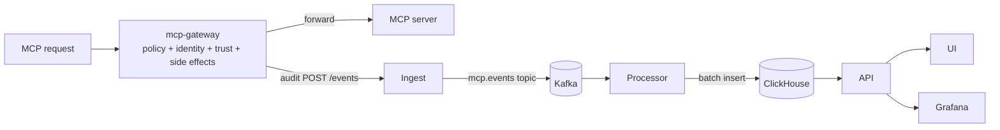

# Sentinel

`mcp-sentinel` is the bundled service stack for gateway enforcement, audit, query, governance UI, and observability around MCP servers. It governs **live MCP requests**, not arbitrary cluster traffic. It ships in `services/` and is installed by default with `mcp-runtime setup` (skip with `--without-sentinel`).

## Services

| Service | Role |
|---|---|
| **mcp-gateway** | Transparent sidecar. Extracts identity, evaluates tool-level policy, emits allow/deny audit events, forwards traffic upstream. |
| **ingest** | Receives `POST /events`, validates ingest-scoped API keys or optional JWTs, writes to Kafka. |
| **processor** | Consumes Kafka, batches, writes into ClickHouse with indexed audit fields. |
| **api** (split) | Three HTTP services behind Traefik path routing: **platform-api** (Postgres identity/auth/registry), **runtime-control** (Kubernetes runtime governance + registry push), **analytics-api** (ClickHouse events/stats/usage). OpenAPI at `GET /api/v1/openapi.yaml` per service. |
| **ui** | Control-plane dashboard: user MCP server dashboard, MCP server catalog and connect config, user API keys, analytics dashboard, governance, MCP operations, and platform management. |
| **gateway** | Kubernetes deployment fronting the sentinel API, ingest, and UI surfaces. |
| **workspace assistant sample** | Sample MCP server in `examples/workspace-assistant-mcp` for end-to-end smoke tests. |

## Kubernetes awareness and hardening

Sentinel services usually run as Kubernetes workloads, but not every service
needs the Kubernetes API. For hardening, separate **Kubernetes-aware** services
that hold a service account token and RBAC from **Kubernetes-agnostic** services
that only use HTTP, Kafka, ClickHouse, Postgres, or local files.

| Component | Kubernetes awareness | Runtime access | Hardening notes |
|---|---|---|---|
| **platform-api** | Postgres-backed; no Kubernetes client. | Identity, auth, registry forwardAuth, admin namespaces/audit, `/internal/*` for runtime-control and analytics-api. | `k8s/08-platform-api-rbac.yaml` grants only user-key secret access. |
| **runtime-control** | Kubernetes-aware via `pkg/k8sclient`. | MCPServer reconciliation helpers, grants/sessions, deployments, registry push (pod-local emptyDir + `POD_IP`). Broad ClusterRole in `k8s/08-runtime-control-rbac.yaml`. | Main privileged API for cluster mutations. NetworkPolicy egress to platform-api:8080 in `k8s/22-split-api-networkpolicy.yaml`. |
| **analytics-api** | ClickHouse-only; `automountServiceAccountToken: false`. | Events, stats, usage queries; resolves display names via platform-api `/internal/*`. | No Kubernetes RBAC. NetworkPolicy egress to platform-api:8080. |
| **gateway** | Kubernetes-aware Traefik ingress controller. | Watches Ingress, Service, Endpoint, Secret, and IngressClass resources for the namespaces it serves. The bundled Sentinel-local gateway watches `mcp-sentinel`; the shared ingress overlays watch `registry`, `mcp-sentinel`, `mcp-servers`, `mcp-servers-org`, and `mcp-servers-public`. | Keep watched namespaces explicit, avoid cluster-wide ingress watches unless required, keep Grafana admin-gated, do not expose Prometheus directly on public hosts, and keep redaction middleware limited to routes that need it. |
| **mcp-gateway** | Kubernetes-integrated but Kubernetes API-agnostic. It is injected into MCP server pods and reads operator-rendered policy from mounted files and env vars. | Does not need a Kubernetes client or service account token. It forwards MCP traffic to the local server container and emits audit events to ingest. | Keep `automountServiceAccountToken: false`, read-only policy mounts, `readOnlyRootFilesystem`, dropped capabilities, and non-root execution. Treat `ANALYTICS_API_KEY` as ingest-scoped, not an admin API key. |
| **ui** | Kubernetes API-agnostic. | Serves the browser UI and proxies `/api/*` to `api` through `API_UPSTREAM` with UI session credentials or the configured upstream key. | Keep it behind TLS for public hosts, retain the security headers in `services/ui`, set `UI_REQUIRE_HTTPS=false` only for deliberate non-TLS dev ingress, set `UI_FORCE_SECURE_COOKIE=true` when a TLS-terminating proxy does not send `X-Forwarded-Proto: https`, and do not grant it Kubernetes RBAC. |
| **ingest** | Kubernetes API-agnostic. | Authenticates `/events`, validates request size and event shape, and writes to Kafka. | Require `INGEST_API_KEYS` or OIDC for real deployments, use ingest-only keys, restrict network access to proxy/gateway callers, and keep the public `/ingest` route off production hosts unless intentionally exposed. |
| **processor** | Kubernetes API-agnostic. | Consumes Kafka and writes ClickHouse. It only exposes health and metrics. | Do not expose it through ingress. Restrict network access to Kafka, ClickHouse, metrics scraping, and tracing endpoints. |
| **storage and observability** | Mixed. ClickHouse, Kafka, Postgres, Grafana, Prometheus, Tempo, Loki, and the OTel collector are Kubernetes API-agnostic in the bundled manifests; Promtail is Kubernetes-aware so it can discover pod logs. | Data stores and dashboards back Sentinel audit, identity, metrics, traces, and logs. Promtail has pod read/watch RBAC. | Review persistence, retention, backups, and dashboard auth before production use. The generated platform-host observability route uses `sentinel-admin-auth@file`; provide equivalent auth if you replace repo-managed Traefik, and review Promtail's cluster log visibility before enabling it on multi-tenant clusters. |

Operationally, the safest production posture is to give Kubernetes API access
only to **runtime-control**, ingress controllers, the runtime operator, and log collectors
that need it. Services that do not call Kubernetes should keep service account
token automounting disabled and should be isolated with NetworkPolicies where
the cluster supports them.

## Event path



1. **Gateway evaluates the request.** Reads identity headers, loads policy from the operator-rendered ConfigMap, and calls the shared `pkg/policy` evaluator for allow / deny at `tools/call` time. The evaluator checks both trust and the tool's declared side-effect class.
2. **Ingest receives the event** on `/events`, validates the shared `pkg/events` envelope, and writes into Kafka topic `mcp.events`.
3. **Processor batches to ClickHouse.** Reads Kafka envelopes and uses `pkg/clickhouse` storage helpers to write to the event table.
4. **API exposes query surfaces.** Recent events, stats, sources, types, and filtered audit views use `pkg/clickhouse` query helpers.
5. **Trace context follows the event path.** Gateway request spans propagate to
   ingest over HTTP, continue through Kafka headers, and resume in the
   processor. Processor traces include Kafka consume spans and per-event
   ClickHouse persistence spans so a request can be followed across the
   gateway, ingest, processor, and storage handoff in Tempo. Ingest also stores
   the active `trace_id` with each event so ClickHouse rows can be linked back
   to Tempo traces.
6. **UI + dashboards consume the data.** UI renders the stream; Grafana backed by Prometheus, plus Tempo, Loki, and Promtail, cover the broader observability path.

## Storage and observability

| Component | Role |
|---|---|
| **ClickHouse** | Stores the event stream with trace IDs plus materialized fields: server, namespace, team ID, cluster, human, agent, session, decision, tool name. |
| **Kafka KRaft cluster** | Three combined broker/controller nodes buffer ingest events for the processor. `mcp.events` has three partitions, replication factor three, `min.insync.replicas=2`, and ingest publishes with `acks=all`. |
| **Prometheus + Grafana** | Service metrics, scrape config, dashboards. |
| **OTel Collector + Tempo** | Distributed tracing pipeline. |
| **Loki + Promtail** | Log shipping and storage. |

The bundled tracing path uses W3C trace context and baggage propagation. For
batch writes, the processor emits `clickhouse.insert_event` spans under each
event trace and a `clickhouse.insert_batch` span for the batch operation. Batch
spans include Kafka topic, partition, first/last offset, and per-partition
offset ranges.

## Service HTTP reference

The Sentinel stack has multiple HTTP services. In local test mode, Traefik
usually exposes them through `http://localhost:18080/`; inside the cluster,
call the service DNS names directly.

For the local build, push, and rollout loop while editing `services/`, see
[Iterate on one Sentinel service](contributor/service-iteration.md).

`api` accepts `API_KEYS`, with admin elevation only for keys also listed in
`ADMIN_API_KEYS`. `ingest` accepts ingest-scoped `INGEST_API_KEYS`, with legacy
fallback to `API_KEYS`, and optional OIDC JWT validation when configured.
For local `setup --test-mode` clusters, setup seeds two email/password logins:
`test@mcpruntime.org` / `test@123` with role `user`, and
`admin@mcpruntime.org` / `admin@123` with role `admin`.

| Surface | Public path in dev | In-cluster service | Notes |
|---|---|---|---|
| **UI** | `/` | `mcp-sentinel-ui:8082` | Browser app and server-side auth/OIDC upstream to platform-api. Traefik routes `/api/v1/*` directly to split API services. |
| **platform-api** | `/api/v1/auth/*`, `/api/v1/registry/authz`, `/api/v1/admin/*` | `mcp-platform-api:8080` | Login, identity, registry forwardAuth, admin namespaces/audit. |
| **runtime-control** | `/api/v1/runtime/*`, `/api/v1/deployments/*` | `mcp-runtime-control:8084` | Runtime governance, registry push, dashboard summary. |
| **analytics-api** | `/api/v1/stats`, `/api/v1/events`, `/api/v1/user/analytics/usage` | `mcp-analytics-api:8085` | ClickHouse query surfaces. |
| **Ingest** | `/ingest/events` | `mcp-sentinel-ingest:8081/events` | Event intake used by `mcp-gateway`; the public ingress strips `/ingest`. |
| **Grafana** | `/grafana` | `grafana:3000` | Admin observability UI. The generated platform-host route is guarded by `sentinel-admin-auth@file`; Grafana still keeps its own login unless you wire auth proxy settings. Tenant-scoped access is intentionally not exposed by the user dashboard. |
| **Prometheus** | Not exposed | `prometheus:9090` | Internal metrics backend and Grafana datasource. Use a temporary `kubectl port-forward` only for backend debugging. |
| **MCP gateway sidecar** | per-server route, for example `/workspace-assistant-mcp/mcp` | pod-local sidecar port | Enforces policy and forwards to the MCP server container. |

### Scoped user observability

The Activity server list exposes Prometheus and Grafana actions only for an
`MCPServer` the authenticated principal can observe. The API checks the live
server before returning links or querying Prometheus, and normal users are
limited to their team namespaces or explicitly caller-owned catalog servers.

Prometheus requests use
`/api/runtime/observability/prometheus/query?namespace=<namespace>&server=<server>&query_id=<id>`.
The `query_id` is allowlisted (`up`, `request_rate`, `deny_rate`,
`latency_p95`); arbitrary PromQL is never accepted. `PROMETHEUS_API_URL`
defaults to `http://prometheus:9090/prometheus`.

Without an external Grafana dashboard template, the API renders a scoped
dashboard from the same allowlisted queries. Set `GRAFANA_SERVER_DASHBOARD_URL`
to a template containing `{namespace}` and `{server}` only when that Grafana
deployment enforces tenant-aware access. Normal-user external links also
require `GRAFANA_SCOPED_USER_ACCESS=true`.

The bundled Prometheus uses read-only Kubernetes discovery for annotated
MCPServer Services and scrapes the gateway sidecar `/metrics` endpoint.
Gateway metrics include request totals, policy decisions, latency, request and
response bytes, in-flight requests, and policy reload state. HTTP and MCP method
labels are normalized to bounded sets to prevent attacker-controlled label
cardinality.

### Auth model

| Service | Auth behavior |
|---|---|
| **platform-api** | `/health` and `/ready` are open. Authenticated `/api/v1/*` identity, admin, and registry routes accept `x-api-key`, user-generated API keys, platform JWT bearer tokens, or OIDC JWT bearer tokens when OIDC is configured. Only keys listed in `ADMIN_API_KEYS` get admin role. Registry forward-auth (`/api/v1/registry/authz`) keeps admin credentials global and allows normal user credentials only on repository paths scoped to the caller's team slug or team namespace. Token-gated `/internal/*` serves runtime-control and analytics-api. |
| **runtime-control** | `/health` and `/ready` are open. `/api/v1/runtime/*`, `/api/v1/deployments`, and admin operations routes accept platform JWTs (audience `runtime-control`) or scoped API keys via `pkg/platformauth`. |
| **analytics-api** | `/health` and `/ready` are open. `/api/v1/events`, `/api/v1/stats`, and usage analytics accept platform JWTs (audience `analytics-api`) or scoped API keys. Admin-only routes require admin role. |
| **ui** | `/auth/login` creates an HttpOnly UI session from `api_key`, `id_token`, or `email`/`password`. Browser `/api/v1/*` calls go through Traefik ingress (not a UI reverse proxy). `/auth/admin-check` accepts admin UI sessions or keys from `ADMIN_API_KEYS`; it falls back to `API_KEYS` only when the explicit legacy dev/test fallback is enabled. |
| **ingest** | `/live`, `/ready`, and `/health` are open. `/events` accepts `x-api-key` from `INGEST_API_KEYS`, legacy `API_KEYS`, or a configured OIDC bearer token. If no API keys and no JWKS are configured, intake auth is bypassed. |
| **processor** | No data API. It exposes metrics and a simple health check on the metrics port. |
| **mcp-gateway** | No admin API. It authenticates MCP requests according to the rendered server policy and exposes Prometheus metrics at `/metrics`. |

### Split API services

The monolith `services/api` (`mcp-sentinel-api`) was split into three binaries.
Traefik routes `/api/v1/*` by path prefix; there is no `/api/*` compatibility
layer. Each service publishes `GET /api/v1/openapi.yaml` and uses `pkg/apihttp`
stable error envelopes.

| Service | Deployment | Port / metrics | Owns |
|---|---|---|---|
| **platform-api** | `mcp-platform-api` | 8080 / 9090 | Postgres identity, auth, admin, registry forward-auth, `/internal/*` |
| **runtime-control** | `mcp-runtime-control` | 8084 / 9094 | MCPServer governance, grants/sessions, deployments, dashboard summary |
| **analytics-api** | `mcp-analytics-api` | 8085 / 9095 | ClickHouse events, stats, usage analytics |

Route tables and request bodies live in [API reference](api.md). Per-service
OpenAPI specs: `services/platform-api/openapi.yaml`,
`services/runtime-control/openapi.yaml`, `services/analytics-api/openapi.yaml`.

Restart request body examples (runtime-control admin operations):

```json
{"component": "platform-api"}
```

```json
{"all": true}
```

Grant/session apply bodies and CRD field details are in the
[API reference](api.md#runtime-governance-api).

### UI service

`services/ui` runs on `PORT` (default `8082`). It serves static assets and
wraps API auth for browser users.

| Method | Path | Purpose |
|---|---|---|
| `GET` | `/health` | UI health. |
| `GET` | `/config.js` | Runtime browser config: API base, default namespace/policy version, Google client ID. |
| `POST` | `/auth/login` | Create a UI session from `{"api_key": "..."}`, `{"id_token": "..."}`, or `{"email": "...", "password": "..."}`. |
| `POST` | `/auth/logout` | Clear the UI session cookie. |
| `GET` | `/auth/status` | Return UI session authentication state and principal. |
| `GET` | `/*` | Static dashboard assets. Browser `/api/v1/*` calls use Traefik ingress directly (see split API services above). |

### Ingest service

`services/ingest` runs event intake on `PORT` (default `8081`) and Prometheus
metrics on `METRICS_PORT` (default `9091`).

| Method | Path | Purpose |
|---|---|---|
| `GET` | `/live` | Liveness check. |
| `GET` | `/ready` | Kafka readiness check. Returns `503` with `kafka_unavailable` when no broker is reachable. |
| `GET` | `/health` | Simple health check. |
| `POST` | `/events` | Validate and enqueue one event to Kafka topic `KAFKA_TOPIC` (default `mcp.events`). Max body size is 1 MiB. |
| `GET` | `/metrics` | Prometheus metrics on the metrics server. |

Event intake body:

```json
{
  "timestamp": "2026-05-04T18:00:00Z",
  "source": "mcp-gateway",
  "event_type": "mcp.request",
  "payload": {
    "server": "payments",
    "namespace": "mcp-servers",
    "team_id": "7d0a0b8f-7c25-4761-a632-3cf0108e31d6",
    "subject_team_id": "7d0a0b8f-7c25-4761-a632-3cf0108e31d6",
    "decision": "deny",
    "reason": "session_not_found"
  }
}
```

`timestamp` is optional; ingest fills it with the current UTC time when absent.
`source`, `event_type`, and a non-null `payload` are required. Success returns
`202 {"ok": true}`.

### Processor service

`services/processor` consumes Kafka and writes ClickHouse. It does not expose a
query or mutation API.

| Method | Path | Purpose |
|---|---|---|
| `GET` | `/health` | Simple health check on `METRICS_PORT` (default `9102`). |
| `GET` | `/metrics` | Prometheus metrics, including processor intake pause gauges/counters. |

### MCP gateway sidecar

`services/mcp-gateway` is injected into gateway-enabled `MCPServer` pods as the
`mcp-gateway` container. It listens on `PORT` (operator default: the server's
gateway port), forwards to `UPSTREAM_URL`, reads policy from `POLICY_FILE`, and
emits audit events to `ANALYTICS_INGEST_URL` when configured.

| Method | Path | Purpose |
|---|---|---|
| `GET` | `/health` | Sidecar health. |
| `GET`, `HEAD` | `/.well-known/oauth-protected-resource...` | OAuth protected-resource metadata when the rendered policy uses OAuth. Returns `404` when OAuth is not enabled for the server. |
| any | `/*` | Reverse proxy to the MCP server. `POST` JSON-RPC `tools/call` requests are inspected and authorized before forwarding. |

The sidecar emits audit events on allowed and denied tool calls. Denied calls do
not reach the upstream MCP server.

## Governance UI walkthrough

The UI's **Governance** tab creates and operates the same `MCPAccessGrant` and `MCPAgentSession` resources the CLI manages. The same flows are available via the Runtime Governance API ([API → Runtime Governance](api.md#runtime-governance-api)).

| Action | What it does |
|---|---|
| **Create grant** | `Create Grant` button. Required: name, namespace, server, at least one of human, agent, or team ID, and the allowed side-effect classes. Tool rules use one rule per line: `tool:allow` or `tool:allow:trust`. |
| **Create session** | `Create Session`. Pick a consented trust level and optional expiry. The gateway looks it up at `tools/call` time alongside the grant. |
| **Disable / enable grant** | Single-action row. Disable flips `spec.disabled=true` — grant is preserved for audit, but the gateway treats it as denying. |
| **Revoke / unrevoke session** | Same row pattern toggles `spec.revoked`. Revoked sessions deny subsequent tool calls immediately. |
| **Filter** | Search box on each table filters by server, human ID, agent ID, or team ID. Local to the loaded set — refresh first if cluster state has changed. |

Tool-rule example:

```text
list_invoices:allow
refund_invoice:allow:high
```

CLI parity: `mcp-runtime access grant init|apply` covers grant CRUD for
authorized principals. `access session init|apply` matches the UI for
**admin** session writes; agents and normal users should use
`POST /api/runtime/adapter/sessions` via `adapter stdio|proxy --server …
--agent …`. CRs are the source of truth — the UI is a convenience layer.

For platform API writes, grants and sessions must reference a server in the same
namespace as the access resource. Non-admin callers cannot write access
resources into the shared `mcp-servers` catalog namespace. Team namespace writes
default and validate server `spec.teamID` against the authenticated principal
namespace. Grant/session writes default missing `subject.teamID` from the
referenced server team, while preserving an explicit foreign `subject.teamID`
for delegated cross-team access.

## Verifying per-server policy isolation

This check verifies that one server's rendered gateway policy does not bleed
into another server. It is per-server policy isolation, not the team namespace
model described in [Multi-team isolation](multi-team.md).

The operator renders a per-server policy ConfigMap
(`<server>-gateway-policy`) holding only the grants and sessions whose
`serverRef` points at that server, and the `mcp-gateway` sidecar evaluates
traffic against that policy alone. To verify isolation end-to-end, deploy two
gateway-enabled servers in `mcp-servers` and grant disjoint subjects on each.

Apply two `MCPServer` resources (same image is fine, different `metadata.name` and `publicPathPrefix`) with `gateway.enabled: true`, `auth.mode: header`, `policy.mode: allow-list`, `session.required: true`, and tool inventory entries that declare `sideEffect`. Then apply two grant + session pairs:

```yaml
apiVersion: mcpruntime.org/v1alpha1
kind: MCPAccessGrant
metadata: {name: alice-server-a, namespace: mcp-servers}
spec:
  serverRef: {name: server-a-mcp}
  subject:   {humanID: alice, agentID: alice-agent}
  maxTrust: high
  allowedSideEffects: [read]
  toolRules: [{name: add, decision: allow, requiredTrust: low}]
---
# bob-server-b mirrors the above with serverRef server-b-mcp and a different toolRule
```

Confirm each server's policy contains only its own subject (after
`mcp-runtime auth login --api-url <platform-url>`):

```bash
mcp-runtime server policy inspect server-a-mcp --namespace mcp-servers   # alice only
mcp-runtime server policy inspect server-b-mcp --namespace mcp-servers   # bob only
```

Drive the cross-server matrix using the configured identity headers
(`X-MCP-Human-ID`, `X-MCP-Agent-ID`, `X-MCP-Agent-Session`). The expected
outcomes distinguish the two deny modes:

| Subject | Target server | Tool | Outcome |
|---|---|---|---|
| alice | A | grant-listed tool | **200** allow |
| alice | A | other tool | **403** — known subject, tool not in grant |
| alice | B | any | **401** — gateway has no session/grant for alice on B |
| bob | B | grant-listed tool | **200** allow |
| bob | A | any | **401** |
| no headers / unknown session | any | any | **401** (`reason: session_not_found`) |

The 401-vs-403 split is the isolation signal: cross-server traffic is rejected
at session lookup before tool evaluation; same-server unallowed tools are
rejected by allow-list policy. Audit confirms it:
`/api/events/filter?server=<name>` returns events scoped to that server only,
and cross-server attempts appear as denies on the targeted server with the
source subject preserved, never on the other server.

## Manifests

| Group | Files |
|---|---|
| **Core app** | `00-namespace`, `01-config`, `02-secrets`, `03-clickhouse`, `04-clickhouse-init`, `05-kafka`, `06-ingest`, `07-processor`, `08-platform-api`, `08-runtime-control`, `08-analytics-api`, `09-ui`, `10-gateway`, `20-postgres`, `21-platform-admin-bootstrap-job`, `22-split-api-networkpolicy` |
| **Observability** | `11-prometheus`, `12-grafana`, `15-otel-collector`, `16-tempo`, `17-loki`, `18-promtail`, `19-grafana-datasources` |
| **Example wiring** | `13-mcp-example`, `14-mcp-gateway-sidecar` |

`mcp-runtime setup` builds the sentinel images and deploys this stack by default. Use `--without-sentinel` to skip.

## Operating the stack

These commands require **admin/operator kubectl** access. Normal users should
use the platform dashboard and `/api/v1/*` instead.

```bash
# Health + Kubernetes events
mcp-runtime sentinel status
mcp-runtime sentinel events

# Logs
mcp-runtime sentinel logs ingest --since 15m --follow
mcp-runtime sentinel logs grafana --tail 500

# Local UI / API access
mcp-runtime sentinel port-forward ui
mcp-runtime sentinel port-forward grafana

# Restart
mcp-runtime sentinel restart gateway
mcp-runtime sentinel restart --all
```

`sentinel events` is a Kubernetes event view for the `mcp-sentinel` namespace.
Use `/api/events` or `/api/events/filter` when you need the request/audit
events emitted by `mcp-gateway`.

See [CLI → sentinel](cli.md#sentinel) for component keys and flag details.

## Repository structure note

Services live in `services/`, manifests in `k8s/`, shared libraries in `pkg/` (replacing the older nested `mcp-sentinel/` directory). `pkg/access`, `pkg/policy`, `pkg/controlplane`, `pkg/events`, `pkg/clickhouse`, `pkg/serviceutil`, `pkg/kubeworkload`, `pkg/sentinel`, and `pkg/k8sclient` are used by the CLI, operator, or Sentinel services according to their ownership boundaries. The runtime and example MCP wiring still accept older `MCP_ANALYTICS_*` env names so existing ingest configuration keeps working during the rename.

## Next

- [API → Runtime Governance API](api.md#runtime-governance-api) — the HTTP surface the UI uses.
- [Architecture](architecture.md) — how the proxy fits into the broader request path.
